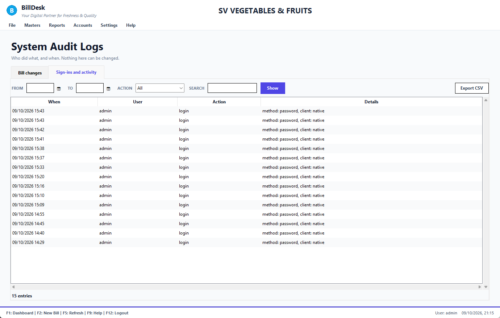

# BillDesk — User Guide and Help

**Billing, orders, purchases, stock and accounts for a fruit & vegetable wholesale business**

*Every screenshot was taken from the real application using made-up demo data (fictional customers, items and amounts). Your screens show your own data. This guide is also the help inside BillDesk: press **F9** on any screen, or open **Help** in the menu bar, and type your question.*

## Contents

- **Chapter 1. Start here**
  - [1.1 How to use this guide](#start-here)
  - [1.2 What BillDesk does](#what-is)
  - [1.3 Signing in](#signing-in)
  - [1.4 Finding your way around](#main-window)
  - [1.5 The dashboard](#dashboard)
- **Chapter 2. Billing at the counter**
  - [2.1 Making a bill](#new-bill-overview)
  - [2.2 Choosing the customer](#bill-customer)
  - [2.3 The bill date and the calendar](#bill-date)
  - [2.4 Entering items](#bill-items)
  - [2.5 The same item twice](#bill-duplicate)
  - [2.6 Taking payment](#bill-payment)
  - [2.7 Park a bill and recall it](#bill-park)
  - [2.8 Print and PDF](#bill-print)
- **Chapter 3. Bill history and returns**
  - [3.1 Bill History](#history)
  - [3.2 Searching and filtering bills](#history-filters)
  - [3.3 Viewing a bill](#history-view)
  - [3.4 Void a bill](#history-void)
  - [3.5 Return goods (credit note)](#return-goods)
  - [3.6 Credit notes](#credit-notes)
  - [3.7 Cancel a return](#cancel-return)
- **Chapter 4. Customer orders**
  - [4.1 Orders and shipments](#orders-list)
  - [4.2 New customer order](#order-new)
  - [4.3 Order and delivery dates](#order-dates)
  - [4.4 Smart Importer (photo, scan or text)](#smart-importer)
  - [4.5 Importing order text](#text-importer)
  - [4.6 Convert an order to a bill](#order-convert)
  - [4.7 Order matrix: how much to buy](#order-matrix)
- **Chapter 5. Masters: items, customers, suppliers**
  - [5.1 Items](#items)
  - [5.2 Customers](#customers)
  - [5.3 Suppliers](#suppliers)
  - [5.4 Fixed contract rates](#fixed-rates)
- **Chapter 6. Stock and purchases**
  - [6.1 Inventory: live stock](#inventory)
  - [6.2 Stock adjustment (after counting)](#stock-adjust)
  - [6.3 Waste and spoilage](#waste)
  - [6.4 Crates](#crates)
  - [6.5 Procurement and vendor bills](#procurement-bills)
  - [6.6 Enter a vendor bill](#vendor-bill)
  - [6.7 Purchase orders and goods receipts](#purchase-orders)
  - [6.8 Return goods to a supplier (debit note)](#purchase-return)
- **Chapter 7. Money and accounts**
  - [7.1 Accounting dashboard](#accounting-home)
  - [7.2 Receivables: who owes you](#receivables)
  - [7.3 Customer receipts](#receipt)
  - [7.4 Customer statement](#statement)
  - [7.5 Payables and supplier payments](#payables)
  - [7.6 Pay a supplier](#supplier-payment)
  - [7.7 Banking and reconciliation](#banking)
  - [7.8 General ledger and manual journal](#journal)
  - [7.9 Trial balance, profit and loss, balance sheet](#statements)
  - [7.10 Integrity check](#integrity)
- **Chapter 8. Reports**
  - [8.1 Daybook](#daybook)
  - [8.2 Item-wise sales](#item-wise)
  - [8.3 Customer-wise sales](#customer-wise)
  - [8.4 Dates in reports](#report-dates)
  - [8.5 Consolidated bills](#consolidated)
- **Chapter 9. Administration**
  - [9.1 Cash drawer](#cash-drawer)
  - [9.2 Users and roles](#users)
  - [9.3 Company configuration](#company)
  - [9.4 Backup and database](#backup)
  - [9.5 System audit logs](#audit-logs)
- **Chapter 10. Reference**
  - [10.1 Keyboard shortcuts](#shortcuts)
  - [10.2 Dates and the calendar](#dates-everywhere)
  - [10.3 What each form accepts](#field-rules)
  - [10.4 Messages and what to do](#messages)
  - [10.5 Frequently asked questions](#faq)
  - [10.6 Glossary](#glossary)
  - [10.7 About this guide](#about-guide)

- [Index of words](#index)

---

## Chapter 1. Start here

### 1.1 How to use this guide

*Screen: Help*

This guide is written so you can **ask a question instead of reading it from page one**.

1. In BillDesk press **F9** (on any screen it opens the help for *that* screen) or choose **Help → Help & User Guide**.
2. Type what you want in your own words, for example *how do I return goods*, *cancel a bill*, *customer owes money*, *backup*. Press **Enter**.
3. Click the best result. Each result shows the first steps right away; the topic page has the pictures and details.
4. Use **◀ Back** to return to your results, and **Contents** to browse by chapter.

Typing a question lists the best topics first, with the first steps of each so you may not need to open it:

On paper, in Word, in the PDF or in the notebook, use **Ctrl+F** and the same words. The notebook edition also has a `ask("...")` search (see the last cell).

**Find it by what you want to do**

| I want to… | Go to |
|---|---|
| make a bill for a customer | [Making a bill](#new-bill-overview) |
| sell to a walk-in customer for cash | [Choosing the customer](#bill-customer) |
| change the bill date | [The bill date and the calendar](#bill-date) |
| add items quickly with the keyboard | [Entering items](#bill-items) |
| put a bill on hold and serve someone else | [Park a bill and recall it](#bill-park) |
| take payment or leave it on credit | [Taking payment](#bill-payment) |
| print or save an invoice or delivery challan | [Print and PDF](#bill-print) |
| find an old bill | [Bill History](#history) |
| see who has not paid | [Filtering bills](#history-filters) |
| cancel a bill I made by mistake | [Void a bill](#history-void) |
| take goods back from a customer | [Return goods (credit note)](#return-goods) |
| cancel a return I entered by mistake | [Cancel a return](#cancel-return) |
| print a credit note | [Credit notes](#credit-notes) |
| record a customer's order | [New customer order](#order-new) |
| read an order from a photo or WhatsApp image | [Smart Importer](#smart-importer) |
| turn an order into a bill | [Convert an order](#order-convert) |
| know how much to buy for tomorrow | [Order matrix](#order-matrix) |
| add a customer, item or supplier | [Customers](#customers), [Items](#items), [Suppliers](#suppliers) |
| give a customer a fixed rate | [Fixed contract rates](#fixed-rates) |
| correct stock after counting | [Stock adjustment](#stock-adjust) |
| write off rotten produce | [Waste and spoilage](#waste) |
| enter a supplier's bill | [Vendor bills](#vendor-bill) |
| send goods back to a supplier | [Return to supplier (debit note)](#purchase-return) |
| record money received from a customer | [Customer receipts](#receipt) |
| see what a customer owes, bill by bill | [Customer statement](#statement) |
| pay a supplier | [Supplier payments](#supplier-payment) |
| see today's money in and out | [Daybook](#daybook) |
| see which items sell best | [Item-wise sales](#item-wise) |
| count the cash drawer | [Cash drawer](#cash-drawer) |
| add a user or change who can do what | [Users and roles](#users) |
| change the company name, address or logo | [Company configuration](#company) |
| back up my data | [Backup and database](#backup) |
| check that the books add up | [Integrity check](#integrity) |
| understand an error message | [Messages and what to do](#messages) |

**Still stuck?** See [Frequently asked questions](#faq) and [Messages and what to do](#messages).

**See also:** [Keyboard shortcuts](#shortcuts) · [Frequently asked questions](#faq) · [Messages and what to do](#messages)

---

### 1.2 What BillDesk does

*Screen: All*

BillDesk is a desktop program for the billing counter and the back office of a wholesale fruit and vegetable business. One program, one database, one set of numbers.

| You do this… | …and BillDesk automatically |
|---|---|
| Make a **bill** | reduces stock, adds to the customer's balance, records the sale and its cost in the accounts |
| Receive **payment** | reduces the customer's balance, records cash or bank in the accounts, closes the bill |
| Enter a **supplier bill** | adds what you owe the supplier (and TDS if it applies) |
| **Return goods** | credits the customer, puts good stock back, reverses the sale in the accounts |
| **Void** a bill | puts the stock back, reverses the balance and the accounts |
| Take a **customer order** | lists it in the order matrix so you know how much to buy, and turns it into a bill with one click |

GST is not used (fresh fruit and vegetables are exempt), so there is no tax set-up. A GSTIN can still be stored for a customer or supplier if you want it on file.

**Who sees what.** Menus depend on your role. Cashiers normally see Billing, Orders and Bill History; managers also see Masters, Reports and Accounts; administrators see everything including Settings. If a menu is missing, your role does not include it: ask the administrator ([Users and roles](#users)).

**See also:** [The dashboard](#dashboard) · [Signing in](#signing-in)

---

### 1.3 Signing in

*Screen: Login*

1. Double-click **BillDesk** on the desktop or in the Start menu. The first start takes a few seconds because BillDesk starts its own database.
2. Type your **username** and **password**.
3. Press **Enter** or click **Login**.

* **First time ever:** the installer creates one administrator named `admin` with a **random password shown once**. Write it down, then create the other users in [Users and roles](#users).
* **Forgot the administrator password?** Ask your IT person to run `python scripts\reset_password.py --user admin`.
* Only **one BillDesk window** can be open on a computer; if you start it twice, the second copy tells you.
* To sign out press **F12** (you are asked to confirm).

**See also:** [Users and roles](#users) · [Finding your way around](#main-window) · [Frequently asked questions](#faq)

---

### 1.4 Finding your way around

*Screen: Main window*

* **Top:** your company name and the menu bar.
* **Middle:** the screen you are working on.
* **Bottom strip:** the keys that work on this screen, who is signed in and the date and time.

| Menu | Contains |
|---|---|
| **File** | New Bill (F2), New Customer Order, Ordering System (Ctrl+O), Purchase system (Ctrl+P), Logout (F12), Exit |
| **Masters** | Item Master (F10), Customer Master (F4), Supplier Master (F11), Inventory & Stock, Waste Management |
| **Reports** | Bills History (F6), Daybook, Item-wise Sales, Customer-wise Sales, Bills Consolidated Report, Order Consolidation, Fixed Rates Report, Profit & Loss, Balance Sheet, Dashboard (F1) |
| **Accounts** | Accounting Dashboard (Ctrl+D), Trial Balance, Profit & Loss, Balance Sheet, BRS, Handover & Settlement, Integrity Check, Accounts Receivables, Accounts Payables |
| **Settings** | User Management, Company Settings, Database Settings, System Audit Logs |
| **Help** | Help & User Guide (F9), Keyboard shortcuts, About |

Press **F9** on any screen for help about that screen. All shortcut keys are listed in [Keyboard shortcuts](#shortcuts).

**See also:** [Keyboard shortcuts](#shortcuts) · [The dashboard](#dashboard) · [How to use this guide](#start-here)

---

### 1.5 The dashboard

*Screen: Dashboard*

The dashboard is the first screen after you sign in. Press **F1** from anywhere to come back to it (the figures are re-read each time).

* **Sales, Order and Purchase Analytics:** six small cards each: today, yesterday, this week, last week, this month, last month. Every card shows the amount and how many bills or orders it covers.
* **Quick Actions:** big buttons for **New Bill**, **Items**, **Customers**, **Suppliers** and **Existing Bills**.
* **At a glance** (scroll down):

| Card | Meaning |
|---|---|
| **To collect (receivables)** | everything customers owe you now (customers who have paid in advance are shown separately as "advances held", not subtracted) |
| **Overdue over 30 days** | the part of that which is older than 30 days |
| **Collected today** | receipts recorded today |
| **Orders waiting** | customer orders not yet billed |
| **Sales – last 14 days** | one bar per day |
| **Customers who owe the most** | the top four balances |

**See also:** [Making a bill](#new-bill-overview) · [Receivables: who owes you](#receivables) · [Daybook](#daybook)

---

## Chapter 2. Billing at the counter

### 2.1 Making a bill

*Screen: New Bill*

Open **File → New Bill** or press **F2**.

1. Press **F5** and choose the customer (or leave **Cash** for a walk-in).
2. The cursor moves to the **Date**; accept today or pick another day from the calendar.
3. Type each item's **code** and press **Enter**; type the **quantity**, **Enter**; the unit and the rate follow.
4. Press **F2** to take payment (or **F3** to save **and** print).
5. Check the amount received and press **Post Payment**.

| Part of the screen | What it is |
|---|---|
| **Billing Company** | which of your companies the invoice is issued under |
| **Customer (F5)** | who the bill is for ([choosing the customer](#bill-customer)) |
| **Date** | the bill date, with a drop-down calendar ([dates](#bill-date)) |
| **The grid** | one row per item: Code, Item Description, Qty, Unit, Rate, Amount, and a red **✕** to clear the row |
| **Line under the grid** | stock and rate of the item you just entered ([the hint line](#bill-items)) |
| **Customer (Delivery) / Bill To** | where the goods go and who is invoiced |
| **Internal Notes** | for your own use, not printed |
| **Total** | the bill total |
| **Park (F6) / Parked (F7)** | put a bill on hold, or bring one back |

**See also:** [Choosing the customer](#bill-customer) · [The bill date and the calendar](#bill-date) · [Entering items](#bill-items) · [Taking payment](#bill-payment)

---

### 2.2 Choosing the customer

*Screen: New Bill*

Press **F5** (or click the customer box).

1. Type part of the customer's name or phone number: the list narrows as you type.
2. Press **↓** or **↑** to move, **Enter** to choose. (Esc closes the list; a click also chooses.)
3. Choose **Cash Customer** for a walk-in sale.

* The customer's address, their "bill to" name and their company are filled in for you, and any **fixed contract rates** for that customer are used.
* The same dialog is used on [New customer order](#order-new), so it works the same everywhere. Orders need a real customer (no Cash option there).
* A customer who is not in the list must be added first in the [Customer Master](#customers).

**See also:** [Making a bill](#new-bill-overview) · [The bill date and the calendar](#bill-date) · [Customers](#customers)

---

### 2.3 The bill date and the calendar

*Screen: New Bill*

Right after you choose the customer the cursor goes to **Date** and a **calendar drops down** under it.

1. Click a day, or use the arrow keys and press **Enter**. **Today** jumps to today.
2. Or type a date (`13/10/2026`, `13-10-26`) and press **Enter**.
3. The cursor moves on to the first empty row of the grid.

* The date you choose **is the date of the bill** and its invoice number follows that day (`20261005-0003` for 5 October).
* A bill cannot be dated in the future.
* More about date boxes everywhere in the program: [Dates and the calendar](#dates-everywhere).

**See also:** [Dates and the calendar](#dates-everywhere) · [Entering items](#bill-items)

---

### 2.4 Entering items

*Screen: New Bill*

Work row by row with the keyboard: **Code → Qty → Unit → Rate → next row**, pressing **Enter** each time.

1. Type the item **code** (for example `111`) or a part of its **name** (`tom`), press **Enter**. The description, unit and rate appear and the cursor goes to **Qty** (1 is filled in).
2. Type the **quantity**, press **Enter**. The cursor passes through **Unit** to **Rate**.
3. Change the **rate** if you need to; press **Enter** to go to the next row.

* **The hint line** under the grid tells you the item, its stock ("No stock recorded" if stock is not tracked for it) and the rate and where it came from: *fixed rate for <customer>* or *item rate*.
* **Several items fit what you typed?** A list opens: **↑ / ↓** to move, **Enter** to choose, **Esc** to cancel. BillDesk never picks the first match for you.

* An item typed in a lower row **moves up** to the first empty row, so there are never gaps.
* The red **✕** clears a row and the rows below move up.
* You can sell more than the stock shows; BillDesk warns but does not stop you (your administrator can change this).
* Quantity and rate must be numbers; a bill cannot have a zero quantity or a negative rate.

**See also:** [The same item twice](#bill-duplicate) · [Taking payment](#bill-payment) · [Fixed contract rates](#fixed-rates)

---

### 2.5 The same item twice

*Screen: New Bill*

If you type an item that is already on the bill, BillDesk asks what to do.

* **Add the QTY (Enter)** adds the new quantity to the existing row.
* **Ignore (Delete Duplicate)** removes the new row.

**See also:** [Entering items](#bill-items)

---

### 2.6 Taking payment

*Screen: New Bill*

1. Press **F2** (save) or **F3** (save and print).
2. The amount received is filled in with the whole total. Change it if the customer pays part.
3. Choose the **payment method** and, for UPI or a cheque, the **reference**.
4. Press **Enter** or **Post Payment**.

| Box | Meaning |
|---|---|
| **Outstanding / Unpaid bills** | what this customer already owes before this bill |
| **Amount Received** | what the customer pays now; anything not paid stays on their account |
| **Payment Date** | shown for information: a counter payment is recorded on the bill's date |
| **Payment Method** | Cash, UPI, Cheque, NEFT/RTGS, or **Credit/Due** (nothing paid now) |
| **Reference / UTR** | UPI or cheque number (optional) |

* You cannot receive more than the bill total.
* After posting, the sheet is cleared for the next bill. With **F3** the invoice opens for printing.
* Later payments are recorded as a [customer receipt](#receipt).

**See also:** [Print and PDF](#bill-print) · [Customer receipts](#receipt) · [Customer statement](#statement)

---

### 2.7 Park a bill and recall it

*Screen: New Bill*

Serving two customers at once? Put one aside.

1. Press **F6** (or **Park**) with the items entered. The sheet clears.
2. Serve the next customer.
3. Press **F7** (or **Parked (n)**), click the parked bill to bring it back. If another bill is on the sheet you are asked before it is replaced.

Parked bills are kept on disk: they survive closing BillDesk or a power cut.

**See also:** [Making a bill](#new-bill-overview)

---

### 2.8 Print and PDF

*Screen: New Bill, Bill History*

After **F3**, or from [Bill History](#history), the invoice opens in the **print preview**.

* **− / + / Fit** change the zoom; **Print** sends it to the printer; **Save PDF** saves a file; **Close** leaves.
* The **invoice** shows the company, customer, items with rates and amounts, the total in words and your terms:

* The **delivery challan (DC)** is the same bill **without prices**, for the driver and the customer's receiving staff:

**See also:** [Taking payment](#bill-payment) · [Viewing a bill](#history-view)

---

## Chapter 3. Bill history and returns

### 3.1 Bill History

*Screen: Bill History*

Open **Reports → Bills History** or press **F6**.

* The three coloured cards show the number of bills, total sales and today's bills.
* The table lists the newest bills first: invoice number, date, company, customer, number of items, amount and **status**.
* Select a bill, then use the buttons at the bottom (or **right-click** it):

| Button | What it does |
|---|---|
| **Preview Invoice / Preview DC** | opens the invoice or the delivery challan |
| **Save Invoice / Save DC** | saves the PDF |
| **View Bill** | shows the bill's details |
| **Void Bill** | cancels the bill ([void](#history-void)) |
| **Return Goods** | takes goods back ([return](#return-goods)) |
| **Credit Notes** | lists and prints the returns on this bill ([credit notes](#credit-notes)) |
| **Refresh** | reloads the list |

* **Per page** and **Previous / Next** move through long lists.

**See also:** [Searching and filtering bills](#history-filters) · [Viewing a bill](#history-view) · [Void a bill](#history-void) · [Return goods (credit note)](#return-goods)

---

### 3.2 Searching and filtering bills

*Screen: Bill History*

* **Search** (F1): type part of an invoice number or customer name.
* **Status list:** All, **Unpaid**, **Partial**, **Paid**, **Void** or **Legacy**.

* **Invoice date:** click the box and pick a day from the calendar; **Reset Date** clears it. You can also type part of a date (`09/2026`) to see a month.

| Status | Meaning |
|---|---|
| **paid** | fully paid |
| **unpaid / partial** | nothing / part paid; the rest is due |
| **void** | cancelled |
| **legacy** | bills made by the older program: it did not track payment per bill; their money is in the customer's balance |

To see what a customer owes bill by bill use the [customer statement](#statement).

**See also:** [Bill History](#history) · [Customer statement](#statement) · [Receivables: who owes you](#receivables)

---

### 3.3 Viewing a bill

*Screen: Bill History*

Double-click a bill (or select it and press **View Bill**).

It shows the customer, date, status, the items with quantity, rate and amount and the grand total, with buttons to preview or save the invoice and the challan.

**See also:** [Bill History](#history) · [Print and PDF](#bill-print)

---

### 3.4 Void a bill

*Screen: Bill History*

A bill made by mistake is **voided**, not deleted, so the record and the invoice number stay.

1. Open [Bill History](#history) and select the bill.
2. Press **Void Bill**.
3. Read what will happen and confirm.

Voiding: reverses the customer's balance, puts the stock back, reverses the crates and the accounts, and marks the bill **void**. Payments that had been allocated to it become the customer's **advance** (credit).

* A bill that has goods returned against it **cannot be voided**: [cancel the return](#cancel-return) first.
* A voided bill cannot be voided twice.
* To take back only some goods, use [Return goods](#return-goods), not void.

**See also:** [Return goods (credit note)](#return-goods) · [Bill History](#history)

---

### 3.5 Return goods (credit note)

*Screen: Bill History*

A customer brings goods back.

1. In [Bill History](#history) select the invoice they were bought on.
2. Press **Return Goods**.
3. Type the **Return qty** for each item. Tick **Spoiled?** if the goods are rotten and cannot be sold again.
4. Write a **reason** (optional) and, for a walk-in customer, choose how you refund (Cash, UPI, Bank).
5. Press **Save return**. You are offered the **credit note** to print.

What happens:

| | Good goods | Spoiled goods |
|---|---|---|
| Customer is credited at the rate billed | yes | yes |
| Goes back into stock | yes, at the cost it was sold at | no |
| Sales are reduced in the accounts | yes | yes |

* The credit first reduces **what the customer still owes on that invoice**; anything more stays as **credit on their account** (shown as *Cr* in the customer list).
* You cannot return more than was billed minus what was already returned.
* A void invoice cannot have goods returned.
* A walk-in customer is refunded from the cash drawer or bank.

**See also:** [Credit notes](#credit-notes) · [Cancel a return](#cancel-return) · [Void a bill](#history-void) · [Customer statement](#statement)

---

### 3.6 Credit notes

*Screen: Bill History*

**Bill History → Credit Notes** lists the returns made on the selected invoice, each with its number, date and amount.

Select one and press **Print / Save PDF**. The credit note shows each item, whether it was good or spoiled, the total in words and how the credit was applied.

**See also:** [Return goods (credit note)](#return-goods) · [Cancel a return](#cancel-return)

---

### 3.7 Cancel a return

*Screen: Bill History, Procurement*

A return entered by mistake can be cancelled.

1. **Bill History → Credit Notes**, select the return.
2. Press **Cancel this return** and confirm.

BillDesk puts back the customer's balance, the invoice's balance due, the stock and the accounts exactly as they were; the credit note stays on file, marked **cancelled**, and no longer counts anywhere. The whole quantity can be returned again afterwards.

* A return can be cancelled once only.
* Returns made by the older program cannot be cancelled here.
* A supplier return (debit note) is cancelled from **Procurement → Returns to Suppliers → Cancel Debit Note** ([purchase return](#purchase-return)).

**See also:** [Return goods (credit note)](#return-goods) · [Return goods to a supplier (debit note)](#purchase-return) · [Credit notes](#credit-notes)

---

## Chapter 4. Customer orders

### 4.1 Orders and shipments

*Screen: Orders*

Open **File → Ordering System** or press **Ctrl+O**.

* The cards show total, pending and today's orders.
* **Search** by order number or customer; the **Date** box filters by order date (pick it from the calendar).

| Button | What it does |
|---|---|
| **+ Create New Order** | opens the [order form](#order-new) |
| **Edit Order** | changes an order that is not yet billed |
| **Convert to Sales Bill** | makes the bill from the order ([convert](#order-convert)) |
| **Convert to Purchase Bill** | turns the order into a purchase from a supplier |
| **Print / Preview** | prints the order as a challan |
| **Cancel Order** | cancels an order that has not been billed |

Status: **pending**, **confirmed**, **billed**, **cancelled**.

**See also:** [New customer order](#order-new) · [Convert an order to a bill](#order-convert) · [Order matrix: how much to buy](#order-matrix)

---

### 4.2 New customer order

*Screen: New Order*

Press **+ Create New Order** on the Orders screen, or **File → New Customer Order**.

1. Press **F5** and choose the customer.
2. The cursor goes to the **order date**, then the **delivery date**, then the first empty row of the items.
3. Enter the items exactly as on a bill (code, quantity, unit, rate).
4. Enter **Crates out / in** if returnable crates go with the order.
5. Press **F3** to save (or **F10** to save and print).

| Key | Does |
|---|---|
| **F3** | save the order (F2 does the same) |
| **F5** | choose the customer, from any box |
| **F8** | [Smart Importer](#smart-importer): read the order from a photo or text |
| **F10** | save and print |
| **Esc** | close the form |

* Orders need a customer from the customer master.
* The commission and mandi fee shown at the bottom come from your settings (both are zero unless your administrator sets them).

**See also:** [Order and delivery dates](#order-dates) · [Smart Importer (photo, scan or text)](#smart-importer) · [Convert an order to a bill](#order-convert)

---

### 4.3 Order and delivery dates

*Screen: New Order*

Both date boxes drop down the calendar when you click them or reach them with the keyboard.

* The **order date** cannot be in the future.
* The **delivery date** cannot be before the order date (those days are greyed out in the calendar). It starts as tomorrow.
* Both are required; an unusable date turns red and the form tells you which one when you save.

**See also:** [New customer order](#order-new) · [Dates and the calendar](#dates-everywhere)

---

### 4.4 Smart Importer (photo, scan or text)

*Screen: New Order*

Customers send orders as photos or messages. **F8** on the order form reads them for you.

1. Press **F8**.
2. Press **Upload Image…** and choose the photo or scan (PNG, JPG, BMP, TIFF, WebP).
3. Wait a few seconds: the picture shows on the left and what was read on the right.
4. Check the **customer**, the **date** and every row. A row marked **? (choose item)** could not be matched: **double-click** it to pick the item, correct the quantity or unit, or remove the line.
5. Press **Import to Grid**. The items go into the order; check the quantities, then save with **F3**.

* BillDesk reads **English and Tamil** (and Hindi, Telugu, Kannada, Malayalam) with the built-in Tesseract reader, converts Tamil numerals, **translates the item names to English** and matches them to your Item Master.
* The date and the customer at the top of the note are picked up too.
* **Printed or typed** orders read well. **Handwriting is hard for this kind of reader**: if nothing can be read the window says so instead of guessing. Use a straight, bright photo, or type the lines with **Paste text instead**.
* The same item twice in one order is added together.

**See also:** [Importing order text](#text-importer) · [New customer order](#order-new)

---

### 4.5 Importing order text

*Screen: New Order*

For orders that arrive as text (WhatsApp, SMS): in the Smart Importer choose **Paste text instead**.

1. Paste the message, one item per line: `111 30kg`, `beans 12 kg`, `105 20`.
2. Press **Parse & Populate** (or **Load File…** for a `.txt` / `.csv`).

Item codes and names both work, in either order with the quantity. Lines that cannot be matched to an item are **not** guessed: they are listed so you can add them by hand.

**See also:** [Smart Importer (photo, scan or text)](#smart-importer) · [New customer order](#order-new)

---

### 4.6 Convert an order to a bill

*Screen: Orders*

1. On **Orders**, select the order.
2. Press **Convert to Sales Bill**.

The bill is made with the order's items and rates and the order becomes **billed**, linked to the invoice (shown in **Linked Docs**). A billed order cannot be converted again. **Convert to Purchase Bill** does the same for buying the goods from a supplier.

**See also:** [Orders and shipments](#orders-list) · [Making a bill](#new-bill-overview)

---

### 4.7 Order matrix: how much to buy

*Screen: Order Matrix*

**Reports → Order Consolidation** adds up all pending orders: one row per item, one column per customer, then the **total order**, **current stock** and **to purchase**.

* **Delivery Date** limits the matrix to orders due on that day (pick it from the calendar); **All** shows every pending order.

* **Show Stock** and **Show To Purchase** switch those columns; **Export to Excel** and **Print Configuration** produce a copy.

**See also:** [Orders and shipments](#orders-list) · [Inventory: live stock](#inventory)

---

## Chapter 5. Masters: items, customers, suppliers

### 5.1 Items

*Screen: Item Master*

**Masters → Item Master** (**F10**).

1. Press **+ Add Item**.
2. Fill the form and press **Save Item**. To change an item, double-click it (or **Edit Selected**).

| Box | Meaning |
|---|---|
| **Alias (Fast Code)** | the short code you type when billing (`111`); no spaces, unique |
| **Item Name** | up to 80 characters; two items cannot have the same name |
| **Category / Unit of Measure** | for grouping; the unit appears on the bill |
| **Standard Rate (₹)** | the rate used when a customer has no fixed rate (0 or more) |
| **Initial Stock Quantity** | opening quantity (0 or more) |

**See also:** [Fixed contract rates](#fixed-rates) · [What each form accepts](#field-rules)

---

### 5.2 Customers

*Screen: Customer Master*

**Masters → Customer Master** (**F4**).

* **Balance** shows **Dr** when the customer owes you and **Cr** when you hold their advance or a return credit.
* Buttons: **+ Add Customer**, **Edit Customer**, **Statement** (the customer's account, bill by bill: [statement](#statement)) and **Refresh**.

* **Customer Name** (ship-to) and **DC Company Name** (the "bill to") can differ: goods go to one place, the invoice to another company. Invoices and the consolidated report use both.
* Phone: 7 to 15 digits, up to three numbers separated by commas. Email and GSTIN are optional but checked when given (GSTIN is 15 letters or digits). Names must be unique.
* **Credit limit** and **Opening balance** must be numbers. A customer's balance is changed only by bills, receipts and returns, never by editing the form.

**See also:** [Customer statement](#statement) · [Fixed contract rates](#fixed-rates) · [What each form accepts](#field-rules)

---

### 5.3 Suppliers

*Screen: Supplier Master*

**Masters → Supplier Master**.

Name, phone, address and GSTIN (optional) as for customers. If **TDS applies** to the supplier, set the **TDS rate** (0 to 100): vendor bills then deduct it automatically.

**See also:** [Enter a vendor bill](#vendor-bill) · [Pay a supplier](#supplier-payment)

---

### 5.4 Fixed contract rates

*Screen: Fixed Rates*

A customer with an agreed price for an item gets that rate automatically on every bill and order while the contract is valid.

1. **Reports → Fixed Rates Report**, press **+ Add Contract Price**.
2. Enter the **customer ID**, the **item ID or code** and the **rate** (must be above zero).
3. Pick the **start** and **end dates** from the calendars (the end cannot be before the start).
4. Press **Save Price**.

A new price for the same customer and item replaces the old one. The billing hint line says *fixed rate for <customer>* when one is used.

**See also:** [Items](#items) · [Customers](#customers) · [Entering items](#bill-items)

---

## Chapter 6. Stock and purchases

### 6.1 Inventory: live stock

*Screen: Inventory*

**Masters → Inventory & Stock** opens the inventory screen on **Live Stock Overview** (**Masters → Waste Management** opens the same screen on the waste tab). It has four tabs.

* **Live Stock Overview:** every item with its quantity on hand.
* **Stock Movement History:** every sale, return, goods receipt, adjustment and waste that changed stock, with date and reference.

* **Produce Waste Logs** and **Crate Balances** are described next.
* Stock for an item may show 0 if you never entered it: BillDesk then does not block sales. Goods receipts and adjustments start it.

**See also:** [Stock adjustment (after counting)](#stock-adjust) · [Waste and spoilage](#waste) · [Crates](#crates)

---

### 6.2 Stock adjustment (after counting)

*Screen: Inventory*

1. Select the item on **Live Stock Overview**.
2. Press **Manual Adjustment (+/-)**.
3. Type the change (`+5` to add, `-3` to reduce) and the **reason** (required for the audit trail).
4. Press **Commit Adjustment**.

* The item can be entered by its **id or its code**.
* Stock cannot go below zero by adjusting; the quantity must be a number.

**See also:** [Inventory: live stock](#inventory) · [Waste and spoilage](#waste)

---

### 6.3 Waste and spoilage

*Screen: Inventory*

Produce that rots or is damaged is **recorded as waste**, so it reduces stock and shows as a loss in your profit and loss.

1. Select the item, press **Record Waste / Spoilage**.
2. Enter the **quantity**, the **estimated cost rate** and the **reason** (Rotten, Crushed…).
3. Press **Record Waste**.

The **Produce Waste Logs** tab lists them:

If the stock is tracked you cannot waste more than is on hand. Goods a **customer** returns as spoiled are handled by [Return goods](#return-goods), not here.

**See also:** [Stock adjustment (after counting)](#stock-adjust) · [Return goods (credit note)](#return-goods) · [Inventory: live stock](#inventory)

---

### 6.4 Crates

*Screen: Inventory*

Returnable crates that go out with a bill or an order (**Crates out**) and come back (**Crates in**) are tracked per customer.

Voiding a bill reverses its crates. Crate numbers must be whole numbers, 0 or more.

**See also:** [New customer order](#order-new) · [Inventory: live stock](#inventory)

---

### 6.5 Procurement and vendor bills

*Screen: Procurement*

**File → Purchase system** or **Ctrl+P**.

Four tabs: **Vendor Purchase Bills**, **Purchase Orders**, **Goods Receipt Notes** and **Returns to Suppliers**. The bills tab lists each supplier invoice with subtotal, TDS, net payable, balance due and status.

**See also:** [Enter a vendor bill](#vendor-bill) · [Purchase orders and goods receipts](#purchase-orders) · [Return goods to a supplier (debit note)](#purchase-return)

---

### 6.6 Enter a vendor bill

*Screen: Procurement*

1. **+ Enter Vendor Bill**.
2. Type the **Supplier ID**, the supplier's **invoice number**, the **item** (id or code), the **quantity** and the **rate**.
3. Press **Record Bill**.

* TDS is worked out from the supplier's rate and what you owe is the **net payable**.
* The same supplier invoice number cannot be entered twice (BillDesk tells you the purchase it already belongs to).
* Quantity and rate must be above zero and the item must exist.

**See also:** [Pay a supplier](#supplier-payment) · [Return goods to a supplier (debit note)](#purchase-return) · [Suppliers](#suppliers)

---

### 6.7 Purchase orders and goods receipts

*Screen: Procurement*

* **Purchase Orders:** what you asked a supplier to send.

* **Goods Receipt Notes (GRN):** what actually arrived against a PO; receiving adds to stock.

A vendor bill linked to a PO and a GRN is checked three ways (rates against the PO, quantities against what was received) and mismatches are flagged.

**See also:** [Enter a vendor bill](#vendor-bill) · [Inventory: live stock](#inventory)

---

### 6.8 Return goods to a supplier (debit note)

*Screen: Procurement*

1. **Procurement → Vendor Purchase Bills**, select the bill the goods came on.
2. Press **↩ Return Goods to Supplier**.
3. Type the quantity of each item, the reason, and press **Save return**. You can print the **debit note**.

* The value is at the bill's rate. If **TDS** was deducted, the same share comes back, so what you owe falls by the **net** amount.
* It reduces what you still owe on that bill first; any excess is **credit with the supplier**.
* Stock goes down only if the goods had been received into stock (the bill has a goods receipt).
* The **Returns to Suppliers** tab lists them; **Print Debit Note** and **Cancel Debit Note** are there.

**See also:** [Cancel a return](#cancel-return) · [Enter a vendor bill](#vendor-bill) · [Pay a supplier](#supplier-payment)

---

## Chapter 7. Money and accounts

### 7.1 Accounting dashboard

*Screen: Finance*

**Accounts → Accounting Dashboard** (**Ctrl+D**).

The cards show total receivables, payables, bank balance and net profit; the quick buttons open the other tabs: **Accounts Receivable (AR)**, **Accounts Payable (AP)**, **Banking & BRS** and **General Ledger**.

**See also:** [Receivables: who owes you](#receivables) · [Payables and supplier payments](#payables) · [Banking and reconciliation](#banking) · [Trial balance, profit and loss, balance sheet](#statements)

---

### 7.2 Receivables: who owes you

*Screen: Accounts Receivables*

**Accounts → Accounts Receivables**.

Each customer who owes money, split by age: **Current**, **1–30**, **31–60**, **61–90** and **90+** days. The total here equals the customer balances, the ledger and the dashboard card. Customers who have paid in advance are not subtracted: they are shown in the line above as *Advances held*.

* **+ Record Customer Receipt** records a payment ([receipt](#receipt)).
* **Customer Statement** opens the selected customer's account ([statement](#statement)).

**See also:** [Customer receipts](#receipt) · [Customer statement](#statement) · [Searching and filtering bills](#history-filters)

---

### 7.3 Customer receipts

*Screen: Accounts Receivables*

When a customer pays later (not at the counter):

1. **Accounts Receivables → + Record Customer Receipt**.
2. Enter the **Customer ID**, the **amount** and choose the **payment mode** from the list.
3. Leave **Invoice No** blank to settle the oldest bills first (FIFO), or type one invoice number.
4. Add the UTR / cheque reference and press **Save Receipt**.

The customer's balance goes down and the matching bills are marked paid. An amount larger than what they owe becomes their **advance**.

**See also:** [Customer statement](#statement) · [Receivables: who owes you](#receivables) · [Taking payment](#bill-payment)

---

### 7.4 Customer statement

*Screen: Customer Master, Receivables*

From **Customer Master → Statement** or **Accounts Receivables → Customer Statement**.

* Lists invoices (billed), receipts, returns and adjustments with a **running balance**, ending on the customer's balance.
* **From / To** (calendar boxes) show one period; the earlier balance is brought forward.
* **Export CSV** saves it for Excel.
* "Adjustment" appears when the customer paid something that was never recorded here.

**See also:** [Customer receipts](#receipt) · [Customers](#customers) · [Receivables: who owes you](#receivables)

---

### 7.5 Payables and supplier payments

*Screen: Accounts Payables*

**Accounts → Accounts Payables** lists your vendor bills with net payable, balance due and status.

**See also:** [Pay a supplier](#supplier-payment) · [Enter a vendor bill](#vendor-bill)

---

### 7.6 Pay a supplier

*Screen: Accounts Payables*

1. **Accounts Payables → + Disburse Supplier Payment**.
2. Enter the **Purchase ID**, the **Supplier ID**, the **amount** and the **payment mode**.
3. Add the UTR and press **Disburse Payment**.

You cannot pay more than the bill's balance due.

**See also:** [Payables and supplier payments](#payables) · [Enter a vendor bill](#vendor-bill)

---

### 7.7 Banking and reconciliation

*Screen: BRS*

**Accounts → BRS**.

1. **+ Add Bank Account** and fill in the form.

| Box | Rule |
|---|---|
| Bank name | required |
| Account number | 6–20 digits, registered once |
| IFSC | optional; 4 letters, a 0, 6 letters/digits (`SBIN0001234`) |
| Account type | Current, Savings or OD |
| Opening balance | a number |

2. **⚡ Auto-Reconciliation** matches bank statement lines with your records by reference and amount; **View BRS Statement** shows the reconciliation.

**See also:** [General ledger and manual journal](#journal) · [Accounting dashboard](#accounting-home)

---

### 7.8 General ledger and manual journal

*Screen: Finance*

The **General Ledger** tab lists every accounting entry. BillDesk posts them automatically for bills, receipts, purchases, payments, returns and waste; use a **manual journal** only for what has no screen (for example opening capital).

1. **+ Post Manual Journal**.
2. Enter a **reference** (`ADJ-001`), the **debit account code** and amount, the **credit account code** and amount.
3. Press **Post Entry**.

The two accounts must be different and the amounts must be equal; otherwise the form tells you before anything is posted.

**See also:** [Trial balance, profit and loss, balance sheet](#statements) · [Accounting dashboard](#accounting-home)

---

### 7.9 Trial balance, profit and loss, balance sheet

*Screen: Finance*

**Accounts → Trial Balance / Profit & Loss / Balance Sheet** (the last two are also under **Reports**) each open a report window with the **period chosen at the top**.

1. Pick the days with the calendar (click the date box or the 📅 button), or use a quick button, then press **Show**.
2. **Save as text…** keeps a copy; **Close** leaves.

| Statement | Box | Quick buttons |
|---|---|---|
| **Trial balance** | **As of**: the position on that day (blank = everything so far) | Today, End of last month, All entries |
| **Profit and loss** | **From / To**: the result of that period (blank = all time) | This month, This financial year (from 1 April), All time |
| **Balance sheet** | **As of**: what you own and owe on that day | Today, End of last month, All entries |

The first lines of the report say which period it is for ("For the period 01/04/2026 to 09/10/2026", "As of 31/03/2026"). The *To* date cannot be before the *From* date.

* **Trial balance:** every account's debits and credits; the totals must be equal.
* **Profit and loss:** sales (net of returns), cost of goods sold, waste and expenses, giving the profit.
* **Balance sheet:** what you own, owe and the owner's capital.

**See also:** [General ledger and manual journal](#journal) · [Integrity check](#integrity)

---

### 7.10 Integrity check

*Screen: Integrity Check*

**Accounts → Integrity Check → Run Check** reads your data (it changes nothing) and tests that the books are consistent.

Each line is **OK**, **Info**, **Warning** or **Fail**: journals balance, receivables equal customer balances, bills add up, statuses agree with balances, invoice numbers are unique, stock is not negative, and more. Open a line to see exactly which records. **Save Report…** keeps a copy. Run it before closing the month and after restoring a backup.

**See also:** [Trial balance, profit and loss, balance sheet](#statements) · [Backup and database](#backup)

---

## Chapter 8. Reports

### 8.1 Daybook

*Screen: Reports*

**Reports → Daybook**: every event in date order: sales, returns, purchases, receipts and supplier payments, with **Billed**, **Bought**, **Money in** and **Money out** and a total line.

Choose the period with the **From / To** boxes ([dates in reports](#report-dates)), or **Today** / **This month**. **Export CSV** saves it.

**See also:** [Item-wise sales](#item-wise) · [Customer-wise sales](#customer-wise) · [Dates in reports](#report-dates)

---

### 8.2 Item-wise sales

*Screen: Reports*

**Reports → Item-wise Sales**: for each item the bills it was on, quantity sold, quantity returned, net quantity, average rate and net amount, best sellers first.

**See also:** [Daybook](#daybook) · [Customer-wise sales](#customer-wise)

---

### 8.3 Customer-wise sales

*Screen: Reports*

**Reports → Customer-wise Sales**: bills, billed, returned, **net sales** and what each customer **owes now**.

**See also:** [Daybook](#daybook) · [Item-wise sales](#item-wise) · [Customer statement](#statement)

---

### 8.4 Dates in reports

*Screen: Reports*

All three reports share the **From / To** boxes.

* Pick a day from the calendar (click the box or the 📅 button beside it) or type it; the *To* date cannot be before the *From* date.
* Leave a box empty for "no limit".
* The reports always net out returns, and cancelled returns are ignored.

**See also:** [Daybook](#daybook) · [Dates and the calendar](#dates-everywhere)

---

### 8.5 Consolidated bills

*Screen: Consolidated Billing*

**Reports → Bills Consolidated Report**: one statement of all bills for a "bill to" company over a period, grouped by delivery address.

1. Press the search icon and choose the **Bill To** company.
2. Pick **From** and **To** (they start at the 1st of this month and today).
3. Press **Generate**, then save or print the PDF.

**See also:** [Customers](#customers) · [Bill History](#history)

---

## Chapter 9. Administration

### 9.1 Cash drawer

*Screen: Handover & Settlement*

**Accounts → Handover & Settlement**.

1. At the start of the day press **Open Drawer Session**, type the **opening float** and press **Start Session**.

2. Work as usual: cash receipts are added to the expected cash.
3. At the end press **Close Drawer & Generate Report**, type the cash you **counted** and a note for any difference.
4. BillDesk shows the Z-report: expected, counted and **short / excess**.

Amounts must be numbers (0 or more). You can have only one open session.

**See also:** [Users and roles](#users) · [Taking payment](#bill-payment)

---

### 9.2 Users and roles

*Screen: User Management*

**Settings → User Management**, tab **Users & Access**.

1. **+ Add Operator User**.
2. Type a **username** (3–30 letters, digits, dot, dash or underscore, unique), a **password** (at least 6 characters, not the same as the username), choose the **role** from the list, add email and phone (optional).
3. Press **Create User**.

The **role** decides which menus a person sees:

| Role | Sees |
|---|---|
| **user** (cashier) | File (billing, orders, purchases), Bills History, Bills Consolidated Report, Order Consolidation, Dashboard, Help |
| **manager** | all of the above, plus **Masters** (items, customers, suppliers, inventory, waste, fixed rates), **Accounts**, **Daybook**, item-wise and customer-wise sales, Profit & Loss, Balance Sheet |
| **admin** | everything, including **Settings** (users, company, database, audit logs) |

A menu never offers a screen you cannot open. A forgotten password is reset by the administrator with `scripts\reset_password.py`.

**See also:** [Signing in](#signing-in) · [Company configuration](#company)

---

### 9.3 Company configuration

*Screen: Company Settings*

**Settings → Company Settings**: your business details as they appear on every invoice.

* **+ Add Company** and the **✏ edit** icon open the form; the trash icon deletes (the default company and the last company cannot be deleted).
* **Search**, **Export** and **Import** (a CSV with a `name` column) manage many companies.

Name, address, phones, email, GSTIN (optional), terms and conditions, signatory title, a **logo** (any picture; it is shrunk) and **use as default company**. Changes appear on the next invoice you print.

**See also:** [Print and PDF](#bill-print) · [Users and roles](#users)

---

### 9.4 Backup and database

*Screen: Database Settings*

**Settings → Database Settings** (titled **Backup & Database**).

* A backup is taken **automatically once a day** while BillDesk is used, and each one is **checked after it is written**.
* **Back Up Now** makes one immediately; **Open Backup Folder** shows the files; **Open Log File** helps your IT person.
* To restore, your IT person runs `python scripts\restore_backup.py <backup.zip> --target-db <new name>`; then run the [Integrity check](#integrity).
* *Where your data is kept* normally needs no change. **Test Connection** checks the database address.
* Copy the backup folder to a pen drive or cloud drive regularly: a backup on the same computer does not help if the computer is lost.

**See also:** [Integrity check](#integrity) · [Frequently asked questions](#faq)

---

### 9.5 System audit logs

*Screen: System Audit Logs*

**Settings → System Audit Logs** answers *who did what, and when*. Nothing on it can be changed. It has two lists:

1. **Bill changes:** every time a bill was made, voided, or had goods returned (or a return cancelled): the time, the user, the invoice, the action and, where something changed, what it was before and after.
2. **Sign-ins and activity:** who signed in and when.

* **From / To** (calendar boxes), **Action** (All, or one kind), and **Search** (any word: a user, an invoice number) narrow the list; press **Show** or Enter.
* **Export CSV** saves what is on screen.
* The newest 2,000 entries are listed; use the dates to look further back.

**See also:** [Users and roles](#users)

---

## Chapter 10. Reference

### 10.1 Keyboard shortcuts

*Screen: All*

The strip at the bottom of each screen lists the keys that work there.

| Key | Anywhere | On **New Bill** | On **New Order** |
|---|---|---|---|
| **F1** | Dashboard (search on Bill History) | | |
| **F2** | New Bill | save and take payment | save the order |
| **F3** | Item Master | save **and print** | **save the order** |
| **F4** | Customer Master | | |
| **F5** | refresh the screen | **choose customer** | **choose customer** |
| **F6** | Bills History | **park** the bill | |
| **F7** | | **parked** bills | |
| **F8** | | | **Smart Importer** |
| **F9** | **Help for this screen** | | |
| **F10** | Item Master | | save and print |
| **F11** | Supplier Master | | |
| **F12** | Log out | | |
| **Esc** | close a dialog | close a dialog | close the form |
| **Ctrl+N** | New Customer Order | | |
| **Ctrl+O** | Orders | | |
| **Ctrl+P** | Procurement | | |
| **Ctrl+D** | Accounting Dashboard | | |

In lists and dialogs: **↑ / ↓** move, **Enter** chooses, **Esc** closes. In the grids: **Enter** moves to the next box. In any date box: **↓** opens the calendar.

**See also:** [Finding your way around](#main-window) · [Entering items](#bill-items)

---

### 10.2 Dates and the calendar

*Screen: All*

Every date box in BillDesk works the same way:

* Click it, or its **📅 button**, or move to it with the keyboard: a **calendar** drops down. **Click** a day, or use the **arrow keys** (Page Up / Down change month) and **Enter**; **Today** jumps to today.
* You can also **type** a date: `13/10/2026`, `13-10-26`, `2026-10-13`. Press **Enter** to accept it.
* Text turns **red** when the date cannot be used; the form tells you why when you save.
* Days that are not allowed are **greyed** in the calendar.

| Where | Rule |
|---|---|
| Bill date | required; not in the future |
| Order date | required; not in the future |
| Delivery date | required; not before the order date |
| Fixed rate start / end | required; end not before start |
| Report, statement and audit-log From / To | optional; *To* not before *From* |
| Profit & Loss From / To; Trial Balance and Balance Sheet As of | optional (blank = all entries); *To* not before *From* |
| Consolidated report From / To | required; *To* not before *From* |
| Filters (Bill History, Orders) | optional; part of a date (`09/2026`) is fine |

**See also:** [The bill date and the calendar](#bill-date) · [Order and delivery dates](#order-dates) · [Dates in reports](#report-dates)

---

### 10.3 What each form accepts

*Screen: All forms*

BillDesk checks what you type and says what is wrong instead of saving bad data.

| Field | Rule |
|---|---|
| Quantity, rate, amount | a real number; quantity above zero; rate zero or more; not absurdly large |
| Item name | required, up to 80 characters, not already used |
| Item code | no spaces, up to 20 characters, unique |
| Customer / supplier name | required, up to 80 characters, not already used |
| Phone | 7–15 digits; up to three numbers separated by comma or slash |
| Email | like `name@shop.com` |
| GSTIN | optional; 15 letters/digits |
| Credit limit, opening balance | a number (credit limit 0 or more) |
| TDS rate | 0 to 100 |
| Username | 3–30 letters, digits, `.` `-` `_` |
| Password | at least 6 characters, at most 72 bytes, not the username |
| Payment mode | Cash, UPI, Cheque, NEFT, RTGS, NEFT/RTGS, Bank, Card (and Credit/Due on a bill) |
| Vendor invoice number | required, up to 40 characters, once per supplier |
| Bank account | 6–20 digits; IFSC like `SBIN0001234`; type Current, Savings or OD |
| Cash drawer amounts | 0 or more |
| Crates | whole numbers, 0 or more |
| Journal entry | reference required; two different accounts; debit equals credit |

**See also:** [Messages and what to do](#messages) · [Dates and the calendar](#dates-everywhere)

---

### 10.4 Messages and what to do

*Screen: All*

Find the words you see on the screen in the first column; the next columns say why it happened and what to do.

| What you see | Why | What to do |
|---|---|---|
| *"Choose a customer from the customer master (F5)"* | an order needs a real customer | press **F5**, choose one; add the customer first if missing |
| *"The bill date cannot be in the future"* | the date box holds a later day | pick today or an earlier day |
| *"… is not a valid date. Use DD/MM/YYYY"* | text in a date box can't be read | pick from the calendar |
| *"The To date cannot be before …"* | To is earlier than From | change one of them |
| *"Amount received (…) is more than the bill total"* | more entered than the bill | type the bill amount or less |
| *"Item … not found"* / *"No item matches"* | wrong code | check the code in the Item Master |
| *"… must be a number"* | letters or symbols in a number box | type digits only (decimals allowed) |
| *"An item / customer named … already exists"* | the name is taken | use another name, or edit the existing one |
| *"Vendor invoice … is already recorded as PUR-…"* | the same supplier invoice was entered before | do not enter it again |
| *"Payment amount … exceeds purchase balance due"* | paying a supplier more than owed | pay the balance due or less |
| *"Waste quantity … exceeds stock on hand"* | more than the tracked stock | check the quantity |
| *"Invoice … has goods returned against it, so it cannot be voided"* | a return exists | [cancel the return](#cancel-return) first, then void |
| *"only n can still be returned"* | more than billed minus earlier returns | reduce the return quantity |
| *"Return … was made by the older BillDesk and cannot be cancelled here"* | old returns lack detail | leave it; it is already reflected in the balance |
| *"The entry does not balance"* | journal debit ≠ credit | make the two amounts equal |
| *"You already have an open cashier session"* | a drawer is open | close it first |
| *"Access Denied"* | your role does not include that screen | ask the administrator |
| *"Tesseract OCR engine is not installed"* | the image reader is missing | use **Paste text instead**, or ask IT to reinstall |
| *"The text in this image could not be read reliably"* | handwriting or a blurry photo | take a straighter, brighter photo or type the lines |
| Integrity check shows **Warning** | an older-data difference | open the line; ask your accountant if unsure |
| Cannot start: database error | the database did not start | restart the computer, then BillDesk; call IT if it repeats |

**See also:** [What each form accepts](#field-rules) · [Frequently asked questions](#faq) · [Backup and database](#backup)

---

### 10.5 Frequently asked questions

*Screen: All*

Short answers to the questions people ask most; follow the link in the last column for the full steps.

| Question | Answer | More |
|---|---|---|
| Can I change the date of a bill after saving? | No. Void the bill and make it again with the right date. | [Void](#history-void) |
| How do I sell to someone who is not a customer? | Leave **Cash** as the customer and take the full payment. | [Customer](#bill-customer) |
| Why did the bill number have a different date? | The invoice number follows the bill date you chose. | [Bill date](#bill-date) |
| A customer paid half. What now? | Enter the amount received; the rest stays on their account. | [Payment](#bill-payment) |
| A customer paid later in cash. How do I record it? | Use **Record Customer Receipt**. | [Receipt](#receipt) |
| How do I see what one customer owes, bill by bill? | Open the customer's **Statement**. | [Statement](#statement) |
| What is "Cr" next to a balance? | You hold the customer's money (advance or return credit). | [Customers](#customers) |
| What is the difference between void and return? | Void cancels the whole bill; return takes back some goods and keeps the bill. | [Return](#return-goods) |
| I returned goods by mistake. | Cancel the return. | [Cancel return](#cancel-return) |
| Does BillDesk handle GST? | No: fruit and vegetables are exempt, so no GST is calculated. | [What it does](#what-is) |
| Can two people bill at once? | Yes on different computers using the same database; park a bill to serve two customers at one counter. | [Park](#bill-park) |
| How often should I back up? | BillDesk backs up daily; also copy the backup folder to another drive weekly. | [Backup](#backup) |
| Can it read my customer's handwritten list? | Not reliably. Printed or typed lists work; otherwise type or paste. | [Smart Importer](#smart-importer) |
| Stock shows 0 but I can still sell. Is that wrong? | No. Stock only tracks what you entered through purchases or adjustments. | [Inventory](#inventory) |
| I forgot my password. | Ask the administrator; they reset it. | [Signing in](#signing-in) |
| Where do I change my shop name and address on invoices? | Settings → Company Settings. | [Company](#company) |

**See also:** [Messages and what to do](#messages) · [How to use this guide](#start-here)

---

### 10.6 Glossary

*Screen: All*

The words used in BillDesk and in this guide, in plain language.

| Word | Meaning |
|---|---|
| **Bill / Invoice** | the document you give the customer for goods sold |
| **Challan (DC)** | the same bill without prices, for delivery |
| **Void** | cancel a whole bill, keeping its record |
| **Credit note** | document for goods a customer returned (their balance goes down) |
| **Debit note** | document for goods you send back to a supplier |
| **Dr / Cr** | Dr: the customer owes you; Cr: you hold their money |
| **Advance** | money received before a bill or more than was owed |
| **Receivables** | money customers owe you |
| **Payables** | money you owe suppliers |
| **PO / GRN** | purchase order / goods receipt note (what actually arrived) |
| **TDS** | tax deducted from a supplier's payment |
| **FIFO** | oldest bill settled first |
| **BRS** | bank reconciliation statement |
| **Trial balance** | list of all accounts; debits must equal credits |
| **Float** | cash put in the drawer at the start of the day |
| **Legacy bill** | a bill made by the older program (no per-bill payment record) |
| **Parked bill** | a bill put on hold |

**See also:** [How to use this guide](#start-here)

---

### 10.7 About this guide

*Screen: Help*

This guide is written once in `Docs/BillDesk_Native_User_Guide.md` and turned into the Word, PDF and Jupyter notebook editions and the in-program Help by `python scripts/build_user_guide.py`. The screenshots come from `python scripts/user_guide/capture_screenshots.py` running on a demo database (see `scripts/user_guide/README.md`), so they can be redone whenever a screen changes.

**See also:** [How to use this guide](#start-here)

---

## Index of words

*Look up a word, then follow the link.*

**A**

- about — [1.2](#what-is), [10.7](#about-guide)
- about this guide — [10.7](#about-guide)
- access — [9.2](#users)
- account code — [7.8](#journal)
- accountant — [9.2](#users)
- accounting — [7.1](#accounting-home)
- accounting dashboard — [7.1](#accounting-home)
- accounts — [1.2](#what-is)
- accounts add up — [7.10](#integrity)
- accounts dashboard — [7.1](#accounting-home)
- activity — [9.5](#audit-logs)
- add company — [9.3](#company)
- add customer — [5.2](#customers)
- add item — [5.1](#items)
- add quantity — [2.5](#bill-duplicate)
- add stock — [6.2](#stock-adjust)
- add supplier — [5.3](#suppliers)
- add user — [9.2](#users)
- address — [5.2](#customers), [9.3](#company)
- adjust quantity — [6.2](#stock-adjust)
- admin — [1.3](#signing-in), [9.2](#users)
- advance — [5.2](#customers), [7.3](#receipt), [10.6](#glossary)
- aging — [7.2](#receivables)
- agreed price — [5.4](#fixed-rates)
- alias — [5.1](#items)
- all transactions — [8.1](#daybook)
- amount received — [2.6](#bill-payment)
- analytics — [1.5](#dashboard)
- ap — [7.5](#payables)
- ar — [7.2](#receivables)
- as of — [7.9](#statements)
- ask — [1.1](#start-here)
- assets — [7.9](#statements)
- at a glance — [1.5](#dashboard)
- audit — [7.10](#integrity), [9.5](#audit-logs)
- audit log — [9.5](#audit-logs)
- auto reconcile — [7.7](#banking)
- automatic — [1.2](#what-is)
- average rate — [8.2](#item-wise)

**B**

- back date — [2.3](#bill-date)
- back up — [9.4](#backup)
- backup — [9.4](#backup)
- backup and database — [9.4](#backup)
- backup folder — [9.4](#backup)
- balance — [2.6](#bill-payment), [5.2](#customers)
- balance sheet — [7.9](#statements)
- bank — [7.7](#banking)
- bank account — [7.7](#banking)
- bank balance — [7.1](#accounting-home)
- bank reconciliation — [7.7](#banking)
- banking — [7.7](#banking)
- banking and reconciliation — [7.7](#banking)
- best selling — [8.2](#item-wise)
- bill by bill — [7.4](#statement)
- bill date — [2.3](#bill-date)
- bill details — [3.3](#history-view)
- bill history — [3.1](#history)
- bill to — [8.5](#consolidated)
- billed — [4.6](#order-convert)
- billing — [2.1](#new-bill-overview)
- books balance — [7.10](#integrity)
- brs — [7.7](#banking), [10.6](#glossary)
- buy — [6.6](#vendor-bill)

**C**

- calendar — [2.3](#bill-date), [4.3](#order-dates), [7.9](#statements), [10.2](#dates-everywhere)
- cancel a return — [3.7](#cancel-return)
- cancel bill — [3.4](#history-void)
- cancel credit note — [3.7](#cancel-return)
- cancel debit note — [3.7](#cancel-return), [6.8](#purchase-return)
- cancel order — [4.1](#orders-list)
- cancel return — [3.7](#cancel-return)
- cannot — [10.4](#messages)
- cards — [1.5](#dashboard)
- cash — [2.6](#bill-payment)
- cash bill — [2.1](#new-bill-overview)
- cash book — [8.1](#daybook)
- cash customer — [2.2](#bill-customer)
- cash drawer — [9.1](#cash-drawer)
- cash sale — [2.2](#bill-customer)
- cashbook — [8.1](#daybook)
- cashier — [9.1](#cash-drawer), [9.2](#users)
- challan — [10.6](#glossary)
- check — [7.10](#integrity)
- cheque — [2.6](#bill-payment), [7.3](#receipt), [7.6](#supplier-payment)
- choose item — [2.4](#bill-items)
- choosing the customer — [2.2](#bill-customer)
- close drawer — [9.1](#cash-drawer)
- code — [2.4](#bill-items), [5.1](#items)
- collect — [7.3](#receipt)
- collect money — [7.2](#receivables)
- collected today — [1.5](#dashboard)
- common questions — [10.5](#faq)
- company — [9.3](#company)
- company configuration — [9.3](#company)
- company settings — [9.3](#company)
- connection — [9.4](#backup)
- consolidated — [8.5](#consolidated)
- consolidated bills — [8.5](#consolidated)
- consolidation — [4.7](#order-matrix)
- contents — [1.1](#start-here)
- contract rate — [5.4](#fixed-rates)
- convert an order to a bill — [4.6](#order-convert)
- convert order — [4.6](#order-convert)
- copy — [2.8](#bill-print)
- copy data — [9.4](#backup)
- correct stock — [6.2](#stock-adjust)
- counted cash — [9.1](#cash-drawer)
- counter — [2.1](#new-bill-overview)
- cr — [5.2](#customers)
- crate balance — [6.4](#crates)
- crates — [4.2](#order-new), [6.4](#crates)
- crates in — [6.4](#crates)
- crates out — [6.4](#crates)
- create order — [4.2](#order-new)
- credit — [2.6](#bill-payment), [7.8](#journal)
- credit bill — [2.1](#new-bill-overview)
- credit limit — [5.2](#customers)
- credit note — [3.5](#return-goods), [3.6](#credit-notes), [10.6](#glossary)
- credit note pdf — [3.6](#credit-notes)
- credit notes — [3.6](#credit-notes)
- csv — [4.5](#text-importer), [7.4](#statement)
- ctrl — [10.1](#shortcuts)
- ctrl+d — [7.1](#accounting-home)
- ctrl+o — [4.1](#orders-list)
- ctrl+p — [6.5](#procurement-bills)
- customer — [2.2](#bill-customer)
- customer account — [7.4](#statement)
- customer balance — [7.2](#receivables)
- customer master — [5.2](#customers)
- customer order — [4.2](#order-new)
- customer payment — [7.3](#receipt)
- customer price — [5.4](#fixed-rates)
- customer receipts — [7.3](#receipt)
- customer returned — [3.5](#return-goods)
- customer statement — [7.4](#statement)
- customer wise — [8.3](#customer-wise)
- customer-wise sales — [8.3](#customer-wise)
- customers — [5.2](#customers)

**D**

- damaged — [3.5](#return-goods), [6.3](#waste)
- dashboard — [1.5](#dashboard)
- data safe — [9.4](#backup)
- database — [9.4](#backup)
- date — [2.3](#bill-date), [10.2](#dates-everywhere)
- date before — [4.3](#order-dates)
- date box — [10.2](#dates-everywhere)
- date filter — [3.2](#history-filters)
- date format — [10.2](#dates-everywhere)
- date picker — [2.3](#bill-date)
- date range — [7.9](#statements)
- dates and the calendar — [10.2](#dates-everywhere)
- dates in reports — [8.4](#report-dates)
- day book — [8.1](#daybook)
- daybook — [8.1](#daybook)
- dc — [2.8](#bill-print), [10.6](#glossary)
- dd/mm/yyyy — [10.2](#dates-everywhere)
- debit — [7.8](#journal)
- debit note — [6.8](#purchase-return), [10.6](#glossary)
- decimal — [10.3](#field-rules)
- default company — [9.3](#company)
- delete bill — [3.4](#history-void)
- deliver order — [4.6](#order-convert)
- delivery challan — [2.8](#bill-print)
- delivery date — [4.2](#order-new), [4.3](#order-dates), [4.7](#order-matrix)
- delivery tomorrow — [4.3](#order-dates)
- demand — [4.7](#order-matrix)
- disburse — [7.6](#supplier-payment)
- documentation — [10.7](#about-guide)
- double click — [3.3](#history-view)
- double entry — [7.8](#journal)
- dr — [5.2](#customers)
- due — [2.6](#bill-payment)
- duplicate — [2.5](#bill-duplicate)
- duplicate invoice — [6.6](#vendor-bill)

**E**

- edit customer — [5.2](#customers)
- edit item — [5.1](#items)
- edit order — [4.1](#orders-list)
- edit supplier — [5.3](#suppliers)
- email — [9.3](#company), [10.3](#field-rules)
- end date — [5.4](#fixed-rates)
- enter a vendor bill — [6.6](#vendor-bill)
- enter key — [2.4](#bill-items)
- enter purchase — [6.6](#vendor-bill)
- entering items — [2.4](#bill-items)
- error — [10.4](#messages)
- errors in data — [7.10](#integrity)
- esc — [10.1](#shortcuts)
- excess — [9.1](#cash-drawer)
- export — [7.4](#statement)
- export csv — [8.4](#report-dates)

**F**

- f1 — [1.5](#dashboard), [10.1](#shortcuts)
- f10 — [5.1](#items), [10.1](#shortcuts)
- f11 — [5.3](#suppliers), [10.1](#shortcuts)
- f12 — [1.3](#signing-in), [10.1](#shortcuts)
- f2 — [2.1](#new-bill-overview), [2.6](#bill-payment), [10.1](#shortcuts)
- f3 — [2.6](#bill-payment), [4.2](#order-new), [10.1](#shortcuts)
- f4 — [5.2](#customers), [10.1](#shortcuts)
- f5 — [2.2](#bill-customer), [4.2](#order-new), [10.1](#shortcuts)
- f6 — [2.7](#bill-park), [3.1](#history), [10.1](#shortcuts)
- f7 — [2.7](#bill-park), [10.1](#shortcuts)
- f8 — [4.2](#order-new), [4.4](#smart-importer), [10.1](#shortcuts)
- f9 — [1.1](#start-here), [10.1](#shortcuts)
- failed — [10.4](#messages)
- faq — [10.5](#faq)
- farmer — [5.3](#suppliers)
- features — [1.2](#what-is)
- field rules — [10.3](#field-rules)
- fifo — [7.3](#receipt), [10.6](#glossary)
- filter — [3.2](#history-filters)
- finance — [7.1](#accounting-home)
- financial statements — [7.9](#statements)
- financial year — [7.9](#statements)
- find — [1.1](#start-here)
- find bill — [3.1](#history)
- find unpaid bills — [3.2](#history-filters)
- finding your way around — [1.4](#main-window)
- first time — [1.3](#signing-in)
- fix — [10.4](#messages)
- fixed contract rates — [5.4](#fixed-rates)
- fixed rate — [2.4](#bill-items), [5.4](#fixed-rates)
- float — [9.1](#cash-drawer)
- forgot password — [1.3](#signing-in)
- frequently asked questions — [10.5](#faq)
- from to — [8.4](#report-dates), [10.2](#dates-everywhere)
- future date — [2.3](#bill-date), [10.2](#dates-everywhere)

**G**

- general ledger — [7.8](#journal)
- general ledger and manual journal — [7.8](#journal)
- glossary — [10.6](#glossary)
- godown — [6.1](#inventory)
- goods back — [3.5](#return-goods)
- goods receipt — [6.7](#purchase-orders)
- grid — [2.1](#new-bill-overview)
- grn — [6.7](#purchase-orders), [10.6](#glossary)
- group bills — [8.5](#consolidated)
- gst — [1.2](#what-is)
- gstin — [5.2](#customers), [9.3](#company), [10.3](#field-rules)
- guide — [1.1](#start-here)

**H**

- handover — [9.1](#cash-drawer)
- handwritten — [4.4](#smart-importer)
- health check — [7.10](#integrity)
- help — [1.1](#start-here), [10.5](#faq)
- hint line — [2.4](#bill-items)
- history — [6.1](#inventory)
- history of changes — [9.5](#audit-logs)
- hold — [2.7](#bill-park)
- home — [1.5](#dashboard)
- hotkey — [10.1](#shortcuts)
- how much to buy — [4.7](#order-matrix)
- how to bill — [2.1](#new-bill-overview)
- how to use — [1.1](#start-here)
- how to use this guide — [1.1](#start-here)

**I**

- ifsc — [7.7](#banking), [10.3](#field-rules)
- image — [4.4](#smart-importer)
- import file — [4.5](#text-importer)
- importing order text — [4.5](#text-importer)
- index — [1.1](#start-here)
- integrity — [7.10](#integrity)
- integrity check — [7.10](#integrity)
- invalid — [10.3](#field-rules)
- invalid date — [4.3](#order-dates), [10.2](#dates-everywhere)
- inventory — [6.1](#inventory)
- inventory: live stock — [6.1](#inventory)
- invoice — [2.1](#new-bill-overview), [2.8](#bill-print)
- invoice header — [9.3](#company)
- invoices — [3.1](#history)
- item master — [5.1](#items)
- item wise — [8.2](#item-wise)
- item-wise sales — [8.2](#item-wise)
- items — [2.4](#bill-items), [5.1](#items)
- items on bill — [3.3](#history-view)
- items to procure — [4.7](#order-matrix)

**J**

- jali — [6.4](#crates)
- journal — [7.8](#journal)

**K**

- keyboard — [2.4](#bill-items), [10.1](#shortcuts)
- keyboard shortcuts — [10.1](#shortcuts)
- keys — [1.4](#main-window), [10.1](#shortcuts)

**L**

- layout — [1.4](#main-window)
- ledger — [7.4](#statement)
- legacy — [3.2](#history-filters)
- liabilities — [7.9](#statements)
- limits — [10.3](#field-rules)
- list of bills — [3.1](#history)
- list of returns — [3.6](#credit-notes)
- live stock — [6.1](#inventory)
- log file — [9.4](#backup)
- log out — [1.3](#signing-in)
- login — [1.3](#signing-in)
- logo — [9.3](#company)
- logout — [1.3](#signing-in)
- loss — [6.3](#waste)
- lost data — [9.4](#backup)

**M**

- make a bill — [2.1](#new-bill-overview)
- make bill from order — [4.6](#order-convert)
- making a bill — [2.1](#new-bill-overview)
- manager — [9.2](#users)
- manual entry — [7.8](#journal)
- match — [7.7](#banking)
- meaning — [10.6](#glossary)
- menu — [1.4](#main-window)
- menu bar — [1.4](#main-window)
- message — [10.4](#messages)
- messages and what to do — [10.4](#messages)
- mistake — [3.4](#history-void)
- money in — [8.1](#daybook)
- money out — [8.1](#daybook)
- month end — [7.9](#statements)
- month end statement — [8.5](#consolidated)
- movements — [6.1](#inventory)
- multiple bills one invoice — [8.5](#consolidated)

**N**

- navigation — [1.4](#main-window)
- neft — [7.3](#receipt), [7.6](#supplier-payment)
- negative — [10.3](#field-rules)
- net profit — [7.1](#accounting-home), [7.9](#statements)
- new bill — [2.1](#new-bill-overview)
- new customer order — [4.2](#order-new)
- new item — [5.1](#items)
- new order — [4.2](#order-new)
- not working — [10.4](#messages)
- number — [10.3](#field-rules)

**O**

- ocr — [4.4](#smart-importer)
- old bills — [3.1](#history)
- opening balance — [7.8](#journal)
- order and delivery dates — [4.3](#order-dates)
- order date — [4.3](#order-dates)
- order form — [4.2](#order-new)
- order list — [4.1](#orders-list)
- order matrix — [4.7](#order-matrix)
- order matrix: how much to buy — [4.7](#order-matrix)
- order to bill — [4.6](#order-convert)
- orders — [4.1](#orders-list)
- orders and shipments — [4.1](#orders-list)
- outstanding — [2.6](#bill-payment), [7.2](#receivables)
- outstanding bills — [3.2](#history-filters)
- overdue — [1.5](#dashboard), [7.2](#receivables)
- overview — [1.2](#what-is)
- owe suppliers — [7.5](#payables)

**P**

- p&l — [7.9](#statements)
- paid — [3.2](#history-filters)
- park — [2.7](#bill-park)
- park a bill and recall it — [2.7](#bill-park)
- parked bills — [2.7](#bill-park)
- parse — [4.5](#text-importer)
- part payment — [7.6](#supplier-payment)
- partial — [3.2](#history-filters)
- password — [1.3](#signing-in), [9.2](#users)
- paste text — [4.5](#text-importer)
- pause — [2.7](#bill-park)
- pay — [2.6](#bill-payment)
- pay a supplier — [7.6](#supplier-payment)
- pay later — [7.3](#receipt)
- pay supplier — [7.6](#supplier-payment)
- payable — [6.5](#procurement-bills), [6.6](#vendor-bill)
- payables — [7.1](#accounting-home), [7.5](#payables)
- payables and supplier payments — [7.5](#payables)
- payment — [2.6](#bill-payment)
- pdf — [2.8](#bill-print), [8.5](#consolidated)
- pending orders — [4.1](#orders-list)
- period — [7.9](#statements), [8.4](#report-dates)
- permissions — [9.2](#users)
- phone — [5.2](#customers), [9.3](#company), [10.3](#field-rules)
- photo — [4.4](#smart-importer)
- physical count — [6.2](#stock-adjust)
- pick customer — [2.2](#bill-customer)
- po — [6.7](#purchase-orders), [10.6](#glossary)
- post journal — [7.8](#journal)
- post payment — [2.6](#bill-payment)
- preview — [2.8](#bill-print)
- previous day — [2.3](#bill-date)
- print — [2.8](#bill-print)
- print and pdf — [2.8](#bill-print)
- print credit note — [3.6](#credit-notes)
- print order — [4.1](#orders-list)
- printer — [2.8](#bill-print)
- problem — [10.4](#messages)
- procurement — [6.5](#procurement-bills)
- procurement and vendor bills — [6.5](#procurement-bills)
- product — [5.1](#items)
- profit and loss — [7.9](#statements)
- purchase — [6.5](#procurement-bills)
- purchase bills — [6.5](#procurement-bills)
- purchase from order — [4.6](#order-convert)
- purchase invoice — [6.6](#vendor-bill)
- purchase order — [6.7](#purchase-orders)
- purchase orders and goods receipts — [6.7](#purchase-orders)
- purchase return — [6.8](#purchase-return)

**Q**

- qty — [2.4](#bill-items)
- quantity — [2.4](#bill-items)
- quantity on hand — [6.1](#inventory)
- quantity sold — [8.2](#item-wise)
- questions — [10.5](#faq)
- quick actions — [1.5](#dashboard)

**R**

- rate — [2.4](#bill-items), [5.1](#items)
- read order from picture — [4.4](#smart-importer)
- rebuild guide — [10.7](#about-guide)
- recall — [2.7](#bill-park)
- receipt — [7.3](#receipt)
- receivables — [1.5](#dashboard), [7.2](#receivables)
- receivables total — [7.1](#accounting-home)
- receivables: who owes you — [7.2](#receivables)
- receive goods — [6.7](#purchase-orders)
- received — [6.7](#purchase-orders)
- received money — [7.3](#receipt)
- reconcile — [7.10](#integrity)
- record payment — [7.3](#receipt)
- recover — [9.4](#backup)
- red date — [10.2](#dates-everywhere)
- reduce stock — [6.2](#stock-adjust)
- reference — [2.6](#bill-payment)
- refund — [3.5](#return-goods)
- repeated item — [2.5](#bill-duplicate)
- report dates — [8.4](#report-dates)
- reprint — [3.6](#credit-notes)
- required — [10.3](#field-rules)
- restore — [9.4](#backup)
- return — [3.5](#return-goods)
- return by mistake — [3.7](#cancel-return)
- return goods — [3.5](#return-goods)
- return goods (credit note) — [3.5](#return-goods)
- return goods to a supplier (debit note) — [6.8](#purchase-return)
- return to supplier — [6.8](#purchase-return)
- returnable — [6.4](#crates)
- returns by customer — [8.3](#customer-wise)
- reverse bill — [3.4](#history-void)
- reverse return — [3.7](#cancel-return)
- roles — [9.2](#users)
- rotten — [3.5](#return-goods), [6.3](#waste)
- rtgs — [7.6](#supplier-payment)
- rules — [10.3](#field-rules)
- running balance — [7.4](#statement)

**S**

- sale — [2.1](#new-bill-overview)
- sales by customer — [8.3](#customer-wise)
- sales by item — [8.2](#item-wise)
- sales return — [3.5](#return-goods)
- sales today — [1.5](#dashboard)
- same item twice — [2.5](#bill-duplicate)
- save bill — [2.6](#bill-payment)
- save order — [4.2](#order-new)
- save pdf — [2.8](#bill-print)
- scan — [4.4](#smart-importer)
- screens — [1.4](#main-window)
- search — [1.1](#start-here), [3.2](#history-filters)
- search bill — [3.1](#history)
- search customer — [2.2](#bill-customer)
- searching and filtering bills — [3.2](#history-filters)
- select customer — [2.2](#bill-customer)
- send back — [6.8](#purchase-return)
- serve another customer — [2.7](#bill-park)
- session — [9.1](#cash-drawer)
- shortage — [9.1](#cash-drawer)
- shortcut — [10.1](#shortcuts)
- shortcut strip — [1.4](#main-window)
- shortcuts — [10.1](#shortcuts)
- shortfall — [4.7](#order-matrix)
- sign in — [1.3](#signing-in)
- signatory — [9.3](#company)
- signing in — [1.3](#signing-in)
- smart importer — [4.4](#smart-importer)
- smart importer (photo, scan or text) — [4.4](#smart-importer)
- special price — [5.4](#fixed-rates)
- spoilage — [6.3](#waste)
- spoiled — [3.5](#return-goods), [6.3](#waste)
- start date — [5.4](#fixed-rates)
- statement — [5.2](#customers), [7.4](#statement), [7.7](#banking)
- statement of bills — [8.5](#consolidated)
- status — [3.2](#history-filters)
- stock — [2.4](#bill-items), [5.1](#items), [6.1](#inventory)
- stock adjustment — [6.2](#stock-adjust)
- stock adjustment (after counting) — [6.2](#stock-adjust)
- stock count — [6.2](#stock-adjust)
- stock overview — [6.1](#inventory)
- supplier balance — [7.5](#payables)
- supplier bill — [6.6](#vendor-bill)
- supplier credit — [6.8](#purchase-return)
- supplier invoice — [6.5](#procurement-bills)
- supplier master — [5.3](#suppliers)
- supplier payment — [7.6](#supplier-payment)
- suppliers — [5.3](#suppliers)
- system audit logs — [9.5](#audit-logs)

**T**

- take back — [3.5](#return-goods)
- taking payment — [2.6](#bill-payment)
- tamil — [4.4](#smart-importer)
- tds — [5.3](#suppliers), [6.5](#procurement-bills), [6.6](#vendor-bill), [10.6](#glossary)
- terms — [10.6](#glossary)
- terms and conditions — [9.3](#company)
- tesseract — [4.4](#smart-importer)
- text importer — [4.5](#text-importer)
- the bill date and the calendar — [2.3](#bill-date)
- the dashboard — [1.5](#dashboard)
- the same item twice — [2.5](#bill-duplicate)
- this month — [8.4](#report-dates)
- three way match — [6.7](#purchase-orders)
- tips — [10.5](#faq)
- to purchase — [4.7](#order-matrix)
- today — [8.4](#report-dates)
- today's bills — [3.1](#history)
- today's transactions — [8.1](#daybook)
- top customers — [8.3](#customer-wise)
- top items — [8.2](#item-wise)
- translate — [4.4](#smart-importer)
- trial balance — [7.9](#statements)
- trial balance, profit and loss, balance sheet — [7.9](#statements)
- troubleshoot — [10.4](#messages)

**U**

- undo bill — [3.4](#history-void)
- undo return — [3.7](#cancel-return)
- unit — [2.4](#bill-items), [5.1](#items)
- unpaid — [3.2](#history-filters)
- update guide — [10.7](#about-guide)
- upi — [2.6](#bill-payment), [7.3](#receipt)
- upload image — [4.4](#smart-importer)
- user activity — [9.5](#audit-logs)
- username — [1.3](#signing-in)
- users — [9.2](#users)
- users and roles — [9.2](#users)
- utr — [2.6](#bill-payment)

**V**

- validation — [10.3](#field-rules)
- validity — [5.4](#fixed-rates)
- vendor bill — [6.6](#vendor-bill)
- vendor bills — [6.5](#procurement-bills)
- vendors — [5.3](#suppliers)
- version — [10.7](#about-guide)
- view bill — [3.3](#history-view)
- viewing a bill — [3.3](#history-view)
- void — [3.2](#history-filters), [3.4](#history-void)
- void a bill — [3.4](#history-void)

**W**

- wait — [2.7](#bill-park)
- walk-in — [2.2](#bill-customer)
- warning — [10.4](#messages)
- wastage — [6.3](#waste)
- waste — [6.3](#waste)
- waste and spoilage — [6.3](#waste)
- what billdesk does — [1.2](#what-is)
- what can i type — [10.3](#field-rules)
- what do i owe — [7.5](#payables)
- what does a customer owe — [7.4](#statement)
- what each form accepts — [10.3](#field-rules)
- what is billdesk — [1.2](#what-is)
- whatsapp — [4.4](#smart-importer)
- whatsapp order — [4.2](#order-new)
- whatsapp text — [4.5](#text-importer)
- where is — [1.4](#main-window)
- which item — [2.4](#bill-items)
- which item sells — [8.2](#item-wise)
- who buys most — [8.3](#customer-wise)
- who can do what — [9.2](#users)
- who did what — [9.5](#audit-logs)
- who has not paid — [3.2](#history-filters)
- who owes — [7.2](#receivables)
- why — [10.4](#messages)
- words — [10.6](#glossary)
- write off — [6.3](#waste)
- wrong — [10.4](#messages)
- wrong bill — [3.4](#history-void)
- wrong date — [2.3](#bill-date)
- wrong item — [2.4](#bill-items)

**Y**

- year end — [7.9](#statements)

**Z**

- z report — [9.1](#cash-drawer)
