# BillDesk — User Guide and Help

**Billing, orders, purchases, stock and accounts for a fruit & vegetable wholesale business**

*Every screenshot was taken from the real application using made-up demo data (fictional customers, items and amounts). Your screens show your own data. This guide is also the help inside BillDesk: press **F9** on any screen, or open **Help** in the menu bar, and type your question.*

<!-- guide: version 2 | app: BillDesk Native -->

---

## Chapter 1. Start here
<!-- chapter: start | title: Start here -->

### How to use this guide
<!-- id: start-here | screen: Help | keywords: help, guide, search, find, how to use, index, contents, F9, ask | related: shortcuts, faq, messages -->

This guide is written so you can **ask a question instead of reading it from page one**.

1. In BillDesk press **F9** (on any screen it opens the help for *that* screen) or choose **Help → Help & User Guide**.
2. Type what you want in your own words, for example *how do I return goods*, *cancel a bill*, *customer owes money*, *backup*. Press **Enter**.
3. Click the best result. Each result shows the first steps right away; the topic page has the pictures and details.
4. Use **◀ Back** to return to your results, and **Contents** to browse by chapter.

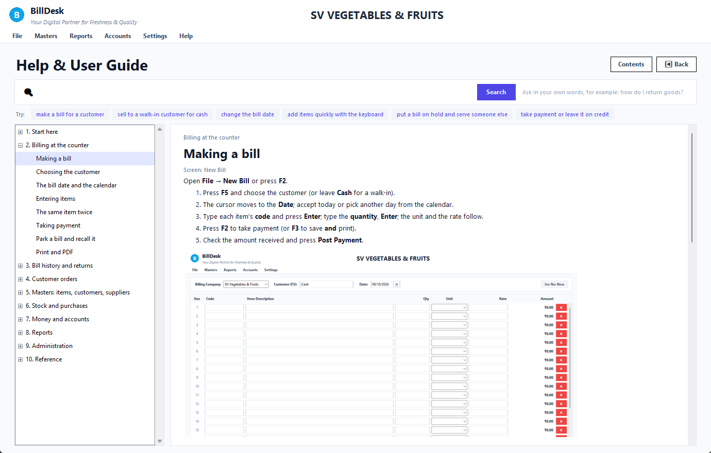

Typing a question lists the best topics first, with the first steps of each so you may not need to open it:

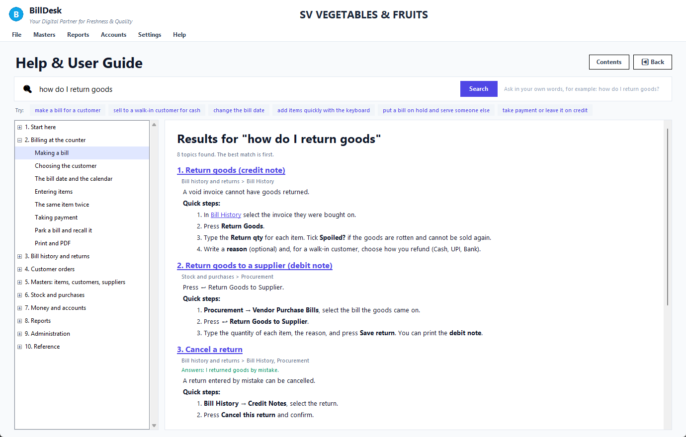

On paper, in Word, in the PDF or in the notebook, use **Ctrl+F** and the same words. The notebook edition also has a `ask("...")` search (see the last cell).

**Find it by what you want to do**

| I want to… | Go to |
|---|---|
| make a bill for a customer | [Making a bill](#new-bill-overview) |
| sell to a walk-in customer for cash | [Choosing the customer](#bill-customer) |
| change the bill date | [The bill date and the calendar](#bill-date) |
| add items quickly with the keyboard | [Entering items](#bill-items) |
| put a bill on hold and serve someone else | [Park a bill and recall it](#bill-park) |
| take payment or leave it on credit | [Taking payment](#bill-payment) |
| print or save an invoice or delivery challan | [Print and PDF](#bill-print) |
| find an old bill | [Bill History](#history) |
| see who has not paid | [Filtering bills](#history-filters) |
| cancel a bill I made by mistake | [Void a bill](#history-void) |
| take goods back from a customer | [Return goods (credit note)](#return-goods) |
| cancel a return I entered by mistake | [Cancel a return](#cancel-return) |
| print a credit note | [Credit notes](#credit-notes) |
| record a customer's order | [New customer order](#order-new) |
| read an order from a photo or WhatsApp image | [Smart Importer](#smart-importer) |
| turn an order into a bill | [Convert an order](#order-convert) |
| know how much to buy for tomorrow | [Order matrix](#order-matrix) |
| add a customer, item or supplier | [Customers](#customers), [Items](#items), [Suppliers](#suppliers) |
| give a customer a fixed rate | [Fixed contract rates](#fixed-rates) |
| correct stock after counting | [Stock adjustment](#stock-adjust) |
| write off rotten produce | [Waste and spoilage](#waste) |
| enter a supplier's bill | [Vendor bills](#vendor-bill) |
| send goods back to a supplier | [Return to supplier (debit note)](#purchase-return) |
| record money received from a customer | [Customer receipts](#receipt) |
| see what a customer owes, bill by bill | [Customer statement](#statement) |
| pay a supplier | [Supplier payments](#supplier-payment) |
| see today's money in and out | [Daybook](#daybook) |
| see which items sell best | [Item-wise sales](#item-wise) |
| count the cash drawer | [Cash drawer](#cash-drawer) |
| add a user or change who can do what | [Users and roles](#users) |
| change the company name, address or logo | [Company configuration](#company) |
| back up my data | [Backup and database](#backup) |
| check that the books add up | [Integrity check](#integrity) |
| understand an error message | [Messages and what to do](#messages) |

**Still stuck?** See [Frequently asked questions](#faq) and [Messages and what to do](#messages).

---

### What BillDesk does
<!-- id: what-is | screen: All | keywords: overview, about, what is billdesk, features, accounts, automatic, GST | related: dashboard, signing-in -->

BillDesk is a desktop program for the billing counter and the back office of a wholesale fruit and vegetable business. One program, one database, one set of numbers.

| You do this… | …and BillDesk automatically |
|---|---|
| Make a **bill** | reduces stock, adds to the customer's balance, records the sale and its cost in the accounts |
| Receive **payment** | reduces the customer's balance, records cash or bank in the accounts, closes the bill |
| Enter a **supplier bill** | adds what you owe the supplier (and TDS if it applies) |
| **Return goods** | credits the customer, puts good stock back, reverses the sale in the accounts |
| **Void** a bill | puts the stock back, reverses the balance and the accounts |
| Take a **customer order** | lists it in the order matrix so you know how much to buy, and turns it into a bill with one click |

GST is not used (fresh fruit and vegetables are exempt), so there is no tax set-up. A GSTIN can still be stored for a customer or supplier if you want it on file.

**Who sees what.** Menus depend on your role. Cashiers normally see Billing, Orders and Bill History; managers also see Masters, Reports and Accounts; administrators see everything including Settings. If a menu is missing, your role does not include it: ask the administrator ([Users and roles](#users)).

---

### Signing in
<!-- id: signing-in | screen: Login | keywords: login, sign in, username, password, forgot password, admin, first time, log out, logout, F12 | related: users, main-window, faq -->

1. Double-click **BillDesk** on the desktop or in the Start menu. The first start takes a few seconds because BillDesk starts its own database.
2. Type your **username** and **password**.
3. Press **Enter** or click **Login**.

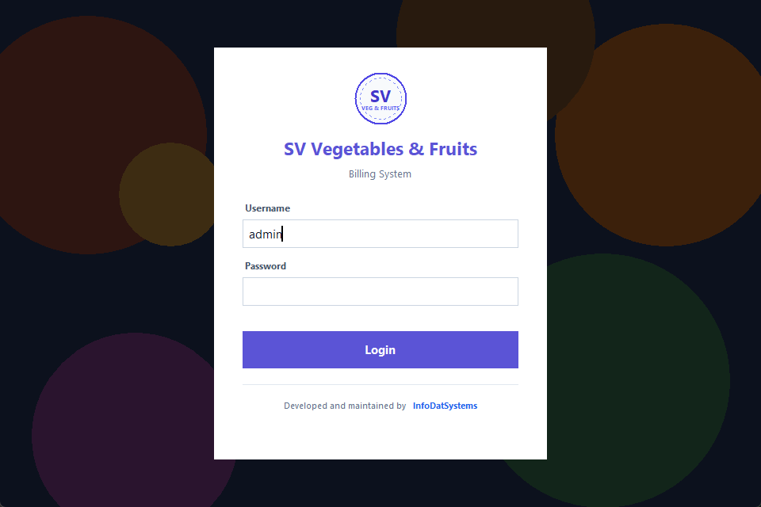

* **First time ever:** the installer creates one administrator named `admin` with a **random password shown once**. Write it down, then create the other users in [Users and roles](#users).
* **Forgot the administrator password?** Ask your IT person to run `python scripts\reset_password.py --user admin`.
* Only **one BillDesk window** can be open on a computer; if you start it twice, the second copy tells you.
* To sign out press **F12** (you are asked to confirm).

---

### Finding your way around
<!-- id: main-window | screen: Main window | keywords: menu, menu bar, navigation, layout, shortcut strip, keys, screens, where is | related: shortcuts, dashboard, start-here -->

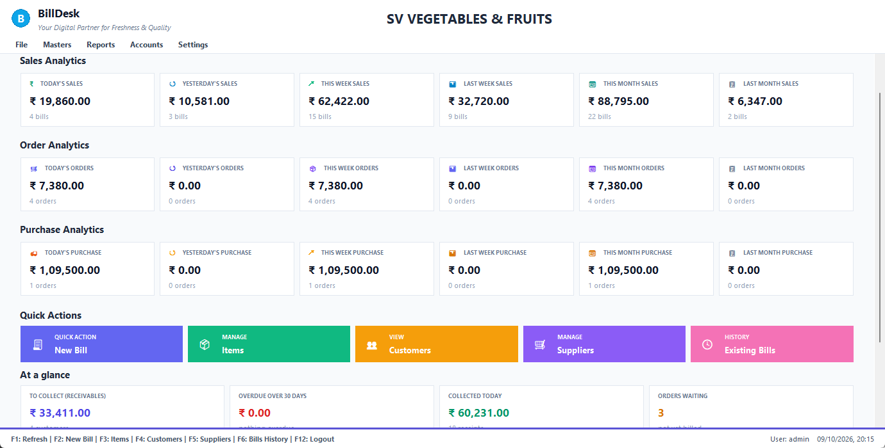

* **Top:** your company name and the menu bar.
* **Middle:** the screen you are working on.
* **Bottom strip:** the keys that work on this screen, who is signed in and the date and time.

| Menu | Contains |
|---|---|
| **File** | New Bill (F2), New Customer Order, Ordering System (Ctrl+O), Purchase system (Ctrl+P), Logout (F12), Exit |
| **Masters** | Item Master (F10), Customer Master (F4), Supplier Master (F5), Waste Management |
| **Reports** | Bills History (F6), Daybook, Item-wise Sales, Customer-wise Sales, Bills Consolidated Report, Order Consolidation, Fixed Rates Report, Profit & Loss, Balance Sheet, Dashboard (F1) |
| **Accounts** | Accounting Dashboard (Ctrl+D), Trial Balance, Profit & Loss, Balance Sheet, BRS, Handover & Settlement, Integrity Check, Accounts Receivables, Accounts Payables |
| **Settings** | User Management, Company Settings, Database Settings, System Audit Logs |
| **Help** | Help & User Guide (F9), Keyboard shortcuts, About |

Press **F9** on any screen for help about that screen. All shortcut keys are listed in [Keyboard shortcuts](#shortcuts).

---

### The dashboard
<!-- id: dashboard | screen: Dashboard | keywords: dashboard, home, sales today, analytics, cards, quick actions, at a glance, receivables, overdue, collected today, F1 | context: Dashboard | related: new-bill-overview, receivables, daybook -->

The dashboard is the first screen after you sign in. Press **F1** from anywhere to come back to it (the figures are re-read each time).

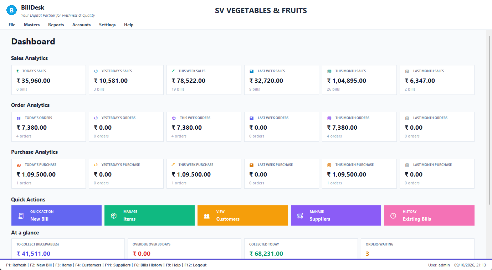

* **Sales, Order and Purchase Analytics:** six small cards each: today, yesterday, this week, last week, this month, last month. Every card shows the amount and how many bills or orders it covers.
* **Quick Actions:** big buttons for **New Bill**, **Items**, **Customers**, **Suppliers** and **Existing Bills**.
* **At a glance** (scroll down):

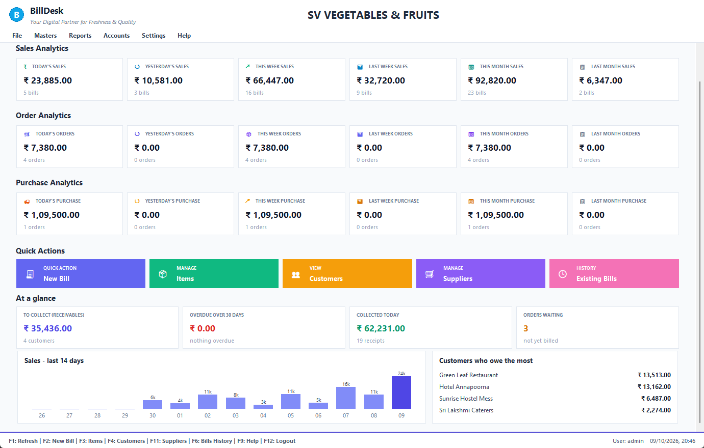

| Card | Meaning |
|---|---|
| **To collect (receivables)** | everything customers owe you now (customers who have paid in advance are shown separately as "advances held", not subtracted) |
| **Overdue over 30 days** | the part of that which is older than 30 days |
| **Collected today** | receipts recorded today |
| **Orders waiting** | customer orders not yet billed |
| **Sales – last 14 days** | one bar per day |
| **Customers who owe the most** | the top four balances |

---

## Chapter 2. Billing at the counter
<!-- chapter: billing | title: Billing at the counter -->

### Making a bill
<!-- id: new-bill-overview | screen: New Bill | keywords: new bill, invoice, billing, sale, make a bill, counter, F2, grid, cash bill, credit bill, how to bill | context: New Bill | related: bill-customer, bill-date, bill-items, bill-payment -->

Open **File → New Bill** or press **F2**.

1. Press **F5** and choose the customer (or leave **Cash** for a walk-in).
2. The cursor moves to the **Date**; accept today or pick another day from the calendar.
3. Type each item's **code** and press **Enter**; type the **quantity**, **Enter**; the unit and the rate follow.
4. Press **F2** to take payment (or **F3** to save **and** print).
5. Check the amount received and press **Post Payment**.

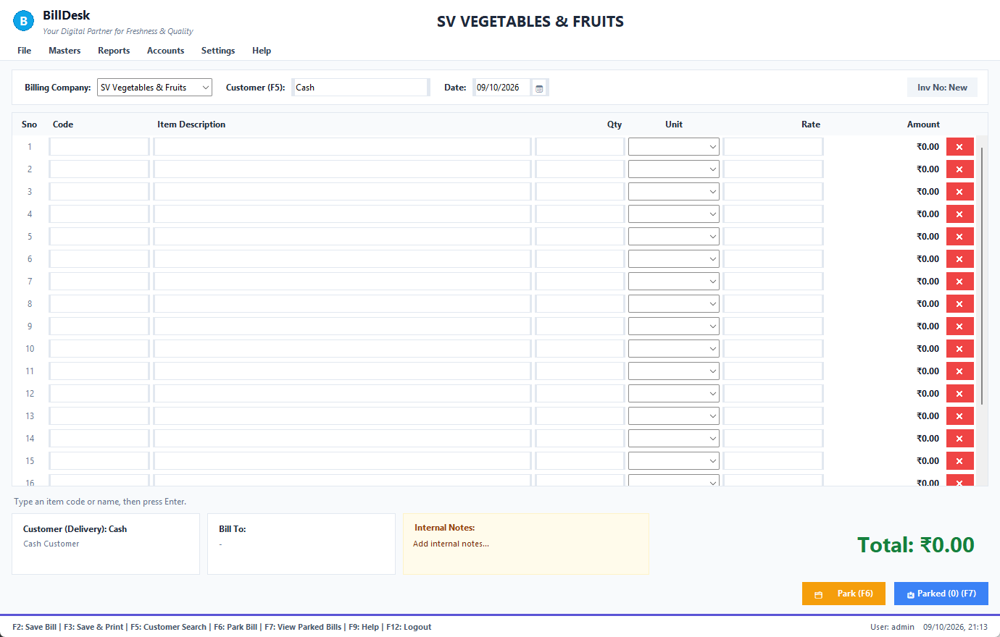

| Part of the screen | What it is |
|---|---|
| **Billing Company** | which of your companies the invoice is issued under |
| **Customer (F5)** | who the bill is for ([choosing the customer](#bill-customer)) |
| **Date** | the bill date, with a drop-down calendar ([dates](#bill-date)) |
| **The grid** | one row per item: Code, Item Description, Qty, Unit, Rate, Amount, and a red **✕** to clear the row |
| **Line under the grid** | stock and rate of the item you just entered ([the hint line](#bill-items)) |
| **Customer (Delivery) / Bill To** | where the goods go and who is invoiced |
| **Internal Notes** | for your own use, not printed |
| **Total** | the bill total |
| **Park (F6) / Parked (F7)** | put a bill on hold, or bring one back |

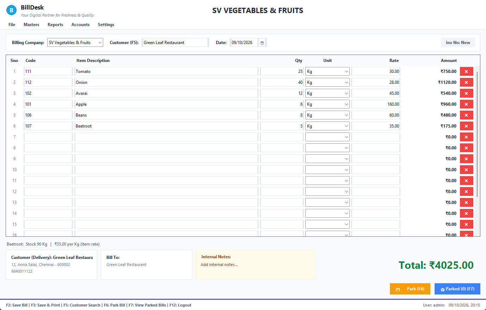

---

### Choosing the customer
<!-- id: bill-customer | screen: New Bill | keywords: customer, F5, search customer, cash customer, walk-in, cash sale, pick customer, select customer | context: | related: new-bill-overview, bill-date, customers -->

Press **F5** (or click the customer box).

1. Type part of the customer's name or phone number: the list narrows as you type.
2. Press **↓** or **↑** to move, **Enter** to choose. (Esc closes the list; a click also chooses.)
3. Choose **Cash Customer** for a walk-in sale.

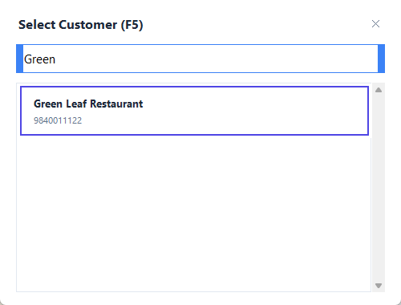

* The customer's address, their "bill to" name and their company are filled in for you, and any **fixed contract rates** for that customer are used.
* The same dialog is used on [New customer order](#order-new), so it works the same everywhere. Orders need a real customer (no Cash option there).
* A customer who is not in the list must be added first in the [Customer Master](#customers).

---

### The bill date and the calendar
<!-- id: bill-date | screen: New Bill | keywords: date, calendar, bill date, back date, previous day, date picker, wrong date, future date | related: dates-everywhere, bill-items -->

Right after you choose the customer the cursor goes to **Date** and a **calendar drops down** under it.

1. Click a day, or use the arrow keys and press **Enter**. **Today** jumps to today.
2. Or type a date (`13/10/2026`, `13-10-26`) and press **Enter**.
3. The cursor moves on to the first empty row of the grid.

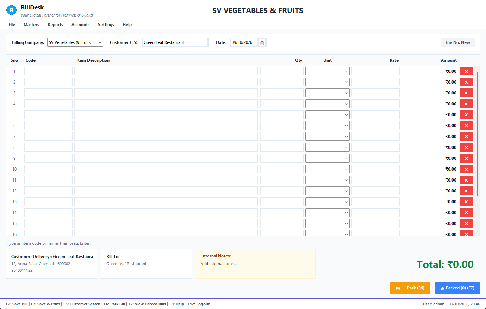

* The date you choose **is the date of the bill** and its invoice number follows that day (`20261005-0003` for 5 October).
* A bill cannot be dated in the future.
* More about date boxes everywhere in the program: [Dates and the calendar](#dates-everywhere).

---

### Entering items
<!-- id: bill-items | screen: New Bill | keywords: items, code, quantity, qty, unit, rate, enter key, keyboard, hint line, stock, fixed rate, wrong item, choose item, which item | related: bill-duplicate, bill-payment, fixed-rates -->

Work row by row with the keyboard: **Code → Qty → Unit → Rate → next row**, pressing **Enter** each time.

1. Type the item **code** (for example `111`) or a part of its **name** (`tom`), press **Enter**. The description, unit and rate appear and the cursor goes to **Qty** (1 is filled in).
2. Type the **quantity**, press **Enter**. The cursor passes through **Unit** to **Rate**.
3. Change the **rate** if you need to; press **Enter** to go to the next row.

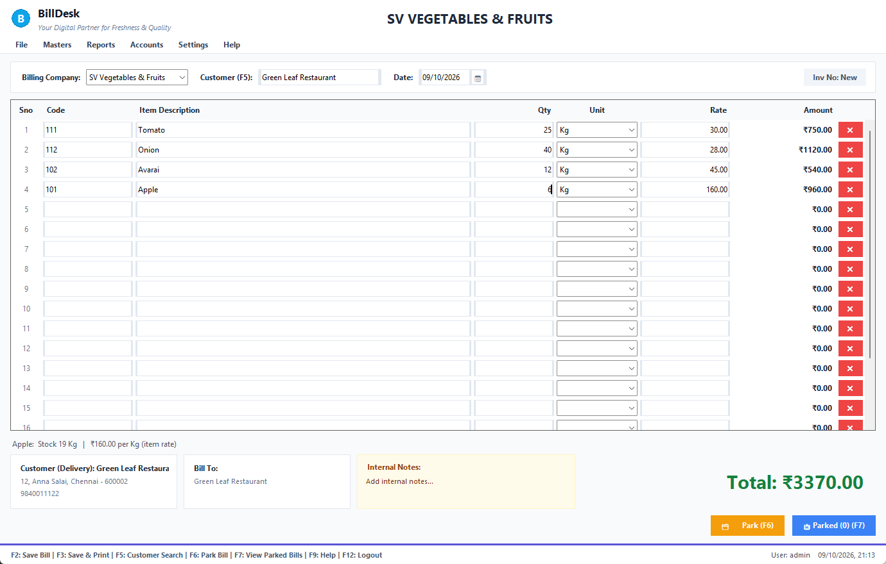

* **The hint line** under the grid tells you the item, its stock ("No stock recorded" if stock is not tracked for it) and the rate and where it came from: *fixed rate for <customer>* or *item rate*.
* **Several items fit what you typed?** A list opens: **↑ / ↓** to move, **Enter** to choose, **Esc** to cancel. BillDesk never picks the first match for you.

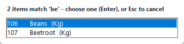

* An item typed in a lower row **moves up** to the first empty row, so there are never gaps.
* The red **✕** clears a row and the rows below move up.
* You can sell more than the stock shows; BillDesk warns but does not stop you (your administrator can change this).
* Quantity and rate must be numbers; a bill cannot have a zero quantity or a negative rate.

---

### The same item twice
<!-- id: bill-duplicate | screen: New Bill | keywords: duplicate, same item twice, add quantity, repeated item | related: bill-items -->

If you type an item that is already on the bill, BillDesk asks what to do.

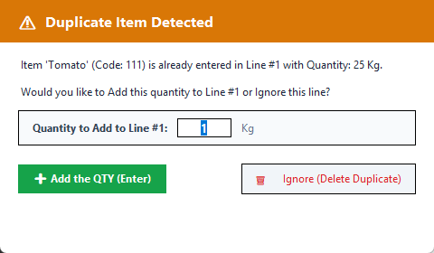

* **Add the QTY (Enter)** adds the new quantity to the existing row.
* **Ignore (Delete Duplicate)** removes the new row.

---

### Taking payment
<!-- id: bill-payment | screen: New Bill | keywords: payment, pay, post payment, F2, F3, amount received, cash, UPI, cheque, credit, due, balance, outstanding, save bill, reference, UTR | related: bill-print, receipt, statement -->

1. Press **F2** (save) or **F3** (save and print).
2. The amount received is filled in with the whole total. Change it if the customer pays part.
3. Choose the **payment method** and, for UPI or a cheque, the **reference**.
4. Press **Enter** or **Post Payment**.

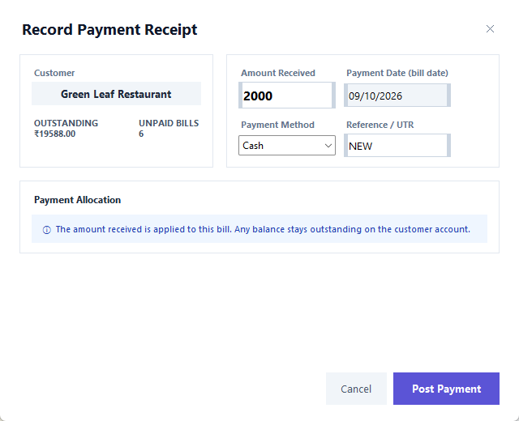

| Box | Meaning |
|---|---|
| **Outstanding / Unpaid bills** | what this customer already owes before this bill |
| **Amount Received** | what the customer pays now; anything not paid stays on their account |
| **Payment Date** | shown for information: a counter payment is recorded on the bill's date |
| **Payment Method** | Cash, UPI, Cheque, NEFT/RTGS, or **Credit/Due** (nothing paid now) |
| **Reference / UTR** | UPI or cheque number (optional) |

* You cannot receive more than the bill total.
* After posting, the sheet is cleared for the next bill. With **F3** the invoice opens for printing.
* Later payments are recorded as a [customer receipt](#receipt).

---

### Park a bill and recall it
<!-- id: bill-park | screen: New Bill | keywords: park, hold, recall, parked bills, F6, F7, pause, wait, serve another customer | related: new-bill-overview -->

Serving two customers at once? Put one aside.

1. Press **F6** (or **Park**) with the items entered. The sheet clears.
2. Serve the next customer.
3. Press **F7** (or **Parked (n)**), click the parked bill to bring it back. If another bill is on the sheet you are asked before it is replaced.

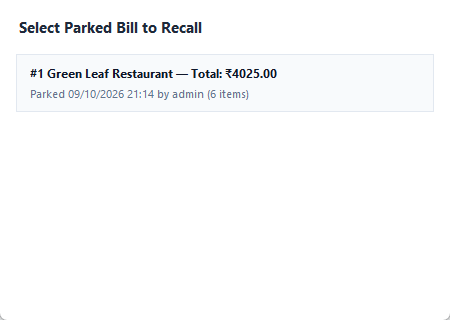

Parked bills are kept on disk: they survive closing BillDesk or a power cut.

---

### Print and PDF
<!-- id: bill-print | screen: New Bill, Bill History | keywords: print, invoice, delivery challan, DC, pdf, preview, save pdf, printer, copy | related: bill-payment, history-view -->

After **F3**, or from [Bill History](#history), the invoice opens in the **print preview**.

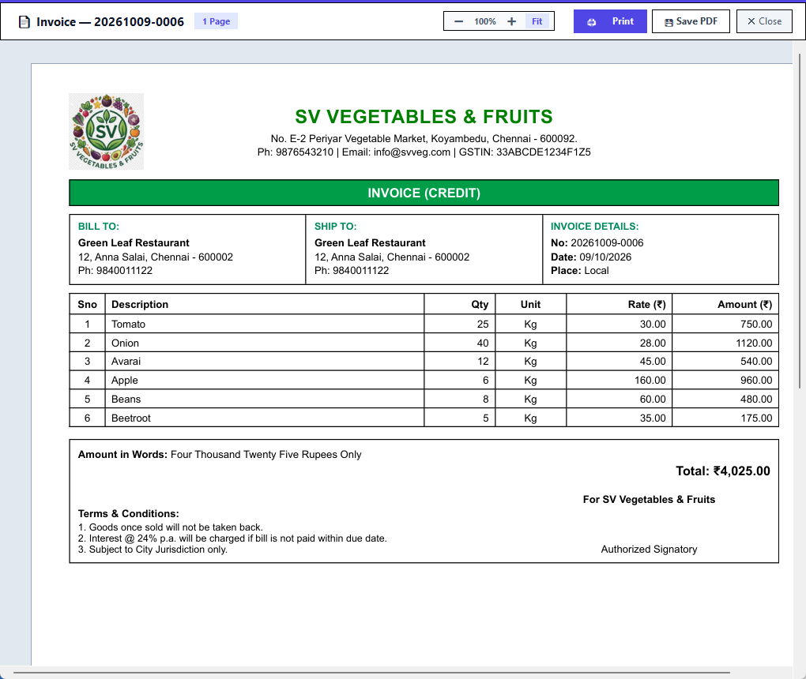

* **− / + / Fit** change the zoom; **Print** sends it to the printer; **Save PDF** saves a file; **Close** leaves.
* The **invoice** shows the company, customer, items with rates and amounts, the total in words and your terms:

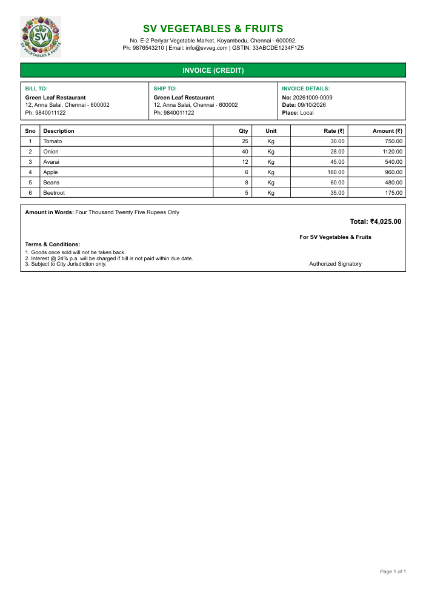

* The **delivery challan (DC)** is the same bill **without prices**, for the driver and the customer's receiving staff:

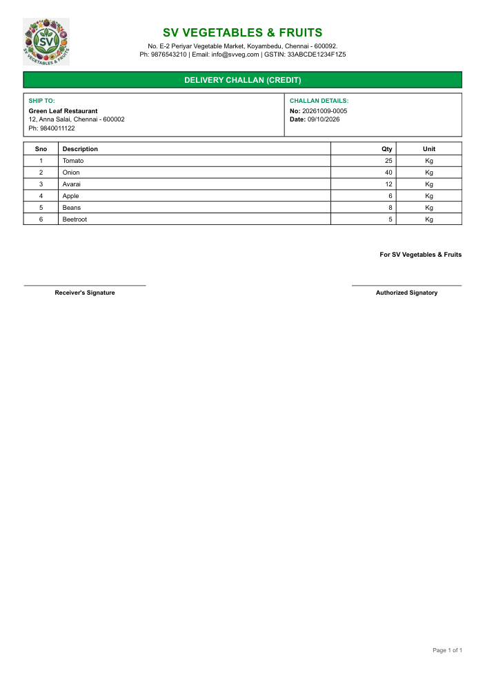

---

## Chapter 3. Bill history and returns
<!-- chapter: history | title: Bill history and returns -->

### Bill History
<!-- id: history | screen: Bill History | keywords: bill history, old bills, find bill, search bill, invoices, F6, list of bills, today's bills | context: Bill History | related: history-filters, history-view, history-void, return-goods -->

Open **Reports → Bills History** or press **F6**.

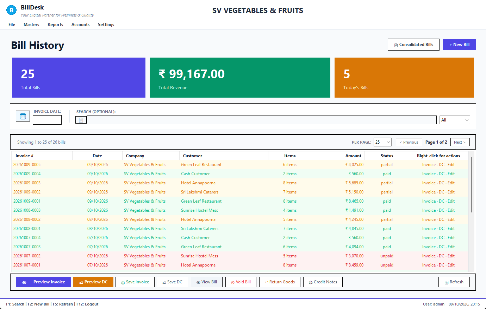

* The three coloured cards show the number of bills, total sales and today's bills.
* The table lists the newest bills first: invoice number, date, company, customer, number of items, amount and **status**.
* Select a bill, then use the buttons at the bottom (or **right-click** it):

| Button | What it does |
|---|---|
| **Preview Invoice / Preview DC** | opens the invoice or the delivery challan |
| **Save Invoice / Save DC** | saves the PDF |
| **View Bill** | shows the bill's details |
| **Void Bill** | cancels the bill ([void](#history-void)) |
| **Return Goods** | takes goods back ([return](#return-goods)) |
| **Credit Notes** | lists and prints the returns on this bill ([credit notes](#credit-notes)) |
| **Refresh** | reloads the list |

* **Per page** and **Previous / Next** move through long lists.

---

### Searching and filtering bills
<!-- id: history-filters | screen: Bill History | keywords: filter, search, status, paid, unpaid, partial, void, legacy, date filter, find unpaid bills, who has not paid, outstanding bills | related: history, statement, receivables -->

* **Search** (F1): type part of an invoice number or customer name.
* **Status list:** All, **Unpaid**, **Partial**, **Paid**, **Void** or **Legacy**.

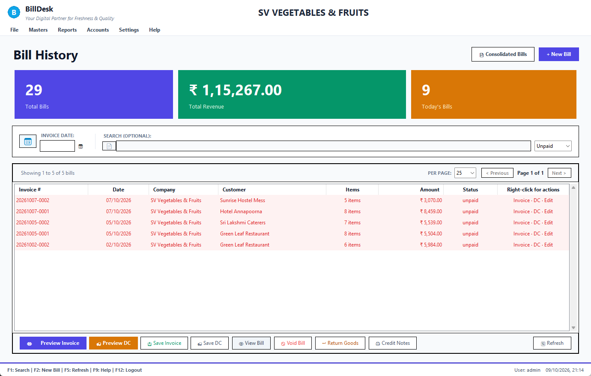

* **Invoice date:** click the box and pick a day from the calendar; **Reset Date** clears it. You can also type part of a date (`09/2026`) to see a month.

| Status | Meaning |
|---|---|
| **paid** | fully paid |
| **unpaid / partial** | nothing / part paid; the rest is due |
| **void** | cancelled |
| **legacy** | bills made by the older program: it did not track payment per bill; their money is in the customer's balance |

To see what a customer owes bill by bill use the [customer statement](#statement).

---

### Viewing a bill
<!-- id: history-view | screen: Bill History | keywords: view bill, bill details, items on bill, double click | related: history, bill-print -->

Double-click a bill (or select it and press **View Bill**).

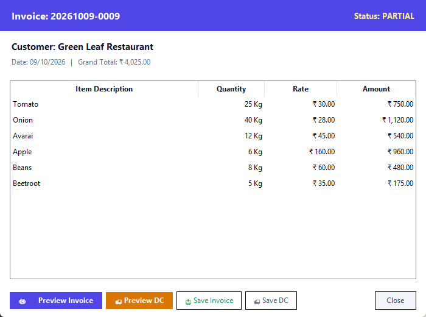

It shows the customer, date, status, the items with quantity, rate and amount and the grand total, with buttons to preview or save the invoice and the challan.

---

### Void a bill
<!-- id: history-void | screen: Bill History | keywords: void, cancel bill, delete bill, wrong bill, mistake, reverse bill, undo bill | related: return-goods, history | -->

A bill made by mistake is **voided**, not deleted, so the record and the invoice number stay.

1. Open [Bill History](#history) and select the bill.
2. Press **Void Bill**.
3. Read what will happen and confirm.

Voiding: reverses the customer's balance, puts the stock back, reverses the crates and the accounts, and marks the bill **void**. Payments that had been allocated to it become the customer's **advance** (credit).

* A bill that has goods returned against it **cannot be voided**: [cancel the return](#cancel-return) first.
* A voided bill cannot be voided twice.
* To take back only some goods, use [Return goods](#return-goods), not void.

---

### Return goods (credit note)
<!-- id: return-goods | screen: Bill History | keywords: return, return goods, credit note, goods back, customer returned, rotten, damaged, refund, take back, spoiled, sales return | related: credit-notes, cancel-return, history-void, statement -->

A customer brings goods back.

1. In [Bill History](#history) select the invoice they were bought on.
2. Press **Return Goods**.
3. Type the **Return qty** for each item. Tick **Spoiled?** if the goods are rotten and cannot be sold again.
4. Write a **reason** (optional) and, for a walk-in customer, choose how you refund (Cash, UPI, Bank).
5. Press **Save return**. You are offered the **credit note** to print.

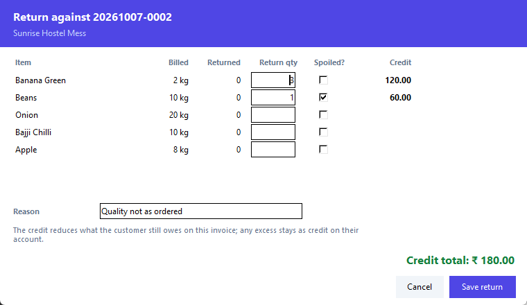

What happens:

| | Good goods | Spoiled goods |
|---|---|---|
| Customer is credited at the rate billed | yes | yes |
| Goes back into stock | yes, at the cost it was sold at | no |
| Sales are reduced in the accounts | yes | yes |

* The credit first reduces **what the customer still owes on that invoice**; anything more stays as **credit on their account** (shown as *Cr* in the customer list).
* You cannot return more than was billed minus what was already returned.
* A void invoice cannot have goods returned.
* A walk-in customer is refunded from the cash drawer or bank.

---

### Credit notes
<!-- id: credit-notes | screen: Bill History | keywords: credit note, print credit note, reprint, list of returns, credit note pdf | related: return-goods, cancel-return -->

**Bill History → Credit Notes** lists the returns made on the selected invoice, each with its number, date and amount.

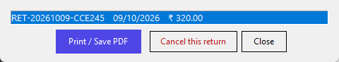

Select one and press **Print / Save PDF**. The credit note shows each item, whether it was good or spoiled, the total in words and how the credit was applied.

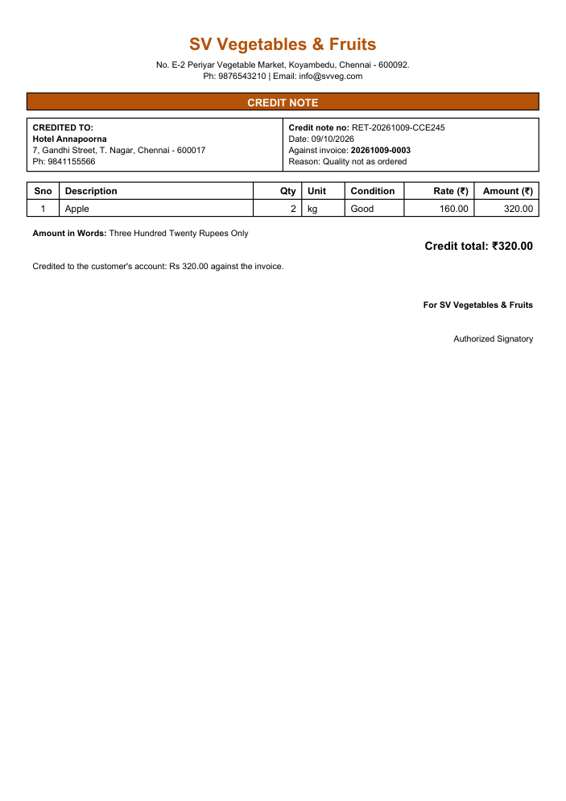

---

### Cancel a return
<!-- id: cancel-return | screen: Bill History, Procurement | keywords: cancel return, undo return, return by mistake, cancel credit note, cancel debit note, reverse return | related: return-goods, purchase-return, credit-notes -->

A return entered by mistake can be cancelled.

1. **Bill History → Credit Notes**, select the return.
2. Press **Cancel this return** and confirm.

BillDesk puts back the customer's balance, the invoice's balance due, the stock and the accounts exactly as they were; the credit note stays on file, marked **cancelled**, and no longer counts anywhere. The whole quantity can be returned again afterwards.

* A return can be cancelled once only.
* Returns made by the older program cannot be cancelled here.
* A supplier return (debit note) is cancelled from **Procurement → Returns to Suppliers → Cancel Debit Note** ([purchase return](#purchase-return)).

---

## Chapter 4. Customer orders
<!-- chapter: orders | title: Customer orders -->

### Orders and shipments
<!-- id: orders-list | screen: Orders | keywords: orders, order list, pending orders, orders and shipments, Ctrl+O, edit order, cancel order, print order | context: Orders | related: order-new, order-convert, order-matrix -->

Open **File → Ordering System** or press **Ctrl+O**.

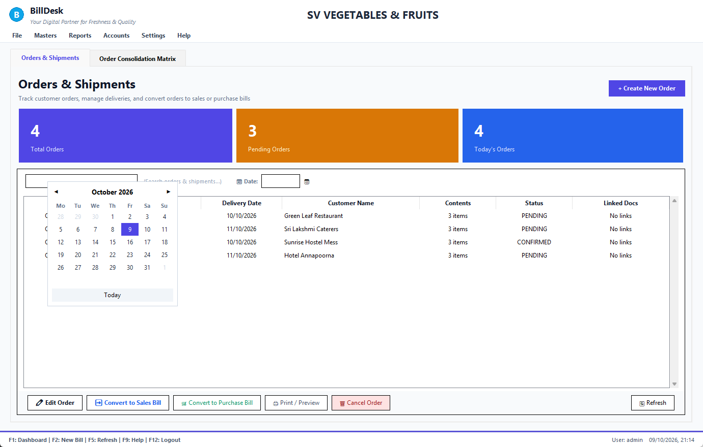

* The cards show total, pending and today's orders.
* **Search** by order number or customer; the **Date** box filters by order date (pick it from the calendar).

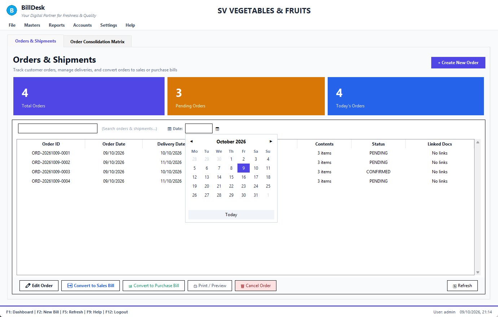

| Button | What it does |
|---|---|
| **+ Create New Order** | opens the [order form](#order-new) |
| **Edit Order** | changes an order that is not yet billed |
| **Convert to Sales Bill** | makes the bill from the order ([convert](#order-convert)) |
| **Convert to Purchase Bill** | turns the order into a purchase from a supplier |
| **Print / Preview** | prints the order as a challan |
| **Cancel Order** | cancels an order that has not been billed |

Status: **pending**, **confirmed**, **billed**, **cancelled**.

---

### New customer order
<!-- id: order-new | screen: New Order | keywords: new order, create order, customer order, order form, F3, F5, F8, delivery date, crates, save order, whatsapp order | context: New Order | related: order-dates, smart-importer, order-convert -->

Press **+ Create New Order** on the Orders screen, or **File → New Customer Order**.

1. Press **F5** and choose the customer.
2. The cursor goes to the **order date**, then the **delivery date**, then the first empty row of the items.
3. Enter the items exactly as on a bill (code, quantity, unit, rate).
4. Enter **Crates out / in** if returnable crates go with the order.
5. Press **F3** to save (or **F10** to save and print).

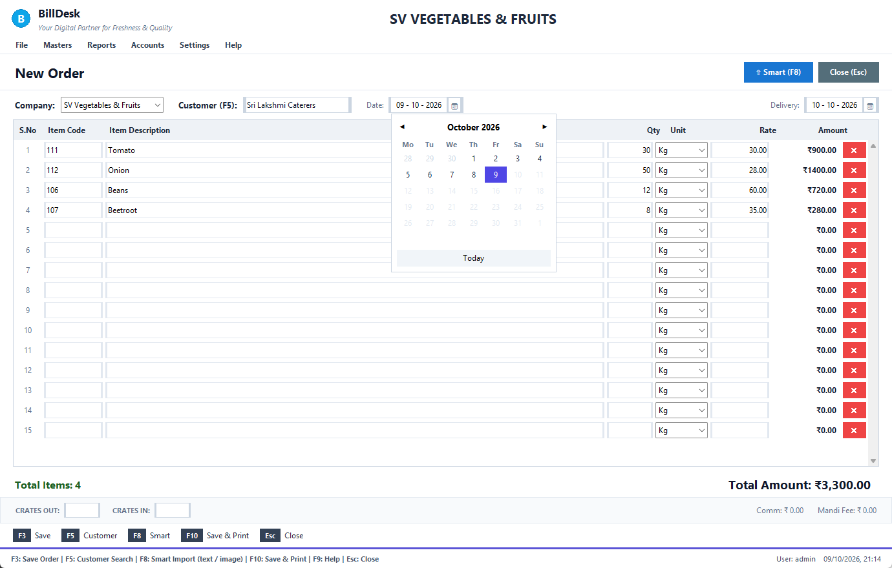

| Key | Does |
|---|---|
| **F3** | save the order (F2 does the same) |
| **F5** | choose the customer, from any box |
| **F8** | [Smart Importer](#smart-importer): read the order from a photo or text |
| **F10** | save and print |
| **Esc** | close the form |

* Orders need a customer from the customer master.
* The commission and mandi fee shown at the bottom come from your settings (both are zero unless your administrator sets them).

---

### Order and delivery dates
<!-- id: order-dates | screen: New Order | keywords: order date, delivery date, calendar, delivery tomorrow, date before, invalid date | related: order-new, dates-everywhere -->

Both date boxes drop down the calendar when you click them or reach them with the keyboard.

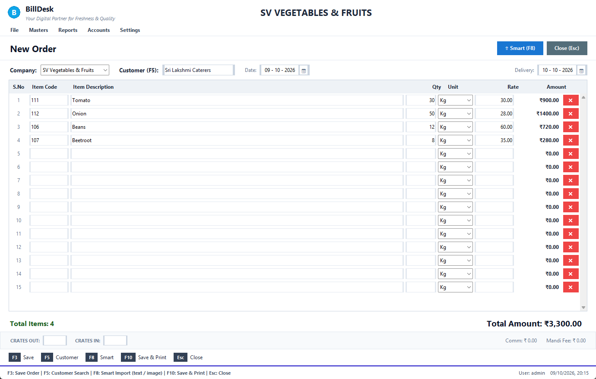

* The **order date** cannot be in the future.
* The **delivery date** cannot be before the order date (those days are greyed out in the calendar). It starts as tomorrow.
* Both are required; an unusable date turns red and the form tells you which one when you save.

---

### Smart Importer (photo, scan or text)
<!-- id: smart-importer | screen: New Order | keywords: smart importer, F8, ocr, photo, image, scan, tesseract, tamil, translate, whatsapp, handwritten, read order from picture, upload image | related: text-importer, order-new -->

Customers send orders as photos or messages. **F8** on the order form reads them for you.

1. Press **F8**.
2. Press **Upload Image…** and choose the photo or scan (PNG, JPG, BMP, TIFF, WebP).
3. Wait a few seconds: the picture shows on the left and what was read on the right.
4. Check the **customer**, the **date** and every row. A row marked **? (choose item)** could not be matched: **double-click** it to pick the item, correct the quantity or unit, or remove the line.
5. Press **Import to Grid**. The items go into the order; check the quantities, then save with **F3**.

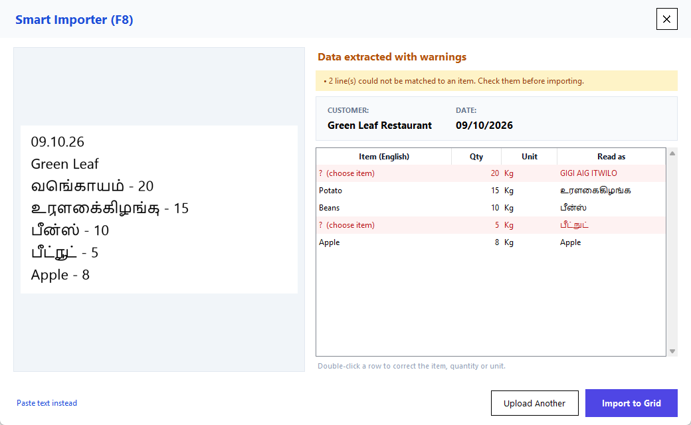

* BillDesk reads **English and Tamil** (and Hindi, Telugu, Kannada, Malayalam) with the built-in Tesseract reader, converts Tamil numerals, **translates the item names to English** and matches them to your Item Master.
* The date and the customer at the top of the note are picked up too.
* **Printed or typed** orders read well. **Handwriting is hard for this kind of reader**: if nothing can be read the window says so instead of guessing. Use a straight, bright photo, or type the lines with **Paste text instead**.
* The same item twice in one order is added together.

---

### Importing order text
<!-- id: text-importer | screen: New Order | keywords: paste text, whatsapp text, text importer, import file, csv, parse | related: smart-importer, order-new -->

For orders that arrive as text (WhatsApp, SMS): in the Smart Importer choose **Paste text instead**.

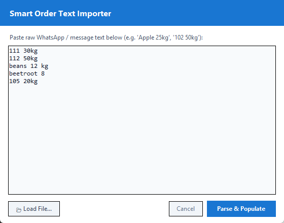

1. Paste the message, one item per line: `111 30kg`, `beans 12 kg`, `105 20`.
2. Press **Parse & Populate** (or **Load File…** for a `.txt` / `.csv`).

Item codes and names both work, in either order with the quantity. Lines that cannot be matched to an item are **not** guessed: they are listed so you can add them by hand.

---

### Convert an order to a bill
<!-- id: order-convert | screen: Orders | keywords: convert order, order to bill, make bill from order, billed, deliver order, purchase from order | related: orders-list, new-bill-overview -->

1. On **Orders**, select the order.
2. Press **Convert to Sales Bill**.

The bill is made with the order's items and rates and the order becomes **billed**, linked to the invoice (shown in **Linked Docs**). A billed order cannot be converted again. **Convert to Purchase Bill** does the same for buying the goods from a supplier.

---

### Order matrix: how much to buy
<!-- id: order-matrix | screen: Order Matrix | keywords: order matrix, consolidation, how much to buy, shortfall, to purchase, items to procure, delivery date, demand | context: Order Matrix | related: orders-list, inventory -->

**Reports → Order Consolidation** adds up all pending orders: one row per item, one column per customer, then the **total order**, **current stock** and **to purchase**.

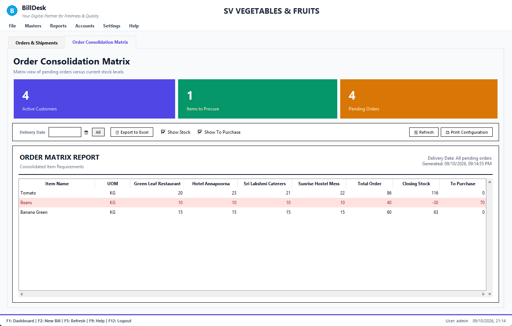

* **Delivery Date** limits the matrix to orders due on that day (pick it from the calendar); **All** shows every pending order.

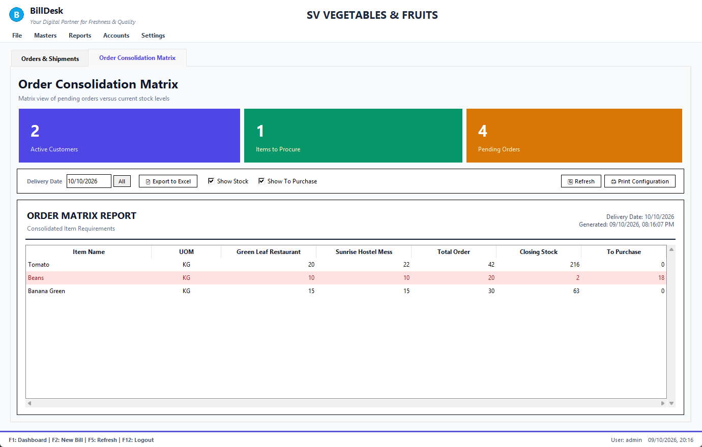

* **Show Stock** and **Show To Purchase** switch those columns; **Export to Excel** and **Print Configuration** produce a copy.

---

## Chapter 5. Masters: items, customers, suppliers
<!-- chapter: masters | title: Masters: items, customers, suppliers -->

### Items
<!-- id: items | screen: Item Master | keywords: items, item master, add item, product, code, alias, rate, unit, stock, F10, new item, edit item | context: Item Master | related: fixed-rates, field-rules -->

**Masters → Item Master** (**F10**).

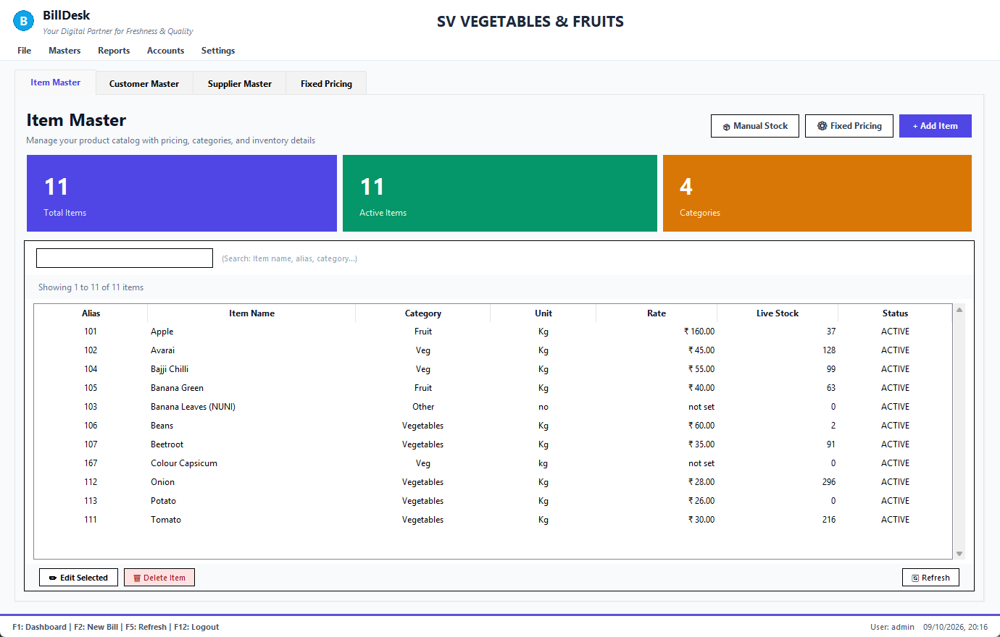

1. Press **+ Add Item**.
2. Fill the form and press **Save Item**. To change an item, double-click it (or **Edit Selected**).

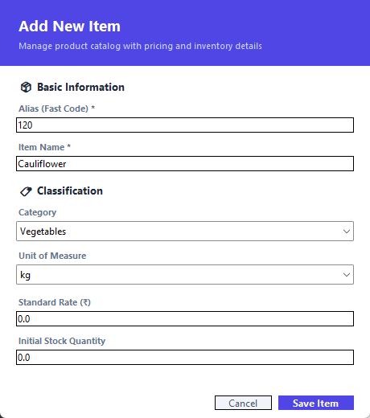

| Box | Meaning |
|---|---|
| **Alias (Fast Code)** | the short code you type when billing (`111`); no spaces, unique |
| **Item Name** | up to 80 characters; two items cannot have the same name |
| **Category / Unit of Measure** | for grouping; the unit appears on the bill |
| **Standard Rate (₹)** | the rate used when a customer has no fixed rate (0 or more) |
| **Initial Stock Quantity** | opening quantity (0 or more) |

---

### Customers
<!-- id: customers | screen: Customer Master | keywords: customers, customer master, add customer, phone, address, credit limit, balance, advance, Dr, Cr, edit customer, F4, statement, GSTIN | context: Customer Master | related: statement, fixed-rates, field-rules -->

**Masters → Customer Master** (**F4**).

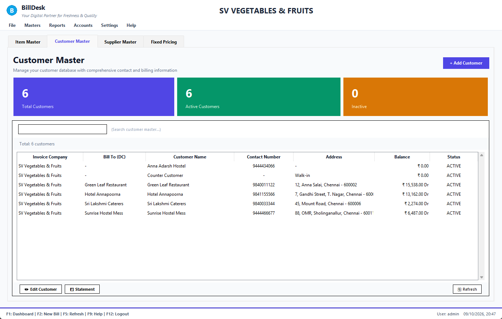

* **Balance** shows **Dr** when the customer owes you and **Cr** when you hold their advance or a return credit.
* Buttons: **+ Add Customer**, **Edit Customer**, **Statement** (the customer's account, bill by bill: [statement](#statement)) and **Refresh**.

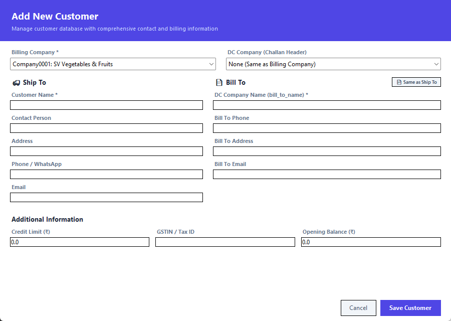

* **Customer Name** (ship-to) and **DC Company Name** (the "bill to") can differ: goods go to one place, the invoice to another company. Invoices and the consolidated report use both.
* Phone: 7 to 15 digits, up to three numbers separated by commas. Email and GSTIN are optional but checked when given (GSTIN is 15 letters or digits). Names must be unique.
* **Credit limit** and **Opening balance** must be numbers. A customer's balance is changed only by bills, receipts and returns, never by editing the form.

---

### Suppliers
<!-- id: suppliers | screen: Supplier Master | keywords: suppliers, vendors, supplier master, add supplier, TDS, farmer, F5, edit supplier | context: Supplier Master | related: vendor-bill, supplier-payment -->

**Masters → Supplier Master**.

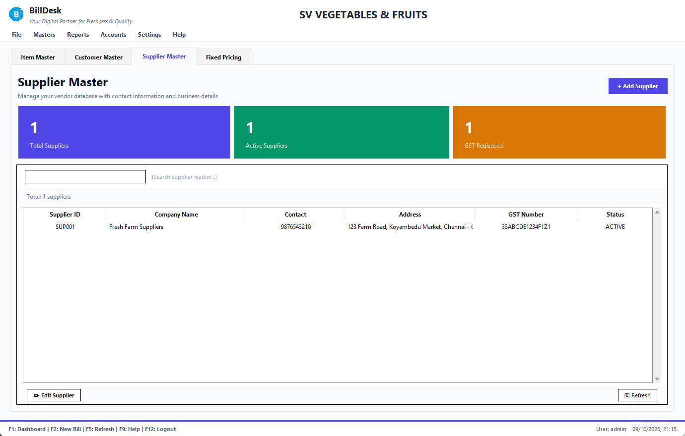

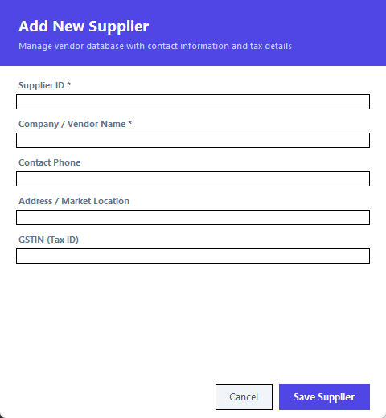

Name, phone, address and GSTIN (optional) as for customers. If **TDS applies** to the supplier, set the **TDS rate** (0 to 100): vendor bills then deduct it automatically.

---

### Fixed contract rates
<!-- id: fixed-rates | screen: Fixed Rates | keywords: fixed rate, contract rate, special price, agreed price, customer price, validity, start date, end date | context: Fixed Rates | related: items, customers, bill-items -->

A customer with an agreed price for an item gets that rate automatically on every bill and order while the contract is valid.

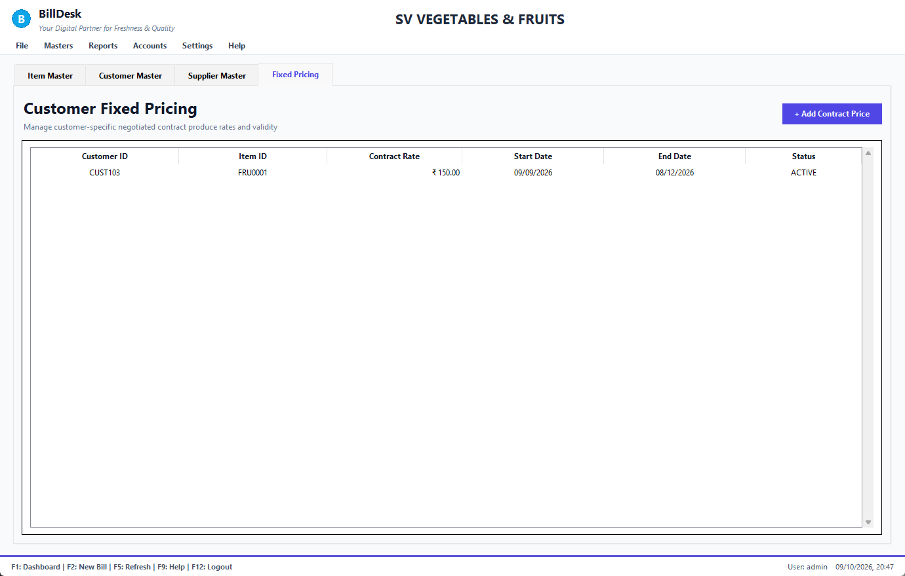

1. **Reports → Fixed Rates Report**, press **+ Add Contract Price**.
2. Enter the **customer ID**, the **item ID or code** and the **rate** (must be above zero).
3. Pick the **start** and **end dates** from the calendars (the end cannot be before the start).
4. Press **Save Price**.

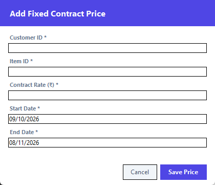

A new price for the same customer and item replaces the old one. The billing hint line says *fixed rate for <customer>* when one is used.

---

## Chapter 6. Stock and purchases
<!-- chapter: stock | title: Stock and purchases -->

### Inventory: live stock
<!-- id: inventory | screen: Inventory | keywords: inventory, stock, live stock, godown, quantity on hand, stock overview, movements, history | context: Inventory; Waste Management | related: stock-adjust, waste, crates -->

**Masters → Waste Management** opens the inventory screen with four tabs.

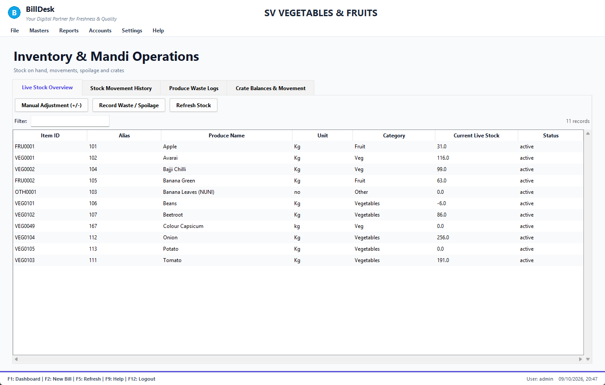

* **Live Stock Overview:** every item with its quantity on hand.
* **Stock Movement History:** every sale, return, goods receipt, adjustment and waste that changed stock, with date and reference.

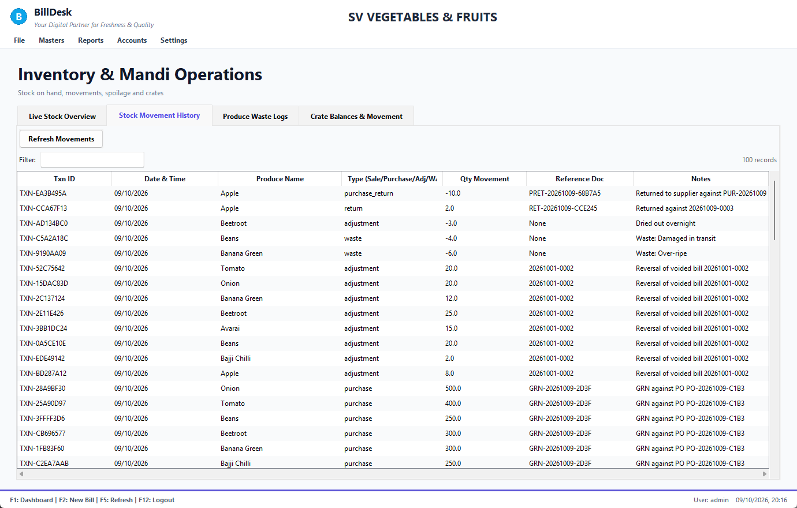

* **Produce Waste Logs** and **Crate Balances** are described next.
* Stock for an item may show 0 if you never entered it: BillDesk then does not block sales. Goods receipts and adjustments start it.

---

### Stock adjustment (after counting)
<!-- id: stock-adjust | screen: Inventory | keywords: stock adjustment, stock count, correct stock, adjust quantity, physical count, add stock, reduce stock | related: inventory, waste -->

1. Select the item on **Live Stock Overview**.
2. Press **Manual Adjustment (+/-)**.
3. Type the change (`+5` to add, `-3` to reduce) and the **reason** (required for the audit trail).
4. Press **Commit Adjustment**.

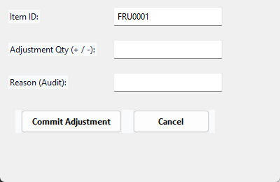

* The item can be entered by its **id or its code**.
* Stock cannot go below zero by adjusting; the quantity must be a number.

---

### Waste and spoilage
<!-- id: waste | screen: Inventory | keywords: waste, spoilage, spoiled, rotten, damaged, write off, loss, wastage | context: | related: stock-adjust, return-goods, inventory -->

Produce that rots or is damaged is **recorded as waste**, so it reduces stock and shows as a loss in your profit and loss.

1. Select the item, press **Record Waste / Spoilage**.
2. Enter the **quantity**, the **estimated cost rate** and the **reason** (Rotten, Crushed…).
3. Press **Record Waste**.

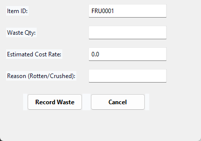

The **Produce Waste Logs** tab lists them:

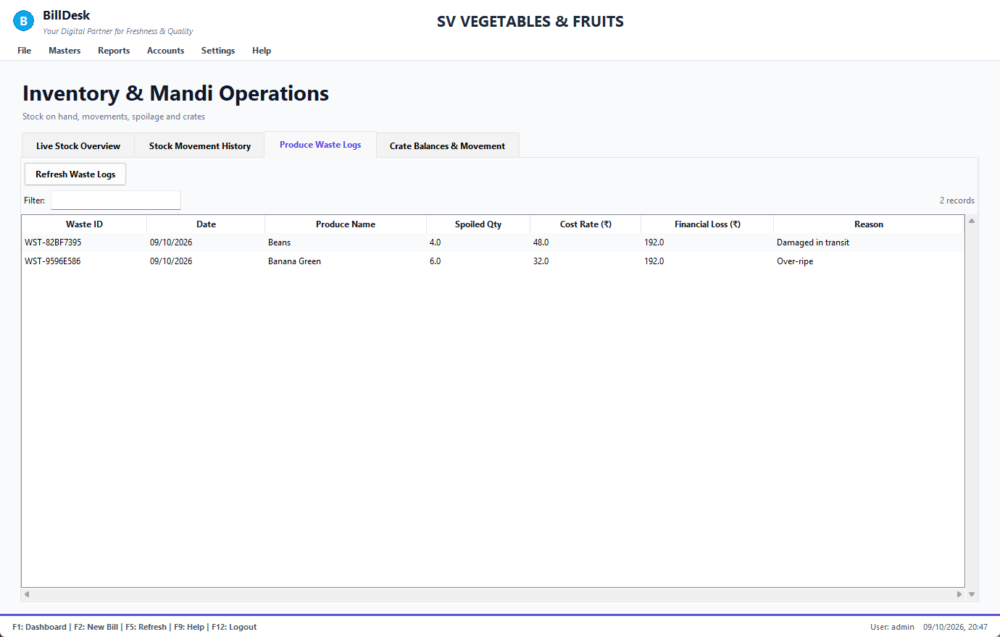

If the stock is tracked you cannot waste more than is on hand. Goods a **customer** returns as spoiled are handled by [Return goods](#return-goods), not here.

---

### Crates
<!-- id: crates | screen: Inventory | keywords: crates, jali, returnable, crate balance, crates out, crates in | related: order-new, inventory -->

Returnable crates that go out with a bill or an order (**Crates out**) and come back (**Crates in**) are tracked per customer.

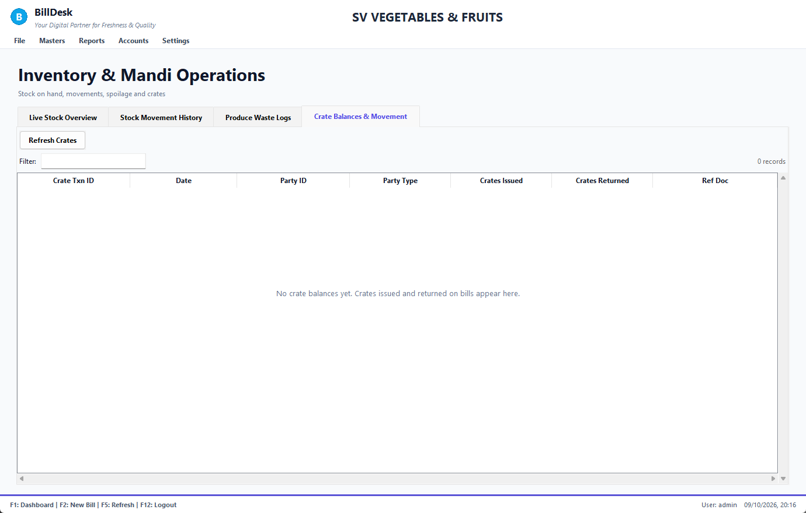

Voiding a bill reverses its crates. Crate numbers must be whole numbers, 0 or more.

---

### Procurement and vendor bills
<!-- id: procurement-bills | screen: Procurement | keywords: procurement, purchase, vendor bills, purchase bills, supplier invoice, Ctrl+P, payable, TDS | context: Procurement | related: vendor-bill, purchase-orders, purchase-return -->

**File → Purchase system** or **Ctrl+P**.

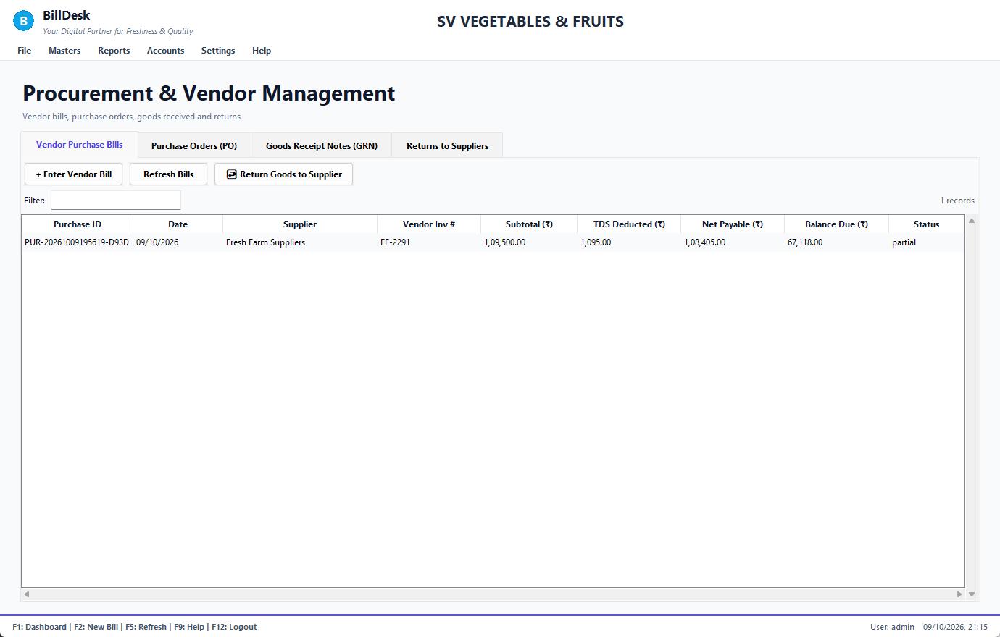

Four tabs: **Vendor Purchase Bills**, **Purchase Orders**, **Goods Receipt Notes** and **Returns to Suppliers**. The bills tab lists each supplier invoice with subtotal, TDS, net payable, balance due and status.

---

### Enter a vendor bill
<!-- id: vendor-bill | screen: Procurement | keywords: vendor bill, supplier bill, enter purchase, purchase invoice, TDS, buy, payable, duplicate invoice | related: supplier-payment, purchase-return, suppliers -->

1. **+ Enter Vendor Bill**.
2. Type the **Supplier ID**, the supplier's **invoice number**, the **item** (id or code), the **quantity** and the **rate**.
3. Press **Record Bill**.

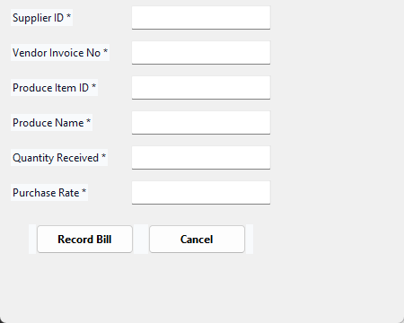

* TDS is worked out from the supplier's rate and what you owe is the **net payable**.
* The same supplier invoice number cannot be entered twice (BillDesk tells you the purchase it already belongs to).
* Quantity and rate must be above zero and the item must exist.

---

### Purchase orders and goods receipts
<!-- id: purchase-orders | screen: Procurement | keywords: purchase order, PO, goods receipt, GRN, received, three way match, receive goods | related: vendor-bill, inventory -->

* **Purchase Orders:** what you asked a supplier to send.

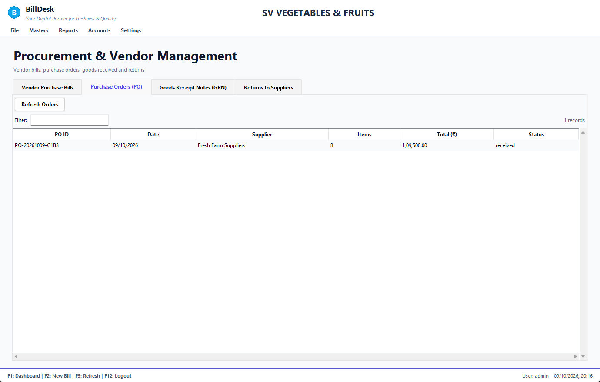

* **Goods Receipt Notes (GRN):** what actually arrived against a PO; receiving adds to stock.

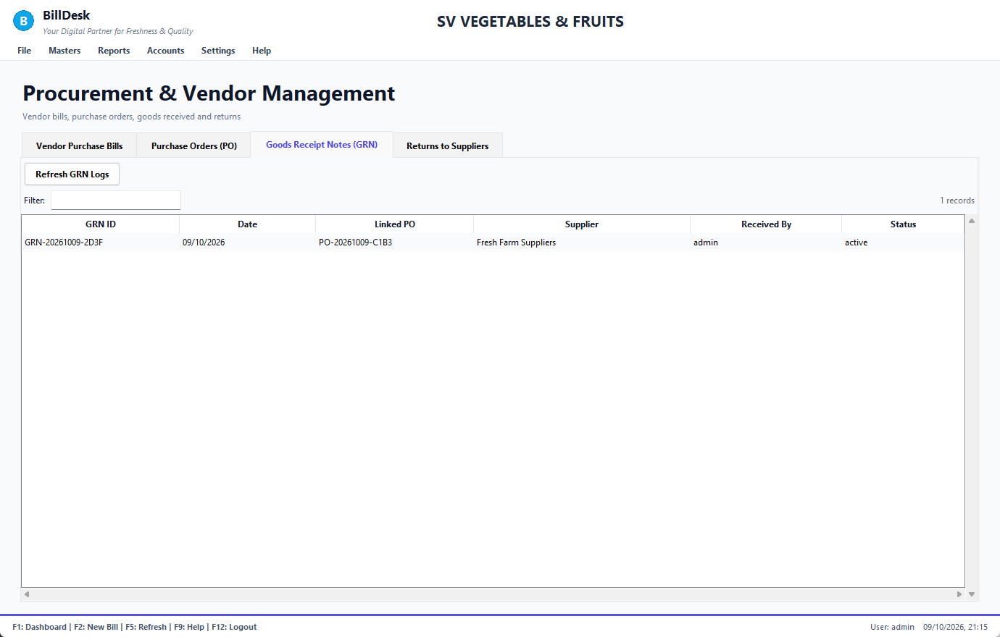

A vendor bill linked to a PO and a GRN is checked three ways (rates against the PO, quantities against what was received) and mismatches are flagged.

---

### Return goods to a supplier (debit note)
<!-- id: purchase-return | screen: Procurement | keywords: return to supplier, debit note, purchase return, send back, supplier credit, cancel debit note | context: | related: cancel-return, vendor-bill, supplier-payment -->

1. **Procurement → Vendor Purchase Bills**, select the bill the goods came on.
2. Press **↩ Return Goods to Supplier**.
3. Type the quantity of each item, the reason, and press **Save return**. You can print the **debit note**.

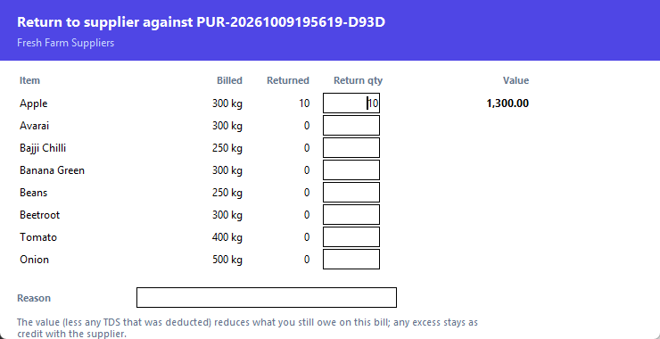

* The value is at the bill's rate. If **TDS** was deducted, the same share comes back, so what you owe falls by the **net** amount.
* It reduces what you still owe on that bill first; any excess is **credit with the supplier**.
* Stock goes down only if the goods had been received into stock (the bill has a goods receipt).
* The **Returns to Suppliers** tab lists them; **Print Debit Note** and **Cancel Debit Note** are there.

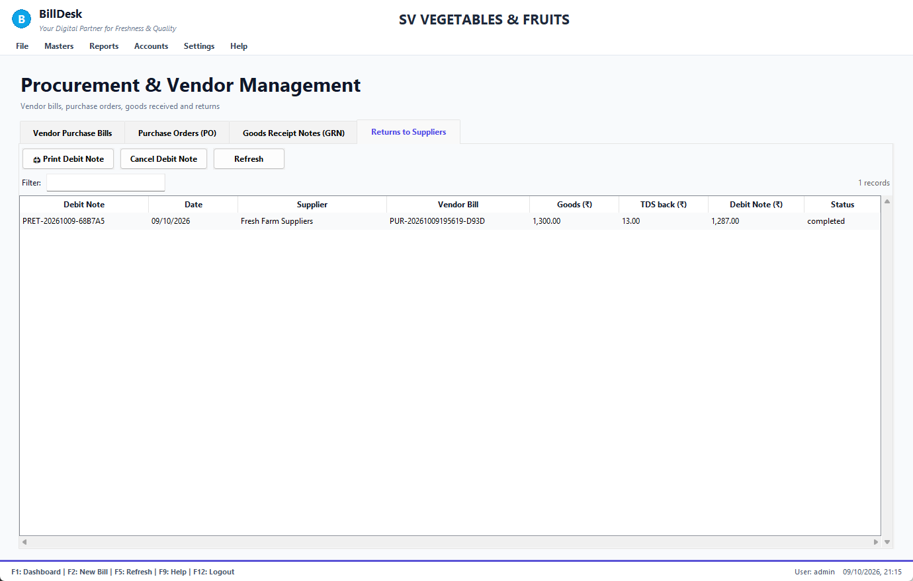

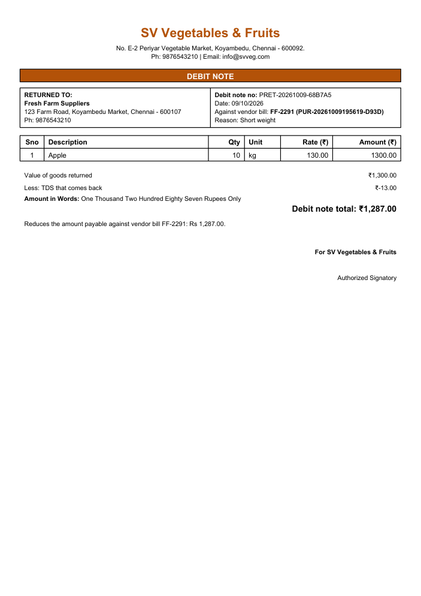

---

## Chapter 7. Money and accounts
<!-- chapter: accounts | title: Money and accounts -->

### Accounting dashboard
<!-- id: accounting-home | screen: Finance | keywords: accounting, finance, accounts dashboard, Ctrl+D, receivables total, payables, bank balance, net profit | context: Finance | related: receivables, payables, banking, statements -->

**Accounts → Accounting Dashboard** (**Ctrl+D**).

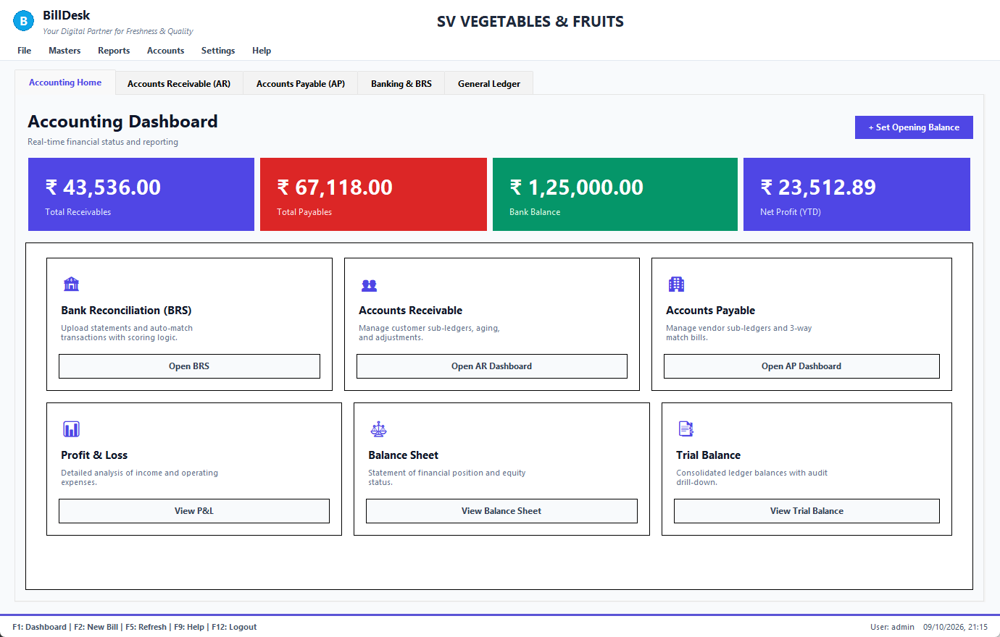

The cards show total receivables, payables, bank balance and net profit; the quick buttons open the other tabs: **Accounts Receivable (AR)**, **Accounts Payable (AP)**, **Banking & BRS** and **General Ledger**.

---

### Receivables: who owes you
<!-- id: receivables | screen: Accounts Receivables | keywords: receivables, who owes, customer balance, aging, overdue, outstanding, AR, collect money | context: Accounts Receivables | related: receipt, statement, history-filters -->

**Accounts → Accounts Receivables**.

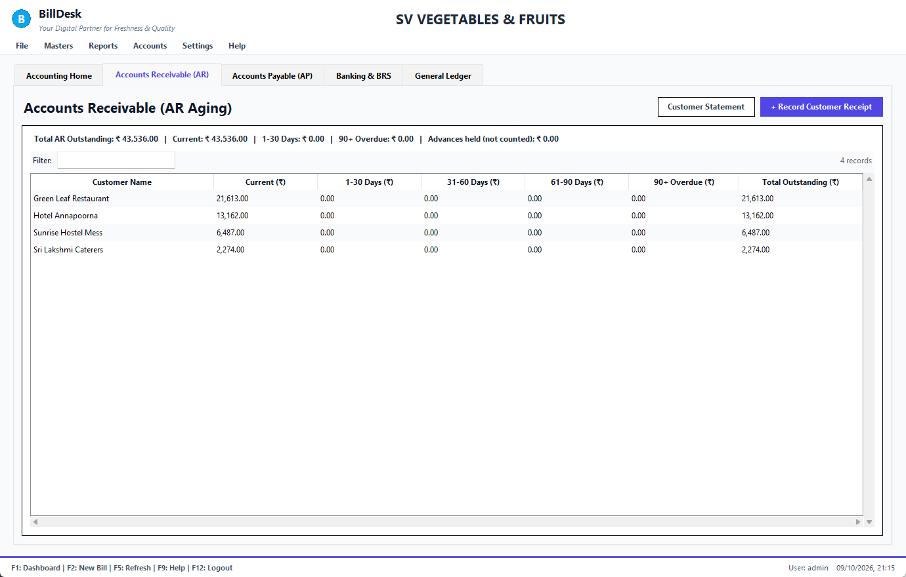

Each customer who owes money, split by age: **Current**, **1–30**, **31–60**, **61–90** and **90+** days. The total here equals the customer balances, the ledger and the dashboard card. Customers who have paid in advance are not subtracted: they are shown in the line above as *Advances held*.

* **+ Record Customer Receipt** records a payment ([receipt](#receipt)).
* **Customer Statement** opens the selected customer's account ([statement](#statement)).

---

### Customer receipts
<!-- id: receipt | screen: Accounts Receivables | keywords: receipt, record payment, customer payment, received money, collect, UPI, cheque, NEFT, advance, FIFO, pay later | related: statement, receivables, bill-payment -->

When a customer pays later (not at the counter):

1. **Accounts Receivables → + Record Customer Receipt**.
2. Enter the **Customer ID**, the **amount** and choose the **payment mode** from the list.
3. Leave **Invoice No** blank to settle the oldest bills first (FIFO), or type one invoice number.
4. Add the UTR / cheque reference and press **Save Receipt**.

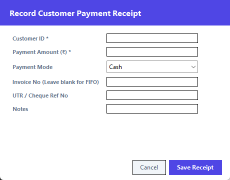

The customer's balance goes down and the matching bills are marked paid. An amount larger than what they owe becomes their **advance**.

---

### Customer statement
<!-- id: statement | screen: Customer Master, Receivables | keywords: statement, customer account, ledger, bill by bill, what does a customer owe, running balance, export, csv | related: receipt, customers, receivables -->

From **Customer Master → Statement** or **Accounts Receivables → Customer Statement**.

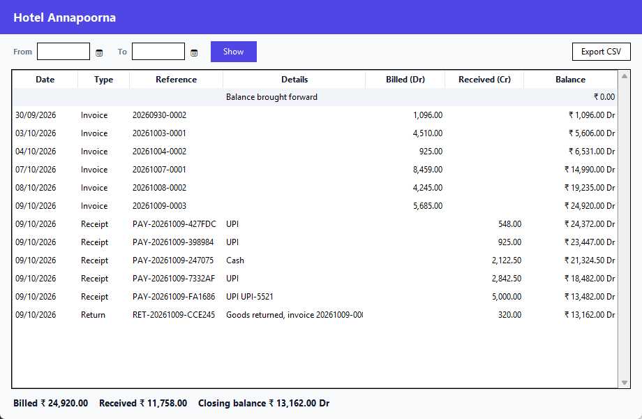

* Lists invoices (billed), receipts, returns and adjustments with a **running balance**, ending on the customer's balance.
* **From / To** (calendar boxes) show one period; the earlier balance is brought forward.
* **Export CSV** saves it for Excel.
* "Adjustment" appears when the customer paid something that was never recorded here.

---

### Payables and supplier payments
<!-- id: payables | screen: Accounts Payables | keywords: payables, what do i owe, supplier balance, AP, owe suppliers | context: Accounts Payables | related: supplier-payment, vendor-bill -->

**Accounts → Accounts Payables** lists your vendor bills with net payable, balance due and status.

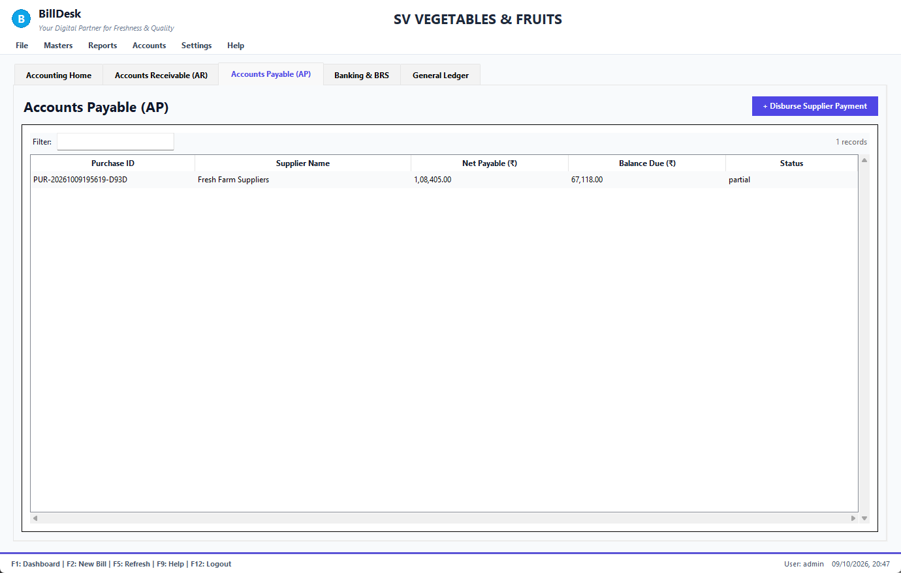

---

### Pay a supplier
<!-- id: supplier-payment | screen: Accounts Payables | keywords: pay supplier, disburse, supplier payment, NEFT, RTGS, cheque, part payment | related: payables, vendor-bill -->

1. **Accounts Payables → + Disburse Supplier Payment**.
2. Enter the **Purchase ID**, the **Supplier ID**, the **amount** and the **payment mode**.
3. Add the UTR and press **Disburse Payment**.

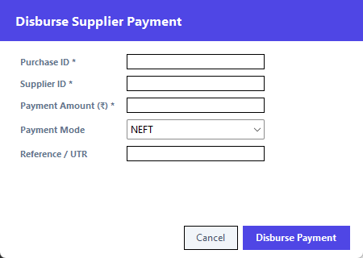

You cannot pay more than the bill's balance due.

---

### Banking and reconciliation
<!-- id: banking | screen: BRS | keywords: bank, banking, BRS, bank reconciliation, bank account, IFSC, statement, match, auto reconcile | context: BRS | related: journal, accounting-home -->

**Accounts → BRS**.

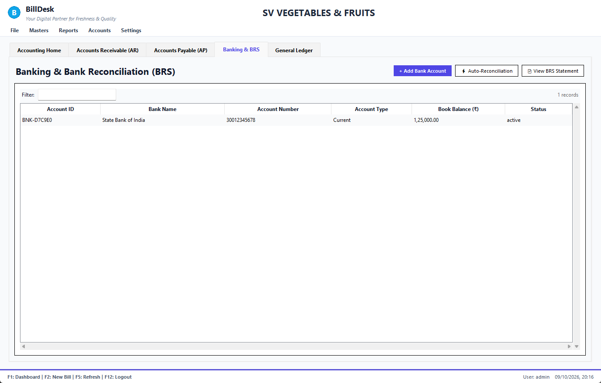

1. **+ Add Bank Account** and fill in the form.

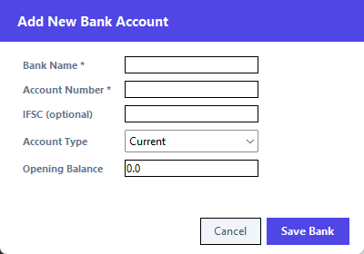

| Box | Rule |
|---|---|
| Bank name | required |
| Account number | 6–20 digits, registered once |
| IFSC | optional; 4 letters, a 0, 6 letters/digits (`SBIN0001234`) |
| Account type | Current, Savings or OD |
| Opening balance | a number |

2. **⚡ Auto-Reconciliation** matches bank statement lines with your records by reference and amount; **View BRS Statement** shows the reconciliation.

---

### General ledger and manual journal
<!-- id: journal | screen: Finance | keywords: general ledger, journal, double entry, post journal, manual entry, debit, credit, account code, opening balance | context: | related: statements, accounting-home -->

The **General Ledger** tab lists every accounting entry. BillDesk posts them automatically for bills, receipts, purchases, payments, returns and waste; use a **manual journal** only for what has no screen (for example opening capital).

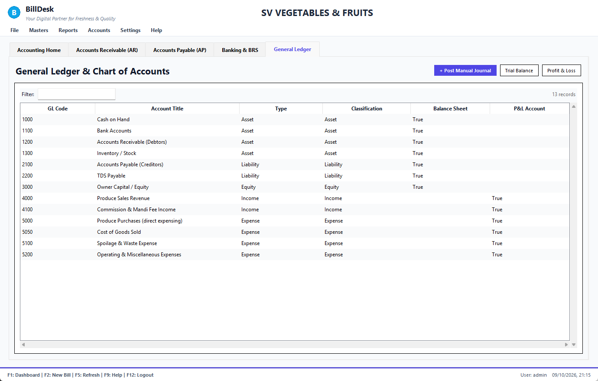

1. **+ Post Manual Journal**.
2. Enter a **reference** (`ADJ-001`), the **debit account code** and amount, the **credit account code** and amount.
3. Press **Post Entry**.

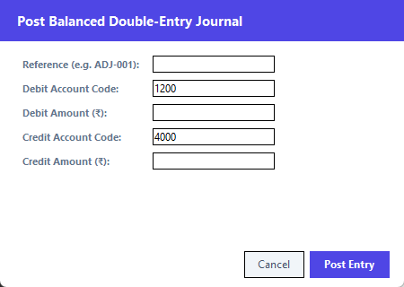

The two accounts must be different and the amounts must be equal; otherwise the form tells you before anything is posted.

---

### Trial balance, profit and loss, balance sheet
<!-- id: statements | screen: Finance | keywords: trial balance, profit and loss, P&L, balance sheet, financial statements, net profit, assets, liabilities | context: Trial Balance; Profit & Loss; Balance Sheet | related: journal, integrity -->

**Accounts → Trial Balance / Profit & Loss / Balance Sheet** each open a report window.

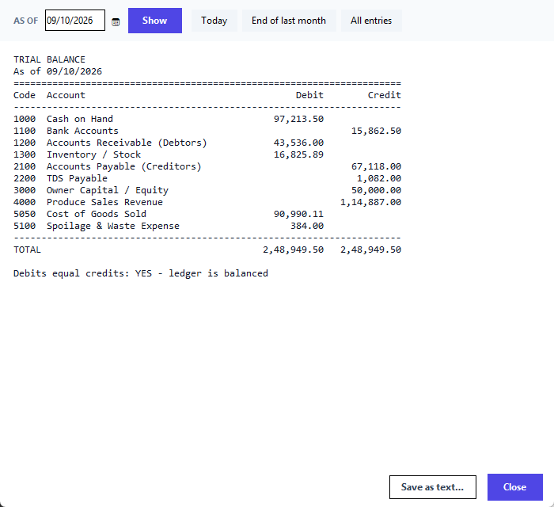

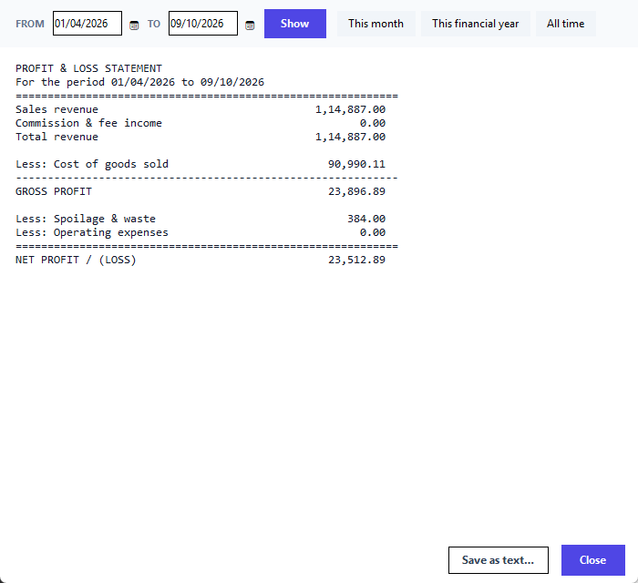

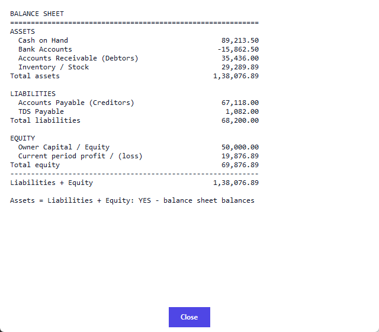

* **Trial balance:** every account's debits and credits; the totals must be equal.
* **Profit and loss:** sales (net of returns), cost of goods sold, waste and expenses, giving the profit.
* **Balance sheet:** what you own, owe and the owner's capital.

---

### Integrity check
<!-- id: integrity | screen: Integrity Check | keywords: integrity, check, books balance, audit, errors in data, reconcile, health check, accounts add up | context: Integrity Check | related: statements, backup -->

**Accounts → Integrity Check → Run Check** reads your data (it changes nothing) and tests that the books are consistent.

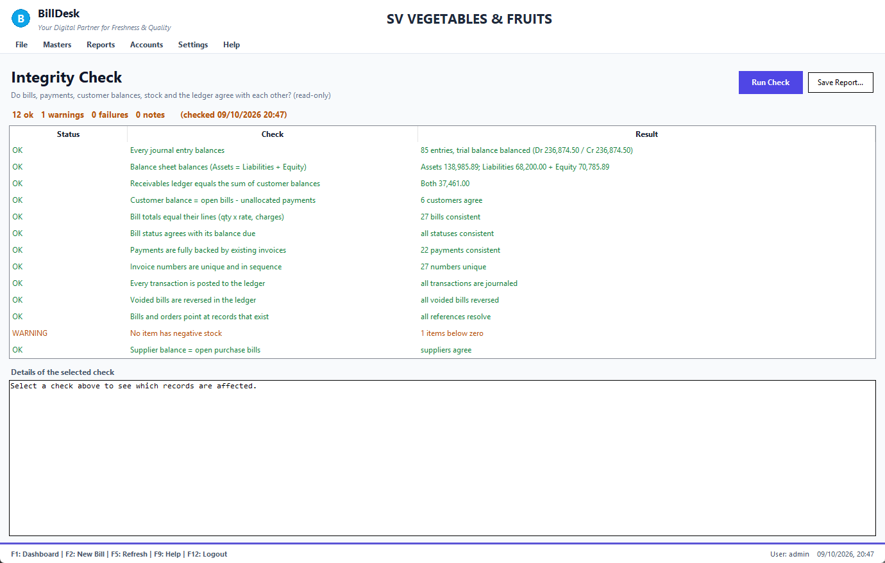

Each line is **OK**, **Info**, **Warning** or **Fail**: journals balance, receivables equal customer balances, bills add up, statuses agree with balances, invoice numbers are unique, stock is not negative, and more. Open a line to see exactly which records. **Save Report…** keeps a copy. Run it before closing the month and after restoring a backup.

---

## Chapter 8. Reports
<!-- chapter: reports | title: Reports -->

### Daybook
<!-- id: daybook | screen: Reports | keywords: daybook, day book, cash book, money in, money out, today's transactions, all transactions, cashbook | context: Daybook; Reports | related: item-wise, customer-wise, report-dates -->

**Reports → Daybook**: every event in date order: sales, returns, purchases, receipts and supplier payments, with **Billed**, **Bought**, **Money in** and **Money out** and a total line.

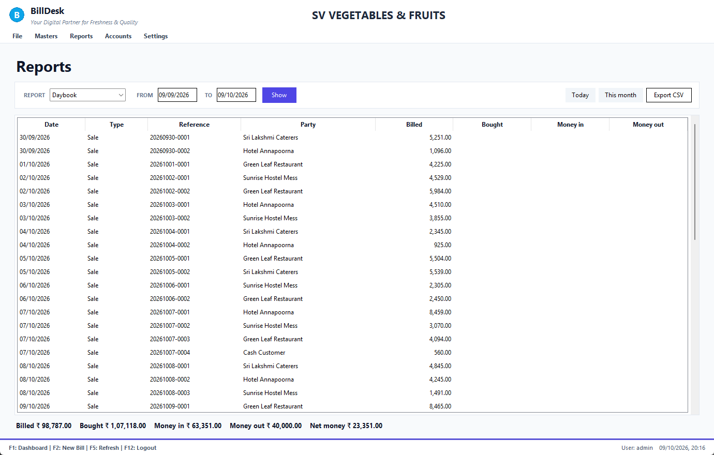

Choose the period with the **From / To** boxes ([dates in reports](#report-dates)), or **Today** / **This month**. **Export CSV** saves it.

---

### Item-wise sales
<!-- id: item-wise | screen: Reports | keywords: item wise, best selling, top items, sales by item, quantity sold, average rate, which item sells | context: Item-wise Sales | related: daybook, customer-wise -->

**Reports → Item-wise Sales**: for each item the bills it was on, quantity sold, quantity returned, net quantity, average rate and net amount, best sellers first.

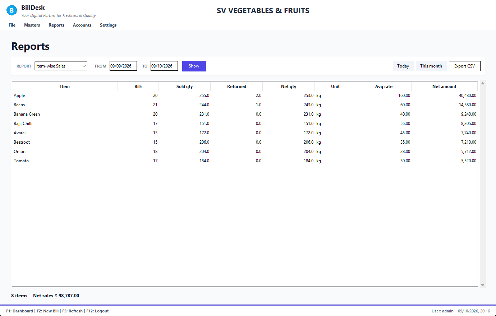

---

### Customer-wise sales
<!-- id: customer-wise | screen: Reports | keywords: customer wise, sales by customer, top customers, who buys most, returns by customer | context: Customer-wise Sales | related: daybook, item-wise, statement -->

**Reports → Customer-wise Sales**: bills, billed, returned, **net sales** and what each customer **owes now**.

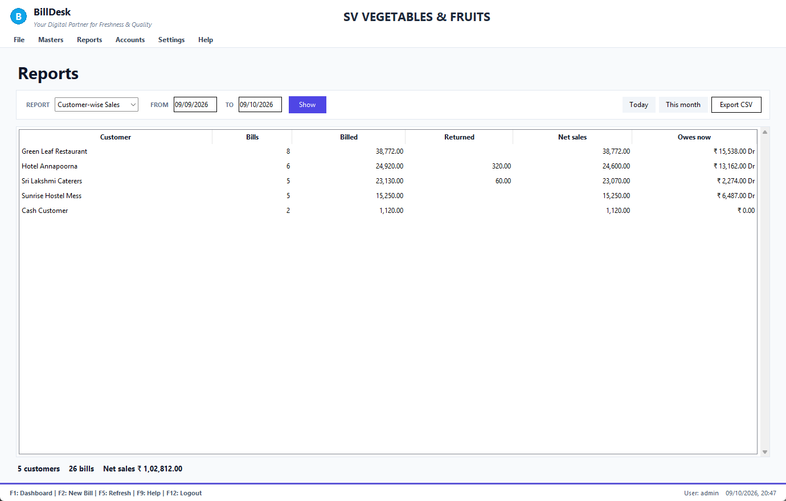

---

### Dates in reports
<!-- id: report-dates | screen: Reports | keywords: report dates, from to, period, this month, today, export csv | related: daybook, dates-everywhere -->

All three reports share the **From / To** boxes.

* Pick a day or type it; the *To* date cannot be before the *From* date.
* Leave a box empty for "no limit".
* The reports always net out returns, and cancelled returns are ignored.

---

### Consolidated bills
<!-- id: consolidated | screen: Consolidated Billing | keywords: consolidated, statement of bills, bill to, multiple bills one invoice, month end statement, group bills, PDF | context: Consolidated Billing | related: customers, history -->

**Reports → Bills Consolidated Report**: one statement of all bills for a "bill to" company over a period, grouped by delivery address.

1. Press the search icon and choose the **Bill To** company.
2. Pick **From** and **To** (they start at the 1st of this month and today).
3. Press **Generate**, then save or print the PDF.

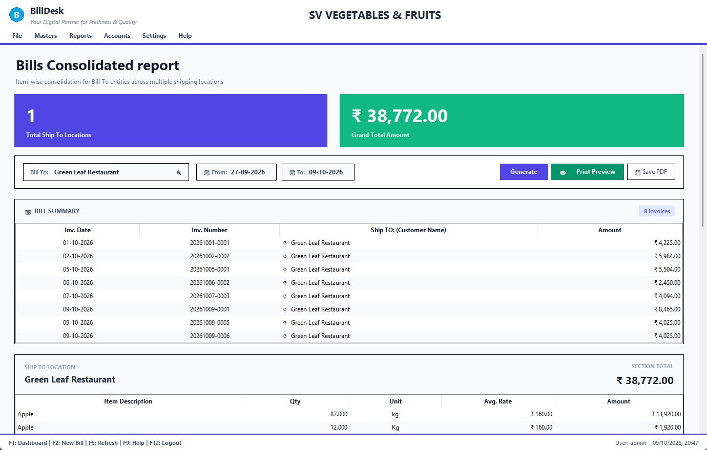

---

## Chapter 9. Administration
<!-- chapter: admin | title: Administration -->

### Cash drawer
<!-- id: cash-drawer | screen: Handover & Settlement | keywords: cash drawer, cashier, session, float, z report, handover, close drawer, counted cash, shortage, excess | context: Handover & Settlement | related: users, bill-payment -->

**Accounts → Handover & Settlement**.

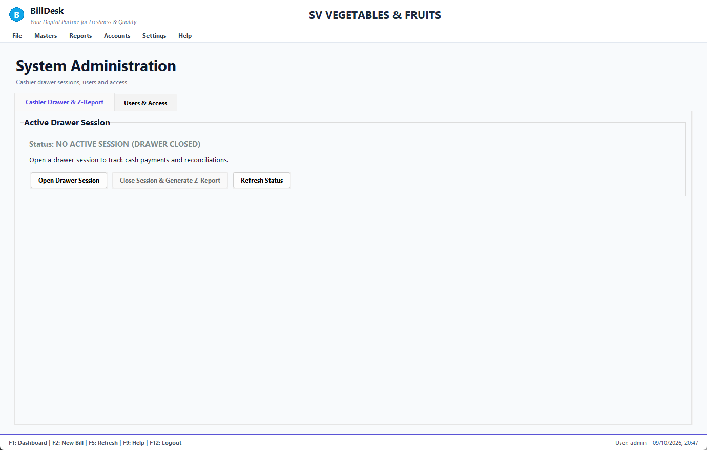

1. At the start of the day press **Open Drawer Session**, type the **opening float** and press **Start Session**.

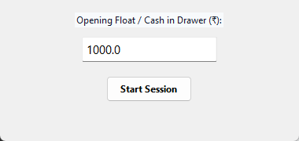

2. Work as usual: cash receipts are added to the expected cash.
3. At the end press **Close Drawer & Generate Report**, type the cash you **counted** and a note for any difference.
4. BillDesk shows the Z-report: expected, counted and **short / excess**.

Amounts must be numbers (0 or more). You can have only one open session.

---

### Users and roles
<!-- id: users | screen: User Management | keywords: users, add user, roles, permissions, access, password, cashier, manager, admin, accountant, who can do what | context: User Management | related: signing-in, company -->

**Settings → User Management**, tab **Users & Access**.

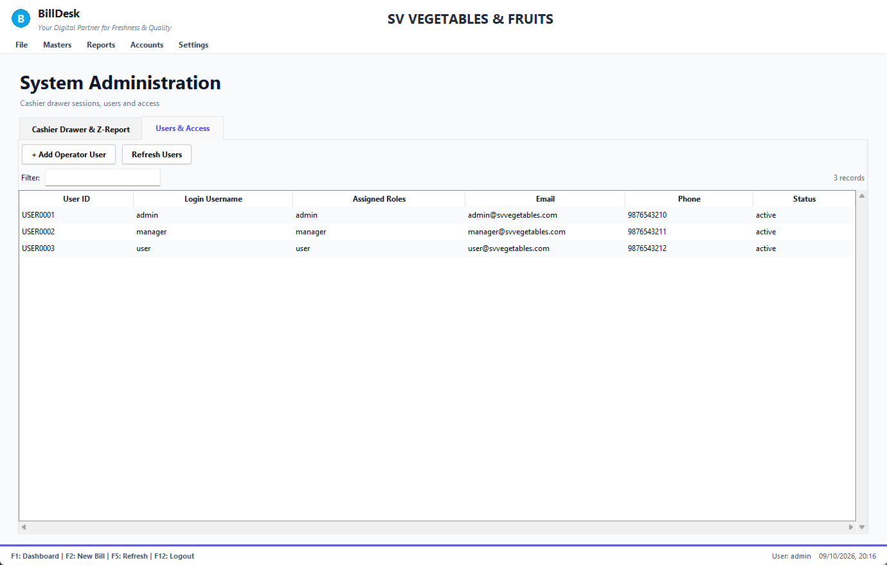

1. **+ Add Operator User**.
2. Type a **username** (3–30 letters, digits, dot, dash or underscore, unique), a **password** (at least 6 characters, not the same as the username), choose the **role** from the list, add email and phone (optional).
3. Press **Create User**.

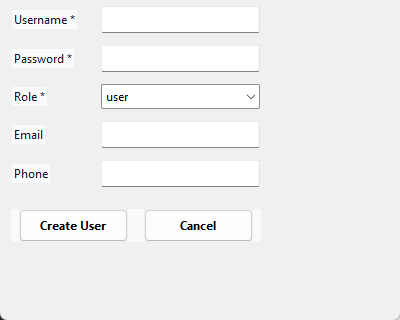

The **role** decides which menus a person sees. A forgotten password is reset by the administrator with `scripts\reset_password.py`.

---

### Company configuration
<!-- id: company | screen: Company Settings | keywords: company, company settings, logo, address, phone, email, GSTIN, terms and conditions, signatory, invoice header, default company, add company | context: Company Settings | related: bill-print, users -->

**Settings → Company Settings**: your business details as they appear on every invoice.

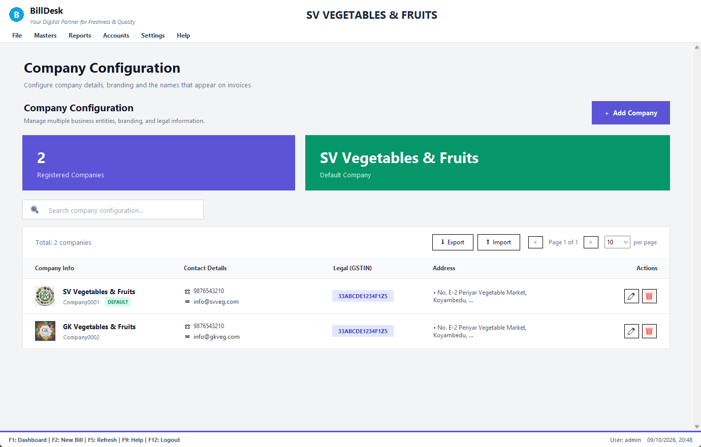

* **+ Add Company** and the **✏ edit** icon open the form; the trash icon deletes (the default company and the last company cannot be deleted).
* **Search**, **Export** and **Import** (a CSV with a `name` column) manage many companies.

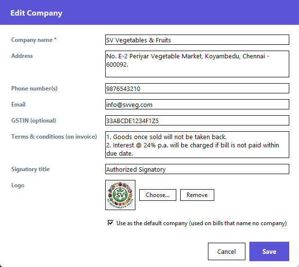

Name, address, phones, email, GSTIN (optional), terms and conditions, signatory title, a **logo** (any picture; it is shrunk) and **use as default company**. Changes appear on the next invoice you print.

---

### Backup and database
<!-- id: backup | screen: Database Settings | keywords: backup, restore, back up, data safe, database, connection, copy data, lost data, recover, log file, backup folder | context: DB Connection | related: integrity, faq -->

**Settings → Database Settings** (titled **Backup & Database**).

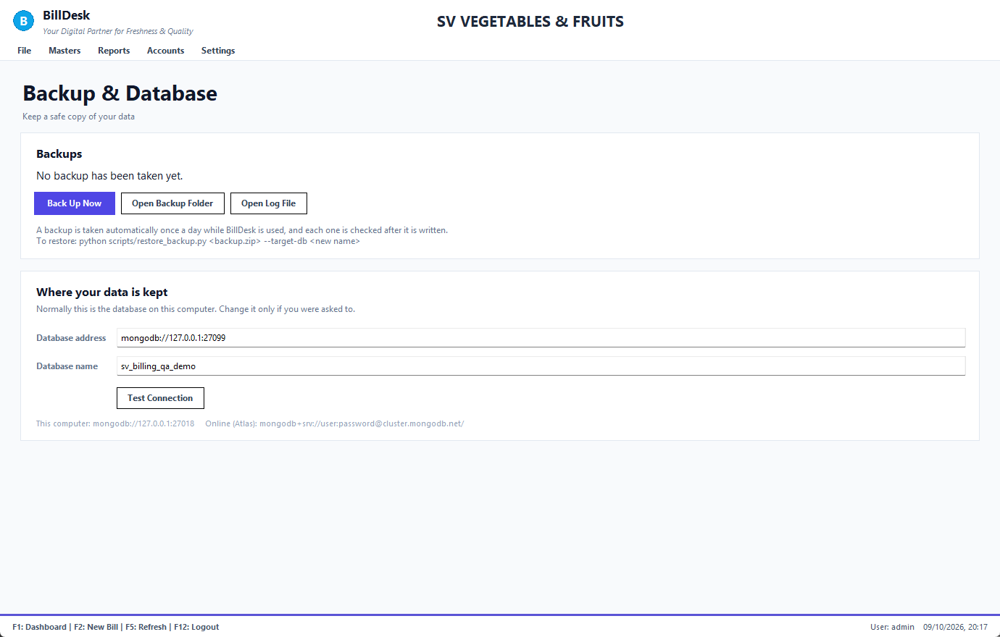

* A backup is taken **automatically once a day** while BillDesk is used, and each one is **checked after it is written**.
* **Back Up Now** makes one immediately; **Open Backup Folder** shows the files; **Open Log File** helps your IT person.
* To restore, your IT person runs `python scripts\restore_backup.py <backup.zip> --target-db <new name>`; then run the [Integrity check](#integrity).
* *Where your data is kept* normally needs no change. **Test Connection** checks the database address.
* Copy the backup folder to a pen drive or cloud drive regularly: a backup on the same computer does not help if the computer is lost.

---

### System audit logs
<!-- id: audit-logs | screen: System Audit Logs | keywords: audit, audit log, who did what, activity, history of changes, user activity | context: System Audit Logs | related: users -->

**Settings → System Audit Logs** lists what users did and when, so you can see who made, voided or changed something.

---

## Chapter 10. Reference
<!-- chapter: reference | title: Reference -->

### Keyboard shortcuts
<!-- id: shortcuts | screen: All | keywords: shortcut, shortcuts, keys, keyboard, hotkey, F1, F2, F3, F4, F5, F6, F7, F8, F9, F10, F11, F12, Esc, Ctrl | related: main-window, bill-items -->

The strip at the bottom of each screen lists the keys that work there.

| Key | Anywhere | On **New Bill** | On **New Order** |
|---|---|---|---|
| **F1** | Dashboard (search on Bill History) | | |
| **F2** | New Bill | save and take payment | save the order |
| **F3** | Item Master | save **and print** | **save the order** |
| **F4** | Customer Master | | |
| **F5** | Supplier Master (from Dashboard); refresh | **choose customer** | **choose customer** |
| **F6** | Bills History | **park** the bill | |
| **F7** | | **parked** bills | |
| **F8** | | | **Smart Importer** |
| **F9** | **Help for this screen** | | |
| **F10** | Item Master | | save and print |
| **F11** | Customer Master | | |
| **F12** | Log out | | |
| **Esc** | close a dialog | close a dialog | close the form |
| **Ctrl+O** | Orders | | |
| **Ctrl+P** | Procurement | | |
| **Ctrl+D** | Accounting Dashboard | | |

In lists and dialogs: **↑ / ↓** move, **Enter** chooses, **Esc** closes. In the grids: **Enter** moves to the next box. In any date box: **↓** opens the calendar.

---

### Dates and the calendar
<!-- id: dates-everywhere | screen: All | keywords: date, calendar, date box, date format, dd/mm/yyyy, future date, from to, red date, invalid date | related: bill-date, order-dates, report-dates -->

Every date box in BillDesk works the same way:

* Click it (or move to it with the keyboard): a **calendar** drops down. **Click** a day, or use the **arrow keys** (Page Up / Down change month) and **Enter**; **Today** jumps to today.
* You can also **type** a date: `13/10/2026`, `13-10-26`, `2026-10-13`. Press **Enter** to accept it.
* Text turns **red** when the date cannot be used; the form tells you why when you save.
* Days that are not allowed are **greyed** in the calendar.

| Where | Rule |
|---|---|
| Bill date | required; not in the future |
| Order date | required; not in the future |
| Delivery date | required; not before the order date |
| Fixed rate start / end | required; end not before start |
| Report and statement From / To | optional; *To* not before *From* |
| Consolidated report From / To | required; *To* not before *From* |
| Filters (Bill History, Orders) | optional; part of a date (`09/2026`) is fine |

---

### What each form accepts
<!-- id: field-rules | screen: All forms | keywords: validation, rules, field rules, what can i type, limits, invalid, required, phone, email, GSTIN, IFSC, negative, number, decimal | related: messages, dates-everywhere -->

BillDesk checks what you type and says what is wrong instead of saving bad data.

| Field | Rule |
|---|---|
| Quantity, rate, amount | a real number; quantity above zero; rate zero or more; not absurdly large |
| Item name | required, up to 80 characters, not already used |
| Item code | no spaces, up to 20 characters, unique |
| Customer / supplier name | required, up to 80 characters, not already used |
| Phone | 7–15 digits; up to three numbers separated by comma or slash |
| Email | like `name@shop.com` |
| GSTIN | optional; 15 letters/digits |
| Credit limit, opening balance | a number (credit limit 0 or more) |
| TDS rate | 0 to 100 |
| Username | 3–30 letters, digits, `.` `-` `_` |
| Password | at least 6 characters, at most 72 bytes, not the username |
| Payment mode | Cash, UPI, Cheque, NEFT, RTGS, NEFT/RTGS, Bank, Card (and Credit/Due on a bill) |
| Vendor invoice number | required, up to 40 characters, once per supplier |
| Bank account | 6–20 digits; IFSC like `SBIN0001234`; type Current, Savings or OD |
| Cash drawer amounts | 0 or more |
| Crates | whole numbers, 0 or more |
| Journal entry | reference required; two different accounts; debit equals credit |

---

### Messages and what to do
<!-- id: messages | screen: All | keywords: error, message, problem, not working, cannot, why, failed, warning, troubleshoot, fix, wrong | related: field-rules, faq, backup -->

Find the words you see on the screen in the first column; the next columns say why it happened and what to do.

| What you see | Why | What to do |
|---|---|---|
| *"Choose a customer from the customer master (F5)"* | an order needs a real customer | press **F5**, choose one; add the customer first if missing |
| *"The bill date cannot be in the future"* | the date box holds a later day | pick today or an earlier day |
| *"… is not a valid date. Use DD/MM/YYYY"* | text in a date box can't be read | pick from the calendar |
| *"The To date cannot be before …"* | To is earlier than From | change one of them |
| *"Amount received (…) is more than the bill total"* | more entered than the bill | type the bill amount or less |
| *"Item … not found"* / *"No item matches"* | wrong code | check the code in the Item Master |
| *"… must be a number"* | letters or symbols in a number box | type digits only (decimals allowed) |
| *"An item / customer named … already exists"* | the name is taken | use another name, or edit the existing one |
| *"Vendor invoice … is already recorded as PUR-…"* | the same supplier invoice was entered before | do not enter it again |
| *"Payment amount … exceeds purchase balance due"* | paying a supplier more than owed | pay the balance due or less |
| *"Waste quantity … exceeds stock on hand"* | more than the tracked stock | check the quantity |
| *"Invoice … has goods returned against it, so it cannot be voided"* | a return exists | [cancel the return](#cancel-return) first, then void |
| *"only n can still be returned"* | more than billed minus earlier returns | reduce the return quantity |
| *"Return … was made by the older BillDesk and cannot be cancelled here"* | old returns lack detail | leave it; it is already reflected in the balance |
| *"The entry does not balance"* | journal debit ≠ credit | make the two amounts equal |
| *"You already have an open cashier session"* | a drawer is open | close it first |
| *"Access Denied"* | your role does not include that screen | ask the administrator |
| *"Tesseract OCR engine is not installed"* | the image reader is missing | use **Paste text instead**, or ask IT to reinstall |
| *"The text in this image could not be read reliably"* | handwriting or a blurry photo | take a straighter, brighter photo or type the lines |
| Integrity check shows **Warning** | an older-data difference | open the line; ask your accountant if unsure |
| Cannot start: database error | the database did not start | restart the computer, then BillDesk; call IT if it repeats |

---

### Frequently asked questions
<!-- id: faq | screen: All | keywords: faq, questions, common questions, help, tips | related: messages, start-here -->

Short answers to the questions people ask most; follow the link in the last column for the full steps.

| Question | Answer | More |
|---|---|---|
| Can I change the date of a bill after saving? | No. Void the bill and make it again with the right date. | [Void](#history-void) |
| How do I sell to someone who is not a customer? | Leave **Cash** as the customer and take the full payment. | [Customer](#bill-customer) |
| Why did the bill number have a different date? | The invoice number follows the bill date you chose. | [Bill date](#bill-date) |
| A customer paid half. What now? | Enter the amount received; the rest stays on their account. | [Payment](#bill-payment) |
| A customer paid later in cash. How do I record it? | Use **Record Customer Receipt**. | [Receipt](#receipt) |
| How do I see what one customer owes, bill by bill? | Open the customer's **Statement**. | [Statement](#statement) |
| What is "Cr" next to a balance? | You hold the customer's money (advance or return credit). | [Customers](#customers) |
| What is the difference between void and return? | Void cancels the whole bill; return takes back some goods and keeps the bill. | [Return](#return-goods) |
| I returned goods by mistake. | Cancel the return. | [Cancel return](#cancel-return) |
| Does BillDesk handle GST? | No: fruit and vegetables are exempt, so no GST is calculated. | [What it does](#what-is) |
| Can two people bill at once? | Yes on different computers using the same database; park a bill to serve two customers at one counter. | [Park](#bill-park) |
| How often should I back up? | BillDesk backs up daily; also copy the backup folder to another drive weekly. | [Backup](#backup) |
| Can it read my customer's handwritten list? | Not reliably. Printed or typed lists work; otherwise type or paste. | [Smart Importer](#smart-importer) |
| Stock shows 0 but I can still sell. Is that wrong? | No. Stock only tracks what you entered through purchases or adjustments. | [Inventory](#inventory) |
| I forgot my password. | Ask the administrator; they reset it. | [Signing in](#signing-in) |
| Where do I change my shop name and address on invoices? | Settings → Company Settings. | [Company](#company) |

---

### Glossary
<!-- id: glossary | screen: All | keywords: glossary, meaning, words, terms, DC, GRN, PO, BRS, TDS, FIFO, advance, credit note, debit note, challan | related: start-here -->

The words used in BillDesk and in this guide, in plain language.

| Word | Meaning |
|---|---|
| **Bill / Invoice** | the document you give the customer for goods sold |
| **Challan (DC)** | the same bill without prices, for delivery |
| **Void** | cancel a whole bill, keeping its record |
| **Credit note** | document for goods a customer returned (their balance goes down) |
| **Debit note** | document for goods you send back to a supplier |
| **Dr / Cr** | Dr: the customer owes you; Cr: you hold their money |
| **Advance** | money received before a bill or more than was owed |
| **Receivables** | money customers owe you |
| **Payables** | money you owe suppliers |
| **PO / GRN** | purchase order / goods receipt note (what actually arrived) |
| **TDS** | tax deducted from a supplier's payment |
| **FIFO** | oldest bill settled first |
| **BRS** | bank reconciliation statement |
| **Trial balance** | list of all accounts; debits must equal credits |
| **Float** | cash put in the drawer at the start of the day |
| **Legacy bill** | a bill made by the older program (no per-bill payment record) |
| **Parked bill** | a bill put on hold |

---

### About this guide
<!-- id: about-guide | screen: Help | keywords: about, version, rebuild guide, documentation, update guide | related: start-here -->

This guide is written once in `Docs/BillDesk_Native_User_Guide.md` and turned into the Word, PDF and Jupyter notebook editions and the in-program Help by `python scripts/build_user_guide.py`. The screenshots come from `python scripts/user_guide/capture_screenshots.py` running on a demo database (see `scripts/user_guide/README.md`), so they can be redone whenever a screen changes.
