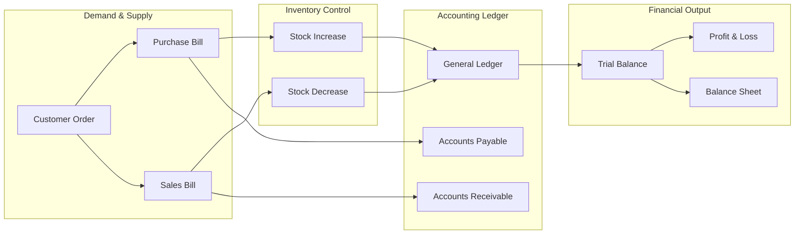
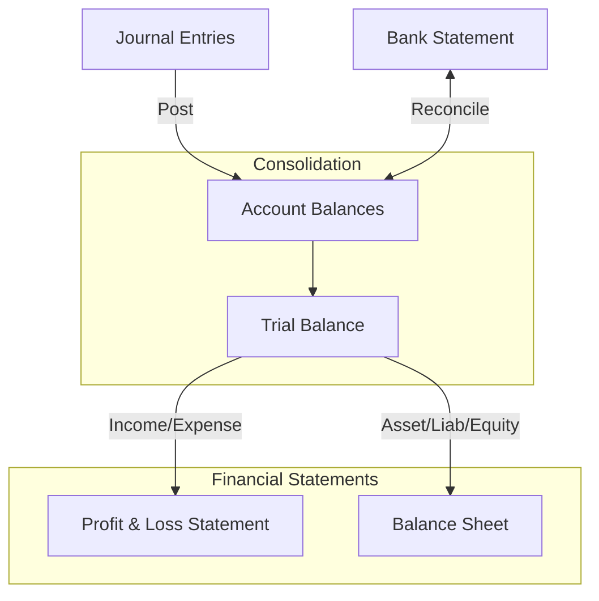

# BillDesk System Data Flow Architecture

This document provides a technical overview of how data flows through the BillDesk system, from initial customer demand to final financial reporting.

---

## 1. End-to-End Operational Lifecycle

The system follows a linear progression from demand intake to financial reconciliation.

---

## 2. Detailed Data Flow Stages

### Phase 1: Order Intake (The Source)
*   **Trigger**: WhatsApp Order, OCR/Smart Import, or Manual Entry.
*   **Entity**: `models.Order`.
*   **Status**: `pending`.
*   **Data Captured**: Items, Quantities, Delivery Dates, Customer Linkage, and Mandi Fees.

### Phase 2: Procurement (Purchase)
*   **Trigger**: Converting an Order to a Purchase or Manual Inward.
*   **Action**: `convert_to_purchase_bill` in `orders.py`.
*   **Financial Impact**: 
    - **Stock**: `Item.stock` increments.
    - **AP**: `Supplier.current_balance` increases (Payable).
    - **Transaction**: `StockTransaction` logged as `type="purchase"`.

### Phase 3: Sales & Invoicing (Revenue)
*   **Trigger**: Converting an Order to a Bill or Direct POS Sale.
*   **Action**: `convert_to_bill` in `orders.py` or `create_bill` in `bills.py`.
*   **Financial Impact**:
    - **Stock**: `Item.stock` decrements.
    - **AR**: `Customer.current_balance` increases (Receivable).
    - **Transaction**: `StockTransaction` logged as `type="sale"`.
    - **Aging**: `Bill.balance_due` tracks the collection status.

### Phase 4: The General Ledger (GL)
*   **Engine**: `financial_ledger.py` -> `post_to_ledger`.
*   **Mechanism**: Every transaction generates a balanced `JournalEntry`.
*   **Double-Entry Posting**:
    - **Sales**: Debit AR Control, Credit Revenue.
    - **Purchase**: Debit Inventory/Expense, Credit AP Control.
    - **Payments**: Debit/Credit Bank/Cash, Credit/Debit AR/AP.

---

## 3. Financial Reporting Architecture

BillDesk uses a hierarchical Chart of Accounts (CoA) to generate real-time reports.

### Key Reporting Logic
1.  **Trial Balance**: A cumulative sum of all `JournalLine` entries grouped by `Account`. Asserts that `Total Debits == Total Credits`.
2.  **Profit & Loss (P&L)**: Extracts account movements for `Income` and `Expense` type accounts within a specific period.
3.  **Balance Sheet**: A snapshot of `Asset`, `Liability`, and `Equity` accounts. It follows the fundamental equation: `Assets = Liabilities + Equity (including Retained Earnings from P&L)`.
4.  **Bank Reconciliation (BRS)**: Matches internal Ledger transactions against external `BankStatement` lines to ensures cash-at-bank accuracy.

---

## 4. Entity Relationship Summary

| Transaction | Primary Entity | Secondary Impact | GL Control Account |
| :--- | :--- | :--- | :--- |
| **Order** | `Order` | Notification | N/A (Off-Balance Sheet) |
| **Purchase** | `PurchaseBill` | `Item.stock` (▲) | 2100 - Sundry Creditors (AP) |
| **Sale** | `Bill` | `Item.stock` (▼) | 1200 - Sundry Debtors (AR) |
| **Payment Recv**| `JournalEntry` | `Customer.balance` (▼)| 1100 - Cash/Bank |
| **Payment Paid**| `JournalEntry` | `Supplier.balance` (▼) | 1100 - Cash/Bank |
