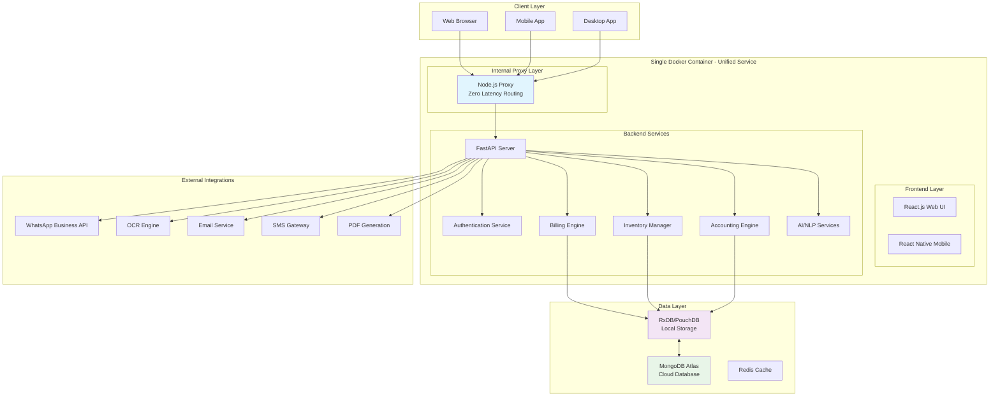
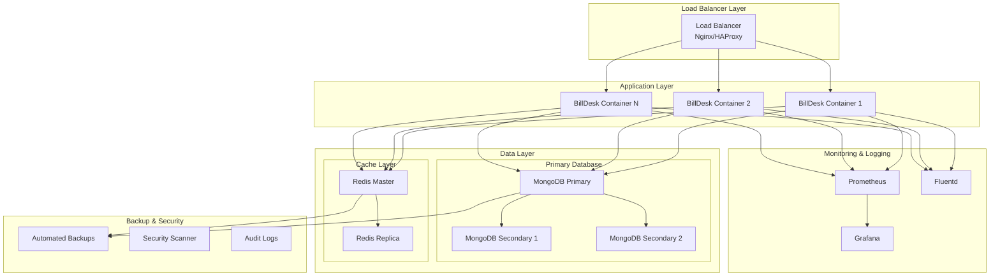

# BillDesk High-Performance Billing System
## Features Document & Reference Architecture

**Version:** 1.0.0  
**Date:** December 24, 2025  
**Document Type:** Technical Features & Architecture Reference  
**Target Audience:** Client IT Teams, Buyer IT Teams, System Integrators  

---

## Executive Summary

BillDesk is a comprehensive, high-performance billing and inventory management system specifically engineered for vegetable and fruit trading businesses in the **Indian market**. Designed to meet the unique requirements of Indian businesses, the system achieves "superfast" performance through a revolutionary Unified Service Architecture that eliminates network latency, combined with a Local-First, Cloud-Sync strategy for offline resilience.

### Indian Market Focus
This product is **exclusively created for the Indian market**, incorporating:
- **Indian Business Practices**: Tailored for traditional Indian trading workflows
- **Multi-Language Support**: Hindi, Tamil, Telugu, Kannada, Malayalam, and English
- **Indian Currency**: Full INR support with Indian number formatting
- **GST Compliance**: Built-in GST calculation and reporting
- **Indian Banking**: Integration with Indian payment systems and banks
- **Master Data Inspection**: Dedicated "View" mode with a read-only interface for Items, Customers, and Suppliers to prevent accidental edits while browsing.
- **Visual Indicators**: Color-coded status for bills, inventory, and payment status.
- **Local Regulations**: Compliance with Indian accounting and tax standards

### Key Value Propositions
- **Zero Latency Performance**: Sub-second billing transactions through unified container architecture
- **Offline-First Design**: Complete functionality without internet connectivity (crucial for Indian market conditions)
- **Multi-Cloud Deployment**: Deploy on AWS, GCP, Azure, or on-premises
- **AI-Powered Order Processing**: WhatsApp and OCR integration for automated order ingestion
- **Complete Accounting Integration**: Double-entry bookkeeping with bank reconciliation
- **Enterprise Security**: RBAC, encryption, audit trails, and compliance features
- **Indian Market Optimized**: GST compliance, multi-language support, and Indian business workflows

---

## System Architecture

### Unified Service Architecture Overview

### Deployment Architecture

---

## Core Features

### 1. High-Speed Billing System (POS)

#### Key Capabilities
- **Sub-Second Transactions**: Rapid Entry Grid with dedicated **Code** and **Description** columns.
- **Alias Shortcoding**: Instant item lookup (101→Apple, 102→Avarai, etc.)
- **Bill Parking**: Park incomplete bills and resume later (F4 key)
- **Tender Screen Integration**: Mandatory "Record Payment Receipt" screen on Save (F2) or Print (F3) to ensure immediate collection tracking.
- **Real-Time Calculations**: Automatic totals, taxes, and GST calculations
- **Internal Notes**: Universally visible notes section in the footer for tracking internal instructions.
- **Invoicing & Layout**: Professional A4 templates with corporate branding (Emerald Green Theme), GST compliance, and symmetrical 3-column details grid (Ship To, Bill To, Details).
- **Master Data Inspection**: Dedicated "View" mode for Items, Customers, and Suppliers to ensure data integrity during lookup.
- **Enhanced Navigation**: Smart cursor flow through Code→Description→Quantity→Unit→Rate
- **Multi-Language Support**: Interface available in Hindi, Tamil, Telugu, Kannada, Malayalam, and English
- **Indian Currency**: Full INR support with Indian number formatting (₹1,23,456.78)

#### Technical Specifications
- **Response Time**: <200ms for item lookup
- **Throughput**: 100+ items per bill in <5 seconds
- **Validation**: Real-time business rule enforcement with GST validation
- **Keyboard Shortcuts**: Complete F1-F12 function key support
- ### 2. Professional Printing & Layout Engine

#### Key Capabilities
- **Unified Invoicing & DC Layout**: High-fidelity symmetrical 3-boxed grid (Bill To | Ship To | Details) across both manual PDF tools and web-based printing systems.
- **Centered Branding**: Precisely centered company headers for a premium corporate appearance.
- **Improved Aesthetics**: Bold green uppercase headers, right-aligned detail values, and emerald green theme consistency (#008a5e).
- **Production Support Toolset**: 
    - **Visual Support Dashboard**: A dedicated interface (`/support`) with form inputs for real-time document generation and instant PDF previewing.
    - **Interactive PDF Editor**: Manual tool allowing CSS/HTML customization with real-time preview zoom and multi-page stability.

#### Technical Specifications
- **PDF Engine**: Robust server-side implementation utilizing `xhtml2pdf` for manual tools and specialized High-Resolution CSS for React-based Web Print.
- **Dynamic Branding**: Automated Emerald Green theme (`#008a5e`) integration with real-time logo placement and centered document headers.
- **Data Integrity**: Base64 encoding for logos to ensure 100% reliable rendering in both previews and high-fidelity PDF exports.

### 3. Intelligent Inventory Management

#### Key Capabilities
- **FIFO Stock Management**: Batch tracking by receipt date
- **Automated Reorder Alerts**: Visual indicators for low stock
- **Wastage Tracking**: Reason codes and expense allocation
- **Multi-Location Support**: Separate stock per location
- **Barcode Integration**: Mobile scanning for rapid identification

#### Technical Specifications
- **Stock Accuracy**: Real-time updates with transaction logging
- **Alert System**: Configurable thresholds and notifications
- **Reporting**: Comprehensive stock ledger and movement reports
- **Integration**: Seamless with billing and purchasing modules

### 3. AI-Powered Order Management

#### Key Capabilities
- **WhatsApp Integration**: Parse text orders using NLP
- **OCR Processing**: Convert handwritten orders to structured data
- **Fuzzy Matching**: Intelligent item recognition and mapping
- **Order Consolidation**: Aggregate orders by delivery date
- **Learning System**: Continuous improvement through user feedback

#### Technical Specifications
- **AI Engine**: spaCy/NLTK for text processing
- **OCR Engine**: Tesseract with Google Vision API fallback
- **Accuracy**: 95%+ item recognition rate
- **Processing Time**: <10 seconds for typical order

### 4. Complete Accounting Integration

#### Key Capabilities
- **Double-Entry Bookkeeping**: Automatic journal entries following Indian accounting standards
- **Bank Reconciliation**: CSV statement import (Date, Description, Reference, Debit, Credit, Balance) with automatic matching. A statement credit matches a book receipt and a statement debit matches a book payment; the amount must agree to the paisa. Score: 60 for the amount, +30 for an equal cheque/UTR reference, +10 for a value date within 3 days (+5 within 10; further apart is no match). A pair scoring 70 or more that clearly beats the alternatives is confirmed (the statement line, book transaction and payment are marked reconciled and the payment gets a clearance date); weaker candidates are returned as suggestions for a person to confirm. `POST /api/reconciliation/brs/auto-match?statement_id=...` (`dry_run=true` only reports) is idempotent. Source: `backend/app/brs_matcher.py`.
- **Accounts Receivable**: Customer payment tracking with Indian payment methods, including **"Credit/Due"** status and **Opening Balance** integration in payment allocation.
- **Trial Balance**: Real-time financial position
- **Multi-Company Support**: Separate books with consolidated reporting
- **GST Integration**: Complete GST workflow from invoice to returns
- **Indian Banking**: Support for NEFT, RTGS, UPI, and other Indian payment systems

#### Technical Specifications
- **Compliance**: Indian accounting standards and GST regulations
- **Automation**: 95% of entries generated automatically
- **Reconciliation**: Rule-based amount/reference/date scoring (see Bank Reconciliation above); ambiguous items are left for a person to confirm
- **Reporting**: 20+ standard financial reports plus GST reports

### 5. Advanced Security & Compliance

#### Key Capabilities
- **Role-Based Access Control (RBAC)**: Granular permissions for all modules.
- **Data Encryption**: AES-256 for sensitive data, TLS 1.3 for all communications.
- **Enhanced Session Management**: 
    - **Multi-Session Detection**: Real-time notification of active sessions on other devices during login.
    - **Session Handover**: Option to logout all other devices during a new session initialization.
    - **Global Logout**: Comprehensive session invalidation across all user devices.
    - **Auto-Expiration**: Idle sessions are automatically invalidated after the predefined timeout period.
- **Universal Audit Trails**: 
    - **Request Logging**: Every API interaction (POST/PUT/DELETE) is captured with its full request payload.
    - **Data Masking**: Sensitive information (like passwords) is automatically masked in audit logs.
    - **Security Visibility**: Detailed dashboard for administrators to monitor system activity and security events.
- **Manual Document Recovery**: Command-line tool for production support to generate critical documents during system downtime or frontend issues.
- **Soft Deletes**: Comprehensive data retention with no permanent loss.

#### Technical Specifications
- **Authentication**: JWT with refresh tokens
- **Password Policy**: Configurable complexity requirements
- **Account Lockout**: 5 failed attempts trigger lockout
- **Compliance**: SOC 2, GDPR, and industry standards

---

## Technical Specifications

### System Requirements

#### Minimum Requirements (Development)
- **CPU**: 2 cores (2.0 GHz)
- **RAM**: 4GB
- **Storage**: 10GB free space
- **Network**: 10 Mbps internet connection
- **OS**: Linux, Windows, macOS

#### Recommended Requirements (Production)
- **CPU**: 4+ cores (2.5 GHz)
- **RAM**: 8GB+
- **Storage**: 50GB+ SSD
- **Network**: 100 Mbps internet connection
- **OS**: Ubuntu 20.04 LTS or CentOS 8

#### Enterprise Requirements (High Availability)
- **CPU**: 8+ cores (3.0 GHz)
- **RAM**: 16GB+
- **Storage**: 200GB+ NVMe SSD
- **Network**: 1 Gbps internet connection
- **OS**: Enterprise Linux with container orchestration

### Technology Stack

#### Frontend Technologies
- **Framework**: Next.js 16 with TypeScript (React 19)
- **Mobile**: React Native for iOS/Android
- **Desktop**: Electron wrapper for desktop apps
- **Styling**: Vanilla CSS for maximum flexibility
- **State Management**: Zustand
- **Testing**: Vitest / Playwright

#### Backend Technologies
- **Framework**: Python FastAPI 0.104+
- **Database**: MongoDB 8.0 with replica sets
- **Cache**: Redis 8.4 with persistence
- **Authentication**: JWT with refresh tokens
- **API**: RESTful with OpenAPI documentation
- **Testing**: pytest with comprehensive coverage

#### AI/ML Technologies
- **NLP Engine**: spaCy 3.7+ with custom models
- **OCR Engine**: Tesseract (open source, offline)
- **Text Processing**: NLTK for advanced linguistics
- **Image Processing**: OpenCV for image enhancement
- **Machine Learning**: scikit-learn for pattern recognition

#### Infrastructure Technologies
- **Containerization**: Docker 24.0+ with multi-stage builds
- **Orchestration**: Docker Compose / Kubernetes
- **Reverse Proxy**: Nginx 1.25+ with SSL termination
- **Monitoring**: Prometheus + Grafana
- **Logging**: Fluentd with centralized aggregation

---

## Indian Market Specialization

### Designed Exclusively for India

BillDesk has been specifically created and optimized for the Indian market, incorporating deep understanding of Indian business practices, regulatory requirements, and cultural preferences.

#### Indian Business Features
- **Traditional Trading Workflows**: Supports traditional Indian vegetable and fruit trading practices
- **Mandi Integration**: Designed for wholesale market (mandi) operations
- **Credit System**: Traditional credit and payment cycles common in Indian markets
- **Seasonal Variations**: Handles seasonal price fluctuations and inventory patterns
- **Regional Preferences**: Customizable for different regional business practices across India

#### Language & Localization
- **Multi-Language Interface**: Complete interface in Hindi, Tamil, Telugu, Kannada, Malayalam, and English
- **Regional Number Formats**: Indian numbering system (₹1,23,456.78)
- **Local Calendar**: Support for Indian financial year (April-March)
- **Festival Calendar**: Integration with Indian festival calendar for business planning
- **Regional Units**: Support for traditional Indian units of measurement

#### GST & Tax Compliance
- **Complete GST Integration**: CGST, SGST, IGST calculations and reporting
- **GSTIN Validation**: Real-time GSTIN validation and verification
- **GST Returns**: Automated GSTR-1, GSTR-3B, and other GST return generation
- **E-Way Bill**: Integration with e-way bill generation system
- **TDS/TCS**: Tax Deducted at Source and Tax Collected at Source compliance
- **HSN Code Management**: Complete HSN code database and classification

#### Indian Banking & Payments
- **UPI Integration**: Support for UPI payments and QR code generation
- **NEFT/RTGS**: Integration with Indian banking systems
- **Bank Reconciliation**: Support for Indian bank statement formats
- **Cheque Management**: Post-dated cheque tracking and management
- **Cash Management**: Optimized for cash-heavy Indian business environment
- **Digital Payments**: Integration with popular Indian payment gateways

---

## Contact Information

**BillDesk is a product of InfoDat Systems - Exclusively for the Indian Market**

### Technical Sales
- **Email**: sales@infodatsystems.com
- **Website**: https://www.infodatsystems.com/contact

---

**Document Version**: 1.0.0  
**Last Updated**: December 24, 2024  

**Product**: BillDesk High-Performance Billing System  
**Company**: InfoDat Systems  
**Website**: https://www.infodatsystems.com  

*This document contains confidential and proprietary information. Distribution is restricted to authorized personnel only.*
